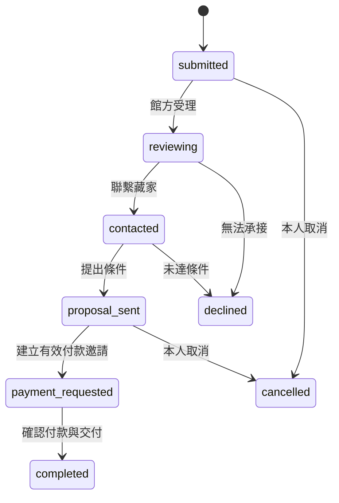
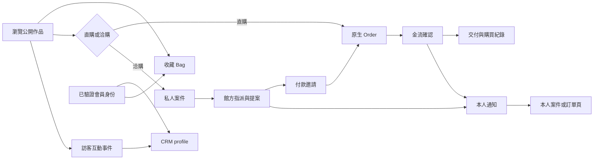

# 六龍藝術：全站欄位盤點與 Vendure 後端串接評估

> 盤點日期：2026-09-06。對象：後端工程師、前端工程師、專案負責人。  
> 本文件是需求與架構評估，**不是已完成的 Vendure 實作**。現況以此工作目錄（包含未提交變更）為準；官方能力以查核當日 Vendure 3.7.3 current 文件為參考，實作時仍須以鎖定版本產生的 GraphQL schema 驗證。版本依據：[Vendure 官方文件首頁](https://docs.vendure.io/)。

## 目錄

- [1. 先看結論與評估邊界](#s1)
- [2. 現況、來源與標記](#s2)
- [3. 共用欄位與轉換規則](#s3)
- [4. 作品、藝術家、分類與媒體](#s4)
- [5. 會員、登入、收藏與紀錄](#s5)
- [6. 聯絡、私人洽購、訂單與付款](#s6)
- [7. CRM、追蹤、通知與統計](#s7)
- [8. 全站內容管理欄位](#s8)
- [9. 全部 48 條 REST 契約與 GraphQL 對照](#s9)
- [10. 建議新增 GraphQL 介面及前端改動](#s10)
- [11. 外掛、資料關聯、Dashboard 與部署](#s11)
- [12. 契約矛盾及串接缺口](#s12)
- [13. 分期、估工與待確認事項](#s13)
- [14. 驗收、遷移與上線檢查](#s14)
- [15. 官方來源與查核限制](#s15)
- [附錄 A：42 個頁面檔案覆蓋表](#appendix-a)
- [附錄 B：76 個 Zod schema 完整欄位展開](#appendix-b)
- [附錄 C：48 條契約的 request／response 索引](#appendix-c)

<a id="s1"></a>
## 1. 先看結論與評估邊界

**這個網站適合讓 Vendure 承接商品、客戶、訂單、金額計算、庫存、付款與交付；但整體工作量屬中大型整合，不能只加幾個 custom fields 就完成。** 藝術家內容、私人洽購案件、付款邀請、收藏與瀏覽紀錄、CRM、站內通知、全站 CMS 都需要額外資料與商業邏輯。

最省重複開發的方向，是沿用 Nuxt 公開網站、改串 Shop GraphQL API，商品和訂單管理改用 Vendure Dashboard；藝術業務以外掛加進 Vendure，避免再維護一套平行的訂單／付款資料來源。

### 1.1 已確認的決策

| 項目 | 本次評估基準 |
| --- | --- |
| Vendure 現況 | 尚未建置，視為新專案；不存在可直接盤點的既有 Vendure 外掛與資料庫 |
| 前台 | 保留目前 Nuxt 網站的主要內容與視覺，資料層改成直接呼叫 Shop GraphQL |
| 管理端 | 使用 Vendure Dashboard；現有 Nuxt `/admin` 只作需求參考 |
| 相容策略 | 優先原生流程，不建 48 條 REST 相容轉接 API |
| 內容範圍 | 全站，包含寫死在 Vue、JSON、語系檔與圖片文章中的內容 |
| 語系／幣別 | 繁中、英文；TWD 作為第一階段的估工基準 |
| 本次實際交付 | 本 MD；不改應用程式、不安裝 Vendure、不執行 migration |

### 1.2 後端改動一覽

| 模組 | 原生可承接 | 仍要做的事 | 改動程度 |
| --- | --- | --- | --- |
| 作品 | Product、ProductVariant、Asset、分類與集合 | 藝術欄位、作者關聯、直購限制、公開價格政策 | 中 |
| 藝術家 | 可透過外掛擴充資料／API | Artist、翻譯、專頁內容、年表、Dashboard | 中～高 |
| 會員 | Customer、User、原生認證、地址 | 生日／性別／偏好語言、會籍狀態、會員級別授權 | 中 |
| 直購 | 活動訂單、計價、庫存、付款／交付狀態 | Nuxt 結帳重接、金流設定、單件作品競爭處理 | 高 |
| 私人洽購 | 可關聯 Customer、Product、Order | 案件流程、指派、提案、付款邀請、私人案件查詢 | 高 |
| 聯絡案件 | 可關聯 Customer、Artist／Product | 表單保存、主旨、案件工作台、通知 | 中 |
| 收藏／瀏覽 | 無本專案所需的現成資料流程 | 收藏 Entity、紀錄 API、訪客合併、真實空狀態 | 中 |
| CRM | Customer 資料與部分歷史可重用 | 匿名 profile、事件、階段、統計、Dashboard | 高 |
| 站內通知 | 可接事件與背景工作 | 通知及收件者、本人權限、未讀數、Dashboard | 中 |
| CMS | Asset、外掛、翻譯擴充能力 | 文章、團隊、頁面區塊、首頁、導覽、發布編輯 | 高 |

原生與擴充能力的基礎參考：[Products](https://docs.vendure.io/current/core/core-concepts/products)、[Plugins](https://docs.vendure.io/current/core/developer-guide/plugins)。表中的具體模組切法是本專案設計建議。

**工作量摘要：**依第 13 節的單一熟悉技術棧工程師假設，完整範圍粗估 71～127 人日，加整合緩衝後約 85～165 人日；這是初期需求估算，不是承諾排程。最大變因是付款方式、隱藏價格／VIP 規則，以及藝術家專頁的編輯自由度。

<a id="s2"></a>
## 2. 現況、來源與標記

### 2.1 本次盤點找到什麼

| 實際來源 | 結果 | 解讀 |
| --- | --- | --- |
| `pages/**/*.vue` | 42 個檔案 | 含轉址頁、動態頁與 9 個管理頁；不等於 42 個獨立資料模型 |
| `backend/src/contracts/api-contracts.ts` | 48 條契約 | 6 認證、1 analytics、1 一般洽詢、1 訂單、7 私人洽購（含管理）、3 付款、6 通知（含管理）、其餘 23 管理 |
| `backend/src/contracts/*.schema.ts` | 76 個匯出 schema | 有共用型別、繼承、輸入／輸出、union；不能當作 76 張資料表 |
| `backend/src/app.ts` | 僅通知路由及 health | 找不到商品、會員、訂單、CRM 等正式 handler |
| `backend/prisma/schema.prisma` | Notification、NotificationRecipient | 沒有 Product、Customer、Order 或 PrivatePurchase 資料表 |
| `public/mock/artworks.json` | 60 件，14 個頂層 key | `imageFull`、`exhibitionCategories` 出現在契約，但目前 JSON 沒有 |
| `public/mock/artists.json` | 6 位，9 個頂層 key | 黃華安另有獨立頁面，不應由 JSON 筆數推定全站只有 6 位藝術家 |
| `components/artists/*.vue` | 6 個具名藝術家元件，加 default／template | 是原始碼內容，並非後台可編輯 CMS |
| `pages/press/[id].vue` | 2 篇、每篇雙語圖片／標題／alt | 文章正文目前是圖片；列表另有 3 筆影片示意 |

48 條契約只有通知的 6 條已有本 repo 的服務實作；其中管理通知沒有相應的 Nuxt 管理頁。通知存在原始碼不代表已部署、已接真實登入或已驗證線上可用。

### 2.2 狀態標記

| 標记 | 意義 |
| --- | --- |
| S：已有服務 | 本 repo 有 route、service 與資料保存邏輯 |
| F：有呼叫 | 前端呼叫已寫好，本 repo 無對應正式服務 |
| C：只有契約 | schema／API 規格存在，沒有實際前端呼叫或服務 |
| M：Mock | JSON、計算產生的展示紀錄或模擬等待 |
| H：寫死內容 | Vue、語系 JSON 或圖片中的內容 |
| N：建議新增 | 為正式運作補齊的設計，不是目前已存在的欄位／功能 |

Vendure 對應使用「原生」「設定」「CF：custom field」「CE：custom entity」「衍生」「前端」六類。同一功能可以同時有多種狀態，例如作品是 M＋F：讀取 Mock，但新增／更新已有 API 呼叫。

### 2.3 閱讀規則

- 主文按「業務上的資料」分組；附錄 B 精確展開現有型別，包含重複使用的嵌套資料。
- 主文寫「建議必填」不代表現有 schema 已驗證；附錄的必填／nullable 才是現況。
- 舊欄位名稱保留作比對；新模型統一命名，不要求 Vendure 模仿所有歷史別名。
- 樣本內容不是已核實的作品來源、售價、庫存、媒體背書或正式營運資訊，不自動作正式 seed。
- 純文案提及的 VIP 閱覽室、證書、預約、邀請、AI 生成，另列延伸需求，不視為已存在功能。

<a id="s3"></a>
## 3. 共用欄位與轉換規則

### 3.1 共用資料字典

| 現有欄位／形狀 | 現有規則／例子 | 目標與處理 |
| --- | --- | --- |
| `id`、`artworkId`、`artistId` | string，通常 min(1)，未統一 trim | GraphQL ID 視為不透明識別字，不轉 number、不靠 ID 推斷權限 |
| `{ zhtw, en }` | 兩個 string 都 trim 且 min(1) | 目錄文字用 translations；前台按當次語系讀取，必要顯示雙語時明確增加另一語系資料 |
| `locale` | `zhtw`／`en` | 前端 `zhtw` → Vendure `zh_Hant`；`en` → `en` |
| `language` | 註冊偏好，與當次 `locale` 並存 | 保存 Customer.preferredLanguage，當次語系留 RequestContext；不重複存同一資訊 |
| `createdAt`／`created_at` | 混用，一部分只是 string | 新 API 統一 `createdAt: DateTime`；舊日期資料確認時區再匯入 |
| `birthday` | 現有只 min(1)，前端額外阻擋未來日期 | 建議 date-only `YYYY-MM-DD`，不存 UTC 午夜來代表生日 |
| `price`／`amount` | JS number；顯示當作新台幣元；大多缺 currency | 目標使用整數金額及 `currencyCode`；TWD 元轉 minor unit 前須做一次性轉換；不把 `680000` 元當 `680000` 分 |
| `image`／`avatar` | min(1) string，不是 URL validator | 存 Asset 關聯，回應提供 preview／source；URL 不作外鍵 |
| `name` | 姓名展示字串 | Customer 用 firstName／lastName；案件另存提交當下完整姓名快照 |
| `phone` | 多數只 trim＋min(1) | 後端再驗證國際電話並存 E.164；`phoneCountry`／`phoneNumber` 是表單拆分 |
| `null`／省略 | optional 與 nullable 不同 | 更新省略＝不改；允許 null 才可清空；不要全部以空字串替代 |
| `items`、`limit`、`cursor` | 通知 cursor 分頁；其他多是完整 array | 一般列表採 `{ items, totalItems }`＋skip/take；通知可保留專用 cursor 模型 |
| `x-visitor-id` | `sd_visitor_id` cookie，約一年 | 客戶端可控制的訪客線索，不是登入憑證；服務端產生正式事件時間與本人關聯 |
| `captchaToken` | optional string；受前端 site key 影響 | 僅表單安全驗證輸入，不成為長期客戶欄位；GraphQL 原生登入 mutation 不自動接受此參數 |

語言碼查核結果為 **`zh_Hant`，不是 `zhtw` 或自行假設的 `zh_TW`**。[Shop LanguageCode enum](https://docs.vendure.io/current/core/reference/graphql-api/shop/enums)。金額採 minor unit 的依據：[Currency](https://docs.vendure.io/current/core/core-concepts/money)。TWD 基準示例：NT$680,000 → `68000000`；正式顯示仍以 currency formatter 為準，未來其他幣別須驗證幣別精度及金流規則。

### 3.2 所有現有業務枚舉

| 枚舉 | 完整值 | Vendure 處理 |
| --- | --- | --- |
| userRole | collector / vip / applicant / admin | 混合了會員級別、申請及管理身份，必須拆開 |
| userStatus | active / pending / suspended | 會員生命週期；非原生單一對應 |
| gender | female / male / non_binary / prefer_not_to_say | Customer CF；可不透露與未知不同 |
| inquiryStatus | pending / contacted / closed | 一般聯絡案件 CE |
| paymentStatus | pending / paid / failed / cancelled / expired | 舊付款頁狀態；與付款邀請、Payment 分開 |
| purchaseRecordStatus | delivered / archived / completed | 顯示／收藏管理狀態；不是原生 OrderState |
| privatePurchaseStatus | submitted / reviewing / contacted / proposal_sent / payment_requested / completed / declined / cancelled | 獨立案件 state machine |
| preferredContactMethod | email / phone | 案件聯絡偏好 |
| crmStage | new / nurturing / engaged / customer | CRM CE，不等於註冊／登入狀態 |
| analyticsEventType | page_view / artist_view / artwork_view / artwork_list_view | 目前只有這四種，勿預設有付款／收藏追蹤 |
| notificationAudience | ALL / USERS | 自訂通知受眾 |
| NotificationStatus（Prisma） | DRAFT / PUBLISHED | 現有建立 route 一律採資料庫預設 PUBLISHED；沒有草稿編輯 API |

`PaymentView`、`LoginMode`、`AccountRecordType`、提示 tone 等是介面狀態或路由分類，保留在前端即可。完整值及欄位見附錄與 `types/`。

### 3.3 建議共通持久欄位

自訂業務 Entity 一般具備 `id`、`createdAt`、`updatedAt`；需對外定位者增加 `code` 或 `slug`；可發布內容增加 `status`、`publishedAt`、`sortOrder`。關聯 Customer、Administrator 與 Channel 的欄位由服務端權限控制。

不要為每個內容小區塊建立一張表。會獨立搜尋、排序、關聯、權限控制或跨頁重用者才做 Entity；段落、FAQ、固定版型區塊使用受驗證的結構化資料。這是本專案的儲存設計建議。

<a id="s4"></a>
## 4. 作品、藝術家、分類與媒體

### 4.1 作品現有欄位 → Vendure

來源：[catalog.schema.ts](../backend/src/contracts/catalog.schema.ts)、[useArtData.ts](../composables/useArtData.ts)、[作品頁](../pages/artwork/[id].vue)、[作品編輯頁](../pages/admin/artworks/edit/[id].vue)。狀態 M＋F；目前購買與詳情以單一 artwork 為單位。

| 現有路徑 | 用途／現有型別 | 建議目標 | 存取／改動 |
| --- | --- | --- | --- |
| `id` | 作品 ID，string | Product.id；另以 Product CF `legacyArtworkId` 保存舊 ID | 公開；網址改 slug 或維持舊 ID 查找 |
| `artistIds[]` | 多作者 ID，允許空 array | Product CF `artists`，list relation → Artist CE | 公開；需關聯 selector；不要塞逗號文字 |
| `title.zhtw/en` | 必填雙語作品名 | Product translations.name | 公開；Dashboard 原生翻譯表單 |
| `category.zhtw/en` | 分類顯示文字 | FacetValue translations.name；Product facetValues | 公開；分類不能再靠英文 label 當 ID |
| `year` | string，可空；可表示年代區間 | Product CF `yearText: string` | 公開；不要強制只有西元整數 |
| `size` | string，可空，如尺寸及 cm | Product CF `dimensionsText: string` | 公開；精確尺寸分項為選配，不從字串猜測 |
| `material.zhtw/en` | 雙語材質 | CF `material: localeString` | 公開；材質篩選若有需求另關联 FacetValue |
| `seals.zhtw/en` | 印章 | CF `seals: localeText` | 公開；草稿可無資料；需補編輯 UI |
| `inscriptions.zhtw/en` | 題識 | CF `inscriptions: localeText` | 公開；不要與 seals 合併 |
| `image` | 列表／詳情圖 | Product.featuredAsset.preview | 公開；Asset ID 寫入 featuredAssetId |
| `imageFull?` | 可省略及 null，鑑賞大圖 | Asset.source 或另設公開高解析 Asset 關聯 | 公開圖與保密原檔需分離，不能只隱藏按鈕 |
| `concept.zhtw/en` | 創作理念 | Product translations.description | 公開；定義為作品介紹主文，前端可清理後呈現 HTML |
| `collectionStory.zhtw/en` | 收藏／來源故事 | CF `collectionStory: localeText` | 公開敘事；不等同正式來源文件 |
| `isDirectPurchase` | 是否可以直購 | CF `isDirectPurchase: boolean`，建議預設 false | 公開讀，管理寫；後端必須阻擋不合資格的加單 |
| `price` | number，未限制非負；更新可 null | ProductVariant 的 channel/currency price | 公開直購價；私人報價另存報價／訂單，不用 0 元模擬未定價 |
| `exhibitionCategories[]?` | 字串分類 key，Mock 沒有 | Collection／FacetValue 關聯 | 公開；舊 key 移為 code 或 legacy mapping |

Product 是展示作品，ProductVariant 是可購買單位。**不能拿 Product.id 直接當 `addItemToOrder` 的 productVariantId。** 第一版以每件原作一個可售 Variant、唯一 SKU、庫存 1 作估工假設；版畫版次、不同尺寸／框裝選項另擴充 Variant，不用重新設計整套模型。原生模型參考：[Products](https://docs.vendure.io/current/core/core-concepts/products)。

### 4.2 正式交易必須補的欄位／規則（N）

| 欄位 | 建議位置／型別 | 必要性／驗證 |
| --- | --- | --- |
| `slug` | Product translation string | 穩定作品網址，雙語可共用 slug；舊網址有映射 |
| `enabled` | Product／Variant 原生 | 發布可見與可交易必須分開理解 |
| `variantId`、`sku` | 原生 ID、string | 下單單位及營運識別，SKU 不重複 |
| `currencyCode`、`priceWithTax` | 原生金額資料 | 結帳顯示不能只依 artwork.price |
| `taxCategoryId` | 原生 Variant 關聯 | 決定稅處理；稅率與含稅政策尚待營運確認 |
| `trackInventory`、`stockOnHand` | 原生庫存設定 | 唯一原作啟用追蹤，禁止超賣；庫存不交給前端扣 |
| `availability` | 建議公開 resolver enum | available / reserved / sold / unavailable；由庫存及業務預留導出，不與 enabled 混用 |
| `priceVisibility` | 建議 CF enum | public / inquiry；會員／VIP 分級價格可作後續方案 |
| `privateQuoteAmount` | 私人提案／訂單資料 | 不放公開 ProductVariant 實際價格欄位來「隱藏」 |
| `relatedWorks` | 建議 resolver | 目前以同分類／同作者取 3 筆；改成服務端按 ID 關聯取公開作品 |
| `sourceReferences`、`verificationStatus` | 內容／文件 metadata | 記錄資料來源及可發布程度；正式證書檔案另列延伸需求 |

如果只是「不公開私人報價」，可讓私人作品公開目錄不帶可購買 Variant，成交條件確認後由管理流程建立訂單所需交易資料。若要求「同一個有售價的 Variant，只有某些會員可看到價格」，工作會增加：要統一檢查 product、search 價格範圍、關聯 Variant、cache 及其他查詢路徑；只加 `priceVisibility` 或不在 Vue 顯示價格無法達成。此條件列為第 13 節高影響待確認項。

CF 的 `public`、`internal`、`readonly` 控制不同層次；自訂欄位的公開設定不會自動控制原生價格。[Custom fields](https://docs.vendure.io/current/core/developer-guide/custom-fields)。

### 4.3 藝術家資料

| 現有欄位 | 用途 | 建議 Artist CE 欄位 |
| --- | --- | --- |
| `id` | URL 同時拿來選 Vue component | id + stable slug；舊字串保存 legacyArtistId |
| `name.zhtw/en` | 名稱 | translations.name |
| `avatar` | 形象圖 | avatarAssetId／avatarAsset |
| `quote.zhtw/en` | 引言 | translations.quote |
| `desc.zhtw/en` | 短介 | translations.summary |
| `lineage.zhtw/en` | 師承／脈絡標題 | translations.lineageTitle |
| `lineage_desc1.zhtw/en` | 脈絡第一段 | translations.lineageParagraph1 |
| `lineage_desc2.zhtw/en` | 脈絡第二段 | translations.lineageParagraph2 |
| `exhibition.zhtw/en` | 既有展覽敘述 | translations.exhibitionSummary |
| `artworkCount` | 衍生 schema 有定義 | resolver 計算可見作品數，不讓編輯手填 |

Artist CE 建議加入 `status`、`publishedAt`、`sortOrder`、`heroAssetId`、`templateKey`、`seoTitle`、`seoDescription`、`contentBlocks`。templateKey 只允許前端已提供的版型，不允許後台提交 Vue 原始碼執行。

獨立專頁還有以下資料，不能只遷 JSON 就算完成：

| 來源 | 額外內容 | 建議保存方式 |
| --- | --- | --- |
| 六個具名 artist Vue 元件 | Hero、外文名、引言、段落標題／正文、背景圖／作品圖、圖片順序 | 同一 Artist 的翻譯內容區塊與媒體關聯；動畫仍由原始碼控制 |
| `pages/artist/huang-hua-an.vue` | 獨立人物介紹、`exhibitions[]`、`series[]`、圖像與語系文案 | Artist 主體＋結構化年表／系列 |
| `exhibitions[].year` | 年／區間 string | yearText；另有活動日期才補 startsAt/endsAt |
| `exhibitions[].title/location/desc` | 原頁目前中文 string | 每筆轉 translations.title/location/description |
| `series[].name/desc` | 系列名稱／說明 | translations.name/description；可選作品關聯 |
| `/admin/artists/edit/:id` | 只顯示元件路徑與摘要 | 改用 Artist Dashboard 詳情／翻譯／發布表單；原元件路徑不是 CMS 欄位 |

目前藝術家新增 payload 只有 name、avatar、desc，回應卻要求 quote、lineage、exhibition 等完整資料；不能靠填假的生平資訊滿足非空 schema。新模型允許草稿缺資料，發布檢查只要求已定義的必要公開內容。

### 4.4 分類、作品集合與展覽

目前 `/exhibition` 是作品瀏覽／私人洽購入口，**不是已實作的展覽活動資料庫**。

| 現有分類資料 | 建議模型／欄位 |
| --- | --- |
| category definition `key` | FacetValue.code 或 Collection.slug／自訂 legacy key |
| `label` | translations.name |
| `sources[]` | 舊英文 category 的遷移映射；不成為正式 runtime 比對 |
| filter branch `key`、`children[]` | Collection parent／children；分類屬性仍可用 Facet |
| route query `category`、`q` | Collection／Facet ID filter 與 search term |
| 類別卡 `title/image/to/wide/icon` | title 翻譯、Asset、連結／集合關聯、展示 layout enum、iconKey |
| 首頁 `slice(0,6)` | 首頁精選 Collection 或明確 productIds 排序，不依資料庫自然順序 |

現有 18 個 key：`all`、`painting-calligraphy`、`landscapes`、`flowers-birds`、`calligraphy`、`figures`、`four-gentlemen`、`masters`、`photography`、`contemporary-works`、`buddhist-sculptures`、`art-objects`、`oil-painting`、`watercolors`、`photographs`、`ai-creations`、`cultural-relics`、`wood-fired-pottery`。`all` 是前端「全部」選項，不建立成作品分類資料。

目前 Landscape／Still／Ink／Figure／Abstract 等來源映射是展示用邏輯，不能把 Abstract 自動判定為所有油畫。正式匯入需由管理者確認作品分類。Facet／Collection 使用依據：[Facets](https://docs.vendure.io/current/core/user-guide/catalog/facets)、[Collections](https://docs.vendure.io/current/core/core-concepts/collections)。

若要管理真實展覽，新增 Exhibition CE：`id`、`slug`、`title`、`summary`、`body`、`venue`、`address`、`dateText`、可選 `startsAt/endsAt`、`heroAsset`、`artistIds[]`、`productIds[]`、`status`、`publishedAt`、`sortOrder`。這是 N，不是現有 48 API 之一。

### 4.5 媒體欄位及上傳

| 欄位 | 現有／目標 |
| --- | --- |
| `file` | 現有瀏覽器 File／multipart；契約卻以 Buffer 表示伺服器解析後資料 |
| `prefix='artworks'` | 現有儲存前綴提示；不是核心業務欄位，Vendure 不必照抄 |
| `preview`、`full` | 舊 upload 回應；新回應採 Asset.id、preview、source |
| `mimeType`、`fileSize`、`width`、`height` | 使用 Asset 原生 metadata；前端可用尺寸避免版面跳動 |
| `alt`、`caption`、`credit` | 建議翻譯 metadata／內容區塊欄位；不是現有 artworkSchema 欄位 |
| `focalPoint` | Asset 可選裁切焦點；若使用則由管理 UI 設定 |
| `localizedAsset` | 圖片文章每語系不同 Asset；不能只翻譯 alt 卻仍回同一張圖 |

使用 Admin `createAssets` 上傳後再綁 Product／內容；不可假設現在 `/api/admin/upload` 的「轉 WebP」註解表示已有處理服務。公開大圖與私人文件需分開儲存與授權。[Asset Entity](https://docs.vendure.io/current/core/reference/typescript-api/entities/asset)、[Admin upload inputs](https://docs.vendure.io/current/core/reference/graphql-api/admin/input-types)。

<a id="s5"></a>
## 5. 會員、登入、收藏與紀錄

### 5.1 註冊、登入及會員資料欄位

來源：[auth.schema.ts](../backend/src/contracts/auth.schema.ts)、[useAuth.ts](../composables/useAuth.ts)、[register.vue](../pages/register.vue)、[login.vue](../pages/login.vue)。目前 F，無正式認證 handler。

| 現有路徑 | 來源／用途 | Vendure 對應／變更 |
| --- | --- | --- |
| form.firstName／lastName | 表單各自必填；目前送出組成 name | 直接送原生 RegisterCustomerInput 的 firstName／lastName，避免再拆完整姓名 |
| request.name／user.name | 完整名稱 string | 前端衍生 displayName；案件保存姓名快照 |
| request.email／user.email | email 驗證 | Customer.emailAddress；login 使用 username 參數承載 Email |
| password | 註冊／重設最少 8；登入最少 1 | 原生認證密碼處理；不進自訂 Customer 明文欄位 |
| verificationCode | 現有必填的數字／文字碼輸入，schema 只 min(1) | 採原生 Email verification token；移除舊先取碼再註冊流程 |
| language | 偏好語言 enum | Customer CF preferredLanguage，登入後可用於聯絡 |
| locale | 當次介面語系 | RequestContext languageCode，用於當次訊息；不與偏好混為一欄 |
| gender | 現有必填 enum | Customer CF gender；由本人讀寫，員工按職責讀 |
| birthday | 現有必填 string | Customer CF dateOfBirth，date-only，驗證有效及不晚於今日 |
| phoneCountry／phoneNumber | 前端電話拆分 | 不必原樣保存；組合成 phoneNumber E.164 |
| phone | 國際號碼 string | Customer.phoneNumber |
| captchaToken | 登入／註冊／發碼／重設 optional | 若維持 Turnstile，需原生認證外圍 guard／驗證入口，不是原生參數 |
| user.id | 舊登入使用者 ID | 分清 CurrentUser.id 與 Customer.id；業務案件綁 Customer.id |
| user.role | collector／vip／applicant／admin | 會員級別、申請流程、管理員拆開，見下表 |
| user.status? | active／pending／suspended | 管理端控制的會員狀態 CF＋服務端執行限制 |
| avatarUrl?／avatar? | 都可 null | 統一 customer avatarAsset；自助上傳另加受限流程，不能暴露 Admin 上傳權限 |
| createdAt?／created_at? | 有兩種別名 | 統一 createdAt |
| response.token | JWT 風格 cookie `sd_token` | 改成 Vendure session；不要直接 `jwt.verify` Vendure bearer token |
| response.user | 舊完整登入 profile | 由 `activeCustomer`＋必要會員擴充欄位形成 ViewModel |
| resendAvailableAt?／resendInSeconds? | 成功發碼回應 | 原生流程重送驗證信；倒數若保留，需自訂限流回應 |
| error.data.nextSendAt?／retryAfterSeconds? | `types/core.ts`，登入表單讀取 | 新錯誤模型明確提供 retry metadata，避免與成功欄位混用 |

### 5.2 角色不能直接對照

| 舊值 | 建議表達 | 後端必須做的事 |
| --- | --- | --- |
| collector | Customer 預設一般會員 | Email 驗證與登入權限走原生 |
| vip | CustomerGroup `vip` | 只有管理員／業務服務可以升級；不要做可讓本人 updateCustomer 修改的 role |
| applicant | 建議 membershipStatus=pending | 若不需要人工審核，不沿用此流程；Email 未驗證不等於待人工審核 |
| admin | Administrator + Role + Permission | 不出現在藏家可選會籍中；Dashboard session 與 Shop 分開 |
| suspended | 建議 membershipStatus=suspended | 實際阻擋受限制 mutation；若需求是停用登入，還需使現有 session 失效及認證限制 |

Dashboard 會員列表要讀得到級別、會籍狀態、驗證狀態與客戶資料，但原生 `User.verified` 只能代表 Email 等認證狀態，不能充當整套會員審核流程。Customer customFields 不因為存在就自帶本人／管理員不同的寫入權限；敏感狀態用受權限保護的 resolver 管理。[User Management](https://docs.vendure.io/current/core/core-concepts/user-management)、[Custom Permissions](https://docs.vendure.io/current/core/developer-guide/custom-permissions)。

### 5.3 採用原生認證後的頁面變更

1. 註冊送出 `registerCustomerAccount`，寄驗證信；回應成功不直接等於登入。
2. 新增 Email token 驗證頁，呼叫 `verifyCustomerAccount`。
3. 登入使用 `login`，以實際 `activeCustomer` 判斷登入成功；不能只看 cookie 有值。
4. 忘記密碼使用 `requestPasswordReset`，新增 token 設密碼頁呼叫 `resetPassword`。
5. 登出呼叫 `logout` 並清前端 state；目前只清 cookie 的方式不能終止伺服器 session。

以上操作與驗證流程依據：[Customer Accounts](https://docs.vendure.io/current/core/storefront/customer-accounts)。驗證失敗、過期、已使用 token 及重新寄送需各有畫面；Email 寄送設定另見第 11 節。

### 5.4 收藏袋、收藏與瀏覽紀錄

來源：[useCart.ts](../composables/useCart.ts)、[cart.vue](../pages/cart.vue)、[會員紀錄頁](../pages/account/[record].vue)。目前 M；`sd_cart` 是去重作品 ID array，保存 30 天，不含數量、日期或伺服器會員關聯。

| 現有欄位 | 現况 | 建議保存／API |
| --- | --- | --- |
| itemIds[] | Cookie 內作品 ID | 訪客保留本機暫存；會員 FavoriteArtwork CE |
| favorite.artwork | 完整 Artwork DTO | 關聯 Product；查詢時選需要的公開欄位 |
| favorite.savedAt | 固定展示日期 | FavoriteArtwork.createdAt，由伺服器產生 |
| history.artwork | 前 5 件 Mock | 關聯 Product，僅本人瀏覽紀錄 |
| history.viewedAt | 固定日期，部分沒有時區 | 每次瀏覽事件的時間 DateTime |
| history.source | 已翻譯的展示文字 | 存 sourceCode／path，前端再翻譯 |
| tabs.count | computed 陣列長度 | 回應 totalItems；不要只計當頁筆數 |
| 最近更新日期 | 收藏頁目前寫死 | max(savedAt) 或集合 updatedAt；沒有收藏則不顯示 |

建議 `FavoriteArtwork`：`id`、`customerId`、`productId`、`createdAt`，唯一 `(customerId, productId)`；查詢／新增／刪除都從 session 決定 customerId。移除收藏用 `removeFavoriteArtwork(productId)`。

`ArtworkView`：`id`、`customerId`、`productId`、`lastViewedAt`、`sourceCode`、`sourcePath`，每次瀏覽新增一筆事件；不對 `(customerId, channelId, productId)` 建立唯一限制。個人歷史頁以 `artworkHistory` 分頁讀取事件，若另有跨使用者分析需求再導入 AnalyticsEvent。

Bag 維持「有興趣作品」用途，不自動變成待付費 Order。按「直接購買」時才加入活動訂單。登入合併本機 ID 時服務端驗證作品存在、去重、保存真實合併時間；舊 cookie 沒日期，不能捏造之前的 savedAt。

目前 favorites 為空時會回退展示作品，登入者也會看到假購買紀錄；正式串接要顯示真實空清單，不使用相同 fallback 補滿。`collectorPreview` 設定存在，但目前會員紀錄頁以 `!isLoggedIn` 直接開預覽，需要實際接上環境控制。

### 5.5 購買紀錄

| 現有欄位 | 建議目標 |
| --- | --- |
| artwork | OrderLine 的商品／歷史摘要；標题及成交金額不能隨現在商品編輯改變 |
| orderId | 區分 Order.id（內部識別）與 Order.code（給藏家的單號） |
| purchasedAt | 實際下單／成交時間，明確採 orderPlacedAt 或付款完成時間之一 |
| amount | 若一筆代表一件作品，使用該 OrderLine 金額；訂單總額只在訂單層顯示 |
| status=delivered | 由履約／交付結果導出 |
| status=completed | 由業務成交及交付條件導出，不能把支付成功當全部完成 |
| status=archived | 目前只是展示；若需個人封存，新增本人 record preference，不改訂單狀態 |

第一版以本人訂單歷史＋OrderLine 展示，不新增一套平行 Purchase 表；退款、部分出貨與取消在紀錄上需保留原訂單狀態，不能硬塞進舊三個 enum 而失真。

<a id="s6"></a>
## 6. 聯絡、私人洽購、訂單與付款

### 6.1 一般聯絡與洽詢

來源：[commerce.schema.ts](../backend/src/contracts/commerce.schema.ts)、[admin.schema.ts](../backend/src/contracts/admin.schema.ts)、[聯絡表單](../pages/contact/form.vue)。一般作品洽詢 F；聯絡表單 H、只開郵件程式。

| 現有欄位 | 目前要求 | 建議 Inquiry CE |
| --- | --- | --- |
| artworkId? | 作品洽詢選填 string | productId nullable；一般聯絡可無作品 |
| name | trim、必填 | contactName，提交快照 |
| email | 必填 Email | emailAddress，提交快照 |
| phone | API 必填，但聯絡表單沒有 | phoneNumber nullable（一般聯絡）；作品洽詢可要求必填 |
| subject | 聯絡表單必填，但 API 沒有 | subject string；保留 art-space 預填意圖 |
| message | trim、必填 | message text；服務端設定長度上限 |
| captchaToken? | 作品洽詢 optional | 僅輸入與驗證，不回傳保存 |
| id | 管理列表 | id、code |
| artwork.zhtw/en? | 管理列表可省略／null | product 關聯／當下作品標題快照 |
| assignee? | 管理列表／編輯 string | assignedAdministratorId，驗證為有效員工 |
| createdAt? | optional string | DateTime |
| status | pending／contacted／closed | 由服務端管理，預設 pending |
| client | 管理編輯 payload 的名字 | 統一為 contactName，不繼續使用 client 別名 |

新增 `customerId?`、`visitorId?`、`locale`、`sourcePath`、`inquiryType`（general／artwork／art-space）、`updatedAt`、可選 internalNote。subject、phone 的條件依 inquiryType 驗證。前台成功應回案件 code，不再只回 void；一般聯絡未必需要會員案件頁，仍須在 Dashboard 可處理。

### 6.2 私人洽購欄位

來源：[private-purchase.schema.ts](../backend/src/contracts/private-purchase.schema.ts)、[PRIVATE_PURCHASE.md](../backend/PRIVATE_PURCHASE.md)。目前 C；需新增前台申請／本人列表／詳情與 Dashboard 工作台。

| 現有路徑 | 用途／條件 | 建議保存與可見性 |
| --- | --- | --- |
| create.artworkId | 必填非空 | product 關聯；只有有效可洽購作品可送 |
| create.name/email/phone | 必填聯絡資料 | 案件快照，不跟 Customer 更新覆寫 |
| preferredContactMethod | email／phone | 案件欄位，本人與員工可讀 |
| message | trim、1～4000 字元 | 原始申請 text；不可直接插入未清理 HTML |
| locale | zhtw／en | 案件聯絡語言，轉成目標 languageCode |
| captchaToken? | optional 非空 | 驗證輸入，非公開欄位 |
| id | 所有回應都有 | CE id；新增供藏家識別的 code |
| summary.artwork.id/title/image/year/artistIds | 列表作品摘要 | Product 關聯；適量快照保存案件歷史 |
| status | 八個狀態 | CE 狀態，服務端合法轉換 |
| createdAt/updatedAt | 目前只 string | DateTime，服務端產生 |
| assignedTo? | 現有本人回應也有 | 管理端保留 Administrator ID；Shop 只給安全顧問顯示名稱 |
| paymentId? | 舊單一付款關聯 | 改成 activePaymentRequest 與付款邀請歷史；不要與原生 Payment.id 混用 |
| internalNote? | 僅 admin response | Admin API，Shop schema 不定義此欄位 |
| userId? | 僅 admin response | customerId，由 session 解析；匿名時 null |
| createdResponse.status | literal submitted | 建立成功固定 submitted；不能信任前端傳 status |

補齊 `PrivatePurchaseTransition`（id、caseId、fromStatus、toStatus、actorAdministratorId／actorCustomerId、occurredAt、reason?）以追查變更；舊單一 internalNote 可以保留，但不能取代狀態歷史。

`proposal_sent` 在舊契約沒有提案正文、金額、有效期限欄位。第一版若只標記已在站外聯絡，保留此狀態即可；若本人頁要看提案，需新增 Proposal：`id`、`privatePurchaseId`、`version`、`summary`、`amount`、`currencyCode`、`shippingAmount?`、`validUntil?`、`sentAt`，舊提案不能被新版覆蓋。完整估工包含簡易提案摘要與版本，不含多人協作報價編輯器。

### 6.3 案件流程與權限



這張圖沿用 repo 既有規劃，不擴大成任意可編輯 status。付款已請求後的取消應走館方撤銷／退款檢查，不能使用通用本人取消直接把交易消掉。`completed` 由後端確認付款及交付，不允許 `submitted → completed`。

匿名可提交；登入後只以已驗證 Email 或專用一次性領取流程，把匿名案件認領給本人，不能只提交 email 就讀回其他人的案件。未驗證帳號、訪客 ID 與案件 ID 都不構成所有權證明。CRM profile 合併同樣適用。

### 6.4 原生訂單流程要補的欄位

舊 `/api/orders` 輸入只有 artworkId?、name、email、phone、address，回 `{ id }`；沒有正式訂單 service，也沒有付款記錄。目標改成多步驟原生 Order 流程。

| 欄位／集合 | 建議來源 | 前端／後端責任 |
| --- | --- | --- |
| productVariantId、quantity | 可售 Variant；原作 quantity=1 | 前端選擇，後端核對直購資格及可售庫存 |
| customer.firstName/lastName/emailAddress/phoneNumber | 登入 Customer 或訪客結帳 | 本人 session／訪客資料，不能用別人 customerId |
| shippingAddress.fullName | 原生地址 | 現有 name 可預填 |
| company? | 地址選填 | 有需求才顯示 |
| streetLine1 | 地址必填 | 舊 address 移到此欄或請使用者補齊 |
| streetLine2? | 地址選填 | 公寓／樓層等 |
| city、province、postalCode | 原生可用地址欄位 | 按目的地要求，不宣稱全球都相同必填 |
| countryCode | 結帳地址必填 | ISO 國別且後端 available countries 有啟用 |
| phoneNumber? | 收件電話 | 配送需要時要求，與會員電話可不同 |
| billingAddress | 帳單地址 | 支援同收件地址，不從純文字亂拆 |
| shippingMethodId | 原生 eligible shipping methods | 選擇可用方法；未配置方案則不能假結帳成功 |
| lines[].unitPriceWithTax、linePriceWithTax | OrderLine 計算值 | 金額以訂單為準，不信任前端送價 |
| subTotalWithTax、shippingWithTax、totalWithTax | 原生 Order 計算值 | 依實際含稅／運費／折扣顯示 |
| currencyCode、state、code、orderPlacedAt | 原生 Order | 確認頁、本人歷史、後續查詢 |
| payments[] | 原生 Payment | 顯示付款狀態；交易 metadata 限制公開範圍 |
| fulfillments[].state/trackingCode | 原生 Fulfillment | 交付狀態；不等於付款狀態 |

預期操作順序：`addItemToOrder` → `setCustomerForOrder`（訪客需要時）→ `setOrderShippingAddress`／`setOrderBillingAddress` → `eligibleShippingMethods`／`setOrderShippingMethod` → `transitionOrderToState(ArrangingPayment)` → 金流對應付款操作 → 確認結果。實際支付外掛可能有專用 mutation，不一律硬套相同 hosted checkout 回應。[Checkout Flow](https://docs.vendure.io/current/core/storefront/checkout-flow)。

現有 `cardNumber`、`expiry`、`cvv` 只在 UI 驗證，未送出；正式版改金流 hosted page／官方 tokenization 元件，不新增這三個資料庫欄位。`create order` 成功只能代表建立訂單，不代表完成扣款。

### 6.5 付款請求不是原生 Payment

目前 `/pay/:id` 的 `id` 代表「館方發出的付款單／邀請」概念；原生 Payment 是某次支付交易。目標採 `PaymentRequest CE → Order → Payment[]`，允許一次邀請有支付重試，不把支付錯誤永久寫死為整筆案件失敗。

| 舊欄位 | 含義 | 建議目標 |
| --- | --- | --- |
| payment.id | 收款網址識別 | PaymentRequest.id；網址使用不透明 token，資料庫保存 token hash |
| payment.orderId? | 可無訂單 | 第一版發送前須有合法 Order 關聯；無商品的任意收款列為額外範圍 |
| payment.amount | 應付金額，非負 | PaymentRequest 金額快照；與應付 Order 金額核對 |
| payment.status | pending／paid／failed／cancelled／expired | 邀請狀態與交易 Payment.state 分欄 |
| description? | 付款說明 | 邀請可公開的 summary，不含內部備註 |
| gateways[].id | 金流代碼 | 可用 payment method code；須按此訂單篩選 |
| gateways[].label.zhtw/en | 金流名稱 | 當次語系名稱或翻譯 |
| gateways[].enabled? | 可用性 | 服務端判定 eligible，不以 UI toggle 授權 |
| checkout.gateway | 選擇的金流 | 驗證為此邀請可用的 method |
| checkout.redirectUrl | 外部支付網址 | 支付外掛產生的 hosted URL；沒有此流程的外掛回 token／client secret 的專用結果 |
| settle.status／orderId? | 返回頁同步確認結果 | 查詢付款真實結果，不允許客戶任意執行 Admin settlePayment |
| admin.name/email/phone? | 無案件時手填 | payer contact snapshot；有案件則從案件讀取 |
| admin.inquiryId?／privatePurchaseId? | 付款來源 | 建議互斥、至多一個，現有 schema 尚未限制同時提交 |
| admin.amount | 必須 >0 | 管理員確認報價；交由訂單服務建立可對帳交易 |
| admin.description | trim 必填 | 對藏家展示的摘要 |
| admin.response.id | 新付款單 ID | 目標另回 code／expiresAt／可發送連結 |

建議補 `code`、`orderId`、`customerId?`、`currencyCode`、`expiresAt`、`tokenHash`、`createdByAdministratorId`、`sentAt?`、`revokedAt?`、`paidAt?`、`createdAt`、`updatedAt`；金流交易補 providerTransactionId、gateway method、狀態及必要 metadata，盡量使用原生 Payment 已有欄位。

用 Draft Order 可協助館方開單，但「建立草稿」不會自動把該訂單變成受邀藏家的 activeOrder。外掛須實作邀請授權、訂單狀態確認及支付上下文，或使用適當的服務層付款流程。[Admin Mutations](https://docs.vendure.io/current/core/reference/graphql-api/admin/mutations)。

### 6.6 付款與庫存重要情境

- webhook 驗證由金流整合實作；以 provider event／transaction 識別去重。重複 callback 不重扣、不重建訂單、不重寄成交通知。
- 返回 URL 的 `settle`／`cancelled` 只是 UI 導航線索；以後端真實交易狀態顯示結果。
- 到期、已撤銷、已付清的 PaymentRequest 不能再次發起付款；已開的外部 session 是否失效取決於金流，需要同步處理。
- 唯一作品最後一件同時下單、私人預留與公開直購衝突，需由服務端交易與庫存策略保證；Cookie 收藏不占庫存。
- 第一版預設不因收藏或送出洽詢就預留作品；建立正式交易條件後才按庫存策略分配。若要 24 小時報價保留，需追加期限、釋放工作及超時付款處理。
- 訂單 code 查詢有原生訪客存取政策；它不能充當永久付款邀請的安全機制。本人長期查詢與訪客短期確認頁應分開。[OrderOptions](https://docs.vendure.io/current/core/reference/typescript-api/orders/order-options)。

### 6.7 狀態對照：不可直接改大小寫

以下是本專案的顯示映射建議，原生狀態本身維持 Vendure 定義。Payment、Order、Fulfillment 與私人案件各自有生命週期；不能用一個 `status` 同時代表四者。

| 來源狀態／條件 | 舊畫面能否直接沿用 | 新畫面建議 |
| --- | --- | --- |
| Order Draft／AddingItems | 不等於待收款完成訂單 | 草稿／收藏明細；不列成交紀錄 |
| Order ArrangingPayment | 可歸為待付款，但不是支付交易成功 | 待付款 |
| Payment Authorized／Order PaymentAuthorized | 不應直接寫成已收款 `paid` | 已授權、待請款；如需出貨由營運規則決定 |
| Payment Settled，且已覆蓋應付總額 | 可將付款邀請顯示為 paid | 已付款；訂單尚未因此 delivered |
| 本次 Payment Declined／Error | 只代表本次支付失敗 | 顯示錯誤與重試，不把整個洽購案件直接 declined |
| Payment Cancelled | 與整張 Order Cancelled 不同 | 顯示本次付款取消，重新查應付金額／其他交易 |
| PaymentRequest 到期／撤銷 | 沒有直接一對一原生付款狀態 | expired／revoked，由邀請 Entity 保存 |
| Order Shipped／PartiallyShipped | 舊紀錄 enum 無對應 | 已寄出／部分寄出，擴充前端顯示狀態 |
| Order Delivered／PartiallyDelivered | delivered 只可代表完整交付或該行已交付 | 完整／部分交付分開 |
| PurchaseRecord archived | 無原生 OrderState 對應 | 若有需求，存個人封存偏好 |
| PrivatePurchase completed | 不是 Payment Settled 的別名 | 付款與約定交付均確認後結案 |

原生付款授權／請款及訂單履約狀態依據：[Payment](https://docs.vendure.io/current/core/core-concepts/payment)、[Orders](https://docs.vendure.io/current/core/core-concepts/orders)。退款需同時呈現 refund 結果與訂單剩餘金額；不得覆寫已發生的付款歷史。

<a id="s7"></a>
## 7. CRM、追蹤、通知與統計

### 7.1 AnalyticsEvent 輸入與保存

來源：[analytics.schema.ts](../backend/src/contracts/analytics.schema.ts)、[useCrm.ts](../composables/useCrm.ts)、[crm.client.ts](../plugins/crm.client.ts)。目前 F；tracking 失敗不阻塞頁面。

| 欄位 | 現有規則 | 建議 CE／責任 |
| --- | --- | --- |
| eventType | 四個 enum | enum；不可任意事件名注入高基數統計 |
| path | string startsWith('/') | 保存允許的路徑；移除付款／重設 token 與其他敏感 query |
| source | literal web | 第一版固定 web |
| artistId? | min(1) | Artist 關聯或可追溯舊 ID，驗證存在 |
| artworkId? | min(1) | Product 關聯 |
| categoryEn? | string nullable | 改 categoryCode／facetValueId；label 由翻譯導出 |
| metadata.{key} | string／number／boolean／null | JSON primitive map，限制 key／大小，不放卡號、密碼、token |
| x-visitor-id | header | visitorId；不能作為查個資的 key |
| id（N） | 目前 request 無 | 服務端生成 |
| occurredAt（N） | 目前 request 無 | 服務端時間；若以後收 client time，另列不可信事件時間 |
| customerId?（N） | 從登入認證得出 | 不信任客戶送 userId |
| profileId?、channelId（N） | 服務端關聯 | 分 channel 及個人，避免跨站合併 |

目前 `crm.client.ts` 發 page_view 只有 visitor header，沒有 bearer；`useCrm` 經 useApi 則可帶登入 token。改串 GraphQL 時要統一 session，否則登入者 page_view 仍可能一直被視為匿名。

### 7.2 CRM Profile 欄位

來源：[crm.schema.ts](../backend/src/contracts/crm.schema.ts)、[CRM 管理頁](../pages/admin/crm/index.vue)。目前 F。除 id 外，多數欄位同時 optional＋nullable，詳見附錄。

| 現有欄位 | 含義 | 目標／可見性 |
| --- | --- | --- |
| id | CRM profile ID | CrmProfile CE，不等於 Customer.id |
| name/email/phone | lead 聯絡資料 | nullable；可關聯 Customer，但匿名／未註冊 lead 仍可存在 |
| visitorId | 匿名識別 | 多訪客 ID 可歸同一 profile，建議 VisitorIdentity 關聯表 |
| stage | new/nurturing/engaged/customer | 管理端編輯；不依是否登入自動跳 customer |
| assignedTo | 負責人 string | Administrator 關聯 |
| lastContactAt | 最近人工聯繫 | DateTime nullable；管理寫 |
| notes | 內部備註 | Admin only，禁止 Shop resolver 暴露 |
| createdAt／lastSeenAt | 建立／最近互動 | 服務端時間 |
| leadScore | 潛在客戶分數 | 目前沒有算法；第一版回 null，不捏造得分 |
| eventCount | 互動次數 | 聚合值，不手填 |
| source | 獲客來源 | sourceCode，與單筆事件 source=web 區別 |
| locale | 偏好／觀察語言 | 明確依最後互動或會員偏好，顯示來源 |
| lastArtwork.title.zhtw/en | 最近作品標題 | 關聯 Product 展開，不複制作品全文 |
| lastArtist.name.zhtw/en | 最近藝術家名稱 | 關聯 Artist 展開 |

CRM detail 另有 `profile?`、`topEventTypes[].eventType/count`、`recentEvents[].id/eventType/occurredAt/path?`。overview 有 `totalProfiles`、`activeLeads`、`customers`、`topArtworks[].titleEn/titleZhtw/count?`。建議新 API 固定返回容器與陣列，沒有資料時返回 0／[]，不以漏欄位代替沒有資料。

查詢條件目前：`limit` coerce integer 1～100，預設 100；`stage?` enum；`search?` trim 1～200。目標補 skip/take、明確 sort，搜尋 name／email／phone，不把整個 metadata JSON 當全文搜尋。

編輯輸入目前 stage、assignedTo、notes 必填，lastContactAt 必填但可 null；新 PATCH mutation 保留只改指定欄位的語義，assignee 接 ID／null，不保留任意員工文字。

### 7.3 統計口徑（N：第一版建議）

| 統計 | 建議定義 |
| --- | --- |
| totalArtworks | 當前 channel 未刪除 Product 數，含草稿；公開數另列 |
| totalArtists | 未封存 Artist 數 |
| pendingInquiries | 一般 Inquiry.status=pending；私人案件另顯示待處理數 |
| totalOrders | 已提交／placed 訂單數，不包含活動購物車與草稿 |
| totalProfiles | 去重後 CRM profile 數 |
| activeLeads | stage 為 new/nurturing/engaged 的 profile；此處不自動代表 30 天活躍 |
| customers | stage=customer；實際成交關聯確認後更新 |
| topArtworks | 最近 30 天 artwork_view 次數；此 30 天為建議預設，UI 要標示範圍 |
| leadScore | 暫為 null；若要排序評分，另約定事件權重、衰減與重算工作 |

### 7.4 通知現有資料與 Vendure 目標

來源：[通知 schema](../backend/src/contracts/notifications.schema.ts)、[Prisma 模型](../backend/prisma/schema.prisma)、[notification.service.ts](../backend/src/modules/notifications/notification.service.ts)。目前 S；建議移入 NotificationPlugin CE，沿用有效的業務語義。

| 層級／欄位 | 現有形狀／用途 | 目標 |
| --- | --- | --- |
| Notification.id | cuid，自動 | 可保留 legacyNotificationId；新 GraphQL ID 不強制 cuid |
| status | DRAFT／PUBLISHED，預設 PUBLISHED | 發布工作流欄位；補管理操作 |
| audience | ALL／USERS，預設 ALL | ALL 指登入收件者可讀，不代表公開匿名 API |
| categoryZhtw/categoryEn | string | 翻譯分類；如採固定分類另存 categoryCode |
| titleZhtw/titleEn | string | 翻譯標題 |
| bodyZhtw/bodyEn | Text | 翻譯內文 |
| publishedAt | DateTime，預設現在 | 只公開已發布且到時的通知 |
| createdAt/updatedAt | DateTime | 服務端 |
| Recipient.id | cuid | recipient record ID |
| Recipient.notificationId | FK | Notification 關聯，刪除 cascade |
| Recipient.userId | string，未 FK auth user | 改為 Customer 關聯，遷移前確認舊 ID 對照 |
| Recipient.isRead | boolean，預設 false | 可改以 readAt 判斷，但遷移必須保持原結果 |
| Recipient.readAt? | DateTime nullable | 本人已讀時間 |
| Recipient.createdAt | DateTime | 系統 |
| response.category/title/body.zhtw/en | 前台雙語 DTO | Shop 回當次語系內容；API migration 必須調整 NotificationDrawer |
| response.date.zhtw/en | publishedAt 的格式化結果 | 不另存兩個日期字串；前端用 publishedAt 格式化 |
| response.unread | 讀狀態導出 | 本人 resolver |
| nextCursor | cuid 或 null | 若換 ID 策略，cursor contract 要一起改 |
| unread-count.count | 非負整數 | 本人 aggregate query |
| read-all.marked | 現有可見通知總數 | 目前包含原已讀項，不是「本次新增已讀」；新 API 要命名／說明清楚 |

建立通知條件：USERS 時 recipientIds 1～500；ALL 時必須空 array；category/title/body 的兩語系都非空；publishedAt 選填且 coerce Date。原資料庫唯一 `(notificationId, userId)`；廣播在本人標記已讀時才建立 read record，未讀列表不預先為每個會員建立資料。

管理列表實际返回 Notification 全部 scalar 加 `_count.recipients`；create 回相同 shape。舊契約以 unknown 表示不完整，目標固定 AdminNotification DTO，不將 Prisma row 直接暴露為新 API。

建議新增 `targetType`、`targetId`、`actionPath`、`eventKey`：私人案件通知可以導向本人詳情，並按 eventKey 去重。現有通知 schema 沒有連結欄位，PRIVATE_PURCHASE 文件提到的導頁還需要實作。站內通知與 Email 是兩種交付通道；安裝 EmailPlugin 不等於有站內通知中心。

<a id="s8"></a>
## 8. 全站內容管理欄位

本節全部以 H／M → N 為主。**內容後台化代表抽出資料與增加編輯／發布流程，不代表重做現有版型，也不代表建置任意拖拉網站產生器。** 第一版採固定區塊與有限版型，使用 Vendure 內容外掛及 Dashboard 編輯；外部 CMS 僅為後續替代。

### 8.1 內容共用欄位

| 建議欄位 | 型別／要求 | 用途 |
| --- | --- | --- |
| id | ID，服務端 | 主鍵 |
| slug／key | stable string，唯一範圍明確 | 路由／固定頁查找；不要以翻譯標題當 key |
| translations[].languageCode | zh_Hant／en | 每語系唯一 |
| translations[].title | string，發布必填 | 頁名或區塊標題 |
| translations[].summary | string，可空 | 短介、摘要 |
| translations[].body／blocks | 文字或受限內容區塊 | 不存 Vue 元件與可執行程式 |
| status | draft／published／archived | 公開查詢只回發布內容 |
| publishedAt | DateTime nullable | 發布日期；需要排程才啟用計時發布 |
| sortOrder | integer | 穩定排序 |
| heroAssetId | ID nullable | 大圖 |
| seoTitle／seoDescription | 翻譯 string nullable | fallback 到公開標題／摘要 |
| ogAssetId | ID nullable | 社群分享圖 |
| createdAt/updatedAt | DateTime | 伺服器 |
| sourceUrl／credit／verificationStatus | 選填 metadata | 來源及發布核對；不得把展示資料自動當核實內容 |

翻譯正文與本體共用 Asset 可按資料需要拆開；「每語系不同圖」必須放翻譯層的 asset relation。已存在短文字 `zh`、`zhtw`、`en` 命名不同，內容遷移時統一。

### 8.2 首頁、導覽與站點設定

| 現有資料／欄位 | 來源 | 建議內容結構 |
| --- | --- | --- |
| heroSlides[].image | `pages/index.vue`，4 張 | HomeSlide.assetId |
| heroSlides[].alt | 雙語計算 | translations.alt |
| heroSlides[].index | 01～04 展示序號 | 由 sortOrder 與可見陣列 index 衍生 |
| heroSlides[].title/subtitle/note | 雙語文字 | 對應翻譯欄位 |
| heroSlides[].to | 路由 | actionLink；允許站內路由或驗證過的 URL |
| featuredWorks | 目前前 6 件 | HomeContent.featuredCollectionId／orderedProductIds |
| categories[].zh/en/to | 首頁類別入口 | NavigationLink label translations＋target |
| pathways[].title/body/to/action | 首頁導覽卡 | LinkCard 區塊 |
| navigationGroups[].label/to | 共用導覽 | NavigationGroup 標題＋連結 |
| navigationGroups[].header/dropdown | 選填 flag | 展示設定；保留明確預設 |
| navigationGroups[].items[].label/to | 子連結 | 有序 NavigationItem |
| primaryNavigation[].label/to | 主導覽獨立資料 | 可重用 link，保留不同位置顯示規則 |
| Footer 品牌中英文、介紹、地址、電話、Email、版權、連結 | component／語系檔 | SiteSettings；版權年份可由時間衍生 |
| 社群／外部連結 | 有實際連結者才盤入 | SiteSettings.socialLinks[].label/url/iconKey |
| 全域 SEO 預設 | nuxt.config／各頁 useSeoMeta | SiteSettings.seoDefaults；頁級覆寫 |

導航中被註解掉的項目不代表公開頁不存在；附錄按路由檔案盤點，CMS 設定需保留「存在但不顯示於導覽」的能力。

### 8.3 一般內容頁與服務／流程／FAQ

| 來源形狀 | 現有欄位 | 建議 PageContent／區塊 |
| --- | --- | --- |
| ArchitectureContentPage | zh、en、zhBody、enBody、image | translations.title/body＋heroAsset |
| ArchitectureContentPage.links[] | tuple [to,zhtw,en] | `{ target, translations.label }`，不要保存位置含義不明的 tuple |
| SitePageHero | eyebrow、title、description、image、imageAlt 等 props | 頁面 hero 結構；純視覺參數維持前端 |
| LinkCard | title、body、to、action? | linkCard block |
| ProcessStep | icon、title、body | steps[].iconKey/title/body/sortOrder；icon 元件不可 JSON 化 |
| FaqItem | [question,answer] | faqItems[].question/answer/order，可雙語 |
| TeamDiscipline | [title,body] | discipline block；無使用者操作狀態 |
| about 頁 | 標題、副標、背景／內文圖、內嵌文字 | PageContent key=about |
| /about/journal | 通用頁上的年度行程文案 | PageContent 初版；若真實排程改 JournalEntry 模型 |
| /collector-services | 理念、服務文案、4 組 FAQ | PageContent key=services |
| /purchasing | 5 個洽購流程步驟 | PageContent key=purchasing |

目前 ArchitecturePage 的 key 有 `vision`、`journal`、`photography`、`masters`、`photographs`、`general`、`private`、`registered`、`vip`。其中部分動態入口或轉址可能不再直接顯示所有內容，遷移時標記「來源存在／實際路由可達」，不自動發布被淘汰的內容。

JournalEntry（延伸 N）最小欄位：id、year、dateText、startsAt?、endsAt?、title、summary、location?、image?、relatedExhibitionId?、status、sortOrder。未提供真實日程時，只遷現有說明頁，不製造活動。

### 8.4 團隊

來源：[team.vue](../pages/team.vue)。目前兩位成員；其姓名與經歷仍是待核實的網站內容。

| 現有欄位 | 建議 TeamMember CE |
| --- | --- |
| name.zhtw/en | translations.name |
| descriptor.zhtw/en | translations.descriptor；專業身份摘要 |
| role.zhtw/en | translations.role；職務／定位 |
| paragraphs[].zhtw/en | translations.biographyParagraphs[] |
| experience[].zhtw/en（部分成員） | translations.experienceItems[]，可空；目前 local TeamMember 型別未宣告此實際欄位 |
| 頁面標題分行 | PageContent title；分行為前端版型 |
| 合照／背景圖 | PageContent asset，不強加到每個人 |
| N：id、slug、sortOrder、status | 管理排序與發布 |
| N：portraitAssetId? | 未來需要個人照片再提供，不假定每位已有 |

### 8.5 文章、媒體與影片

| 現有路徑／欄位 | 建議 PressEntry／PressVideo |
| --- | --- |
| pressEntries['1'/'2'] | stable id／slug；保存 legacyRouteId |
| entry.en/zhtw.title | translations.title |
| entry.en/zhtw.image | translations.pageAssetId；每語系各自檔案 |
| entry.en/zhtw.alt | translations.imageAlt |
| videos[].id | **目前是 YouTube video ID，不是資料主鍵**；新資料新增 id，舊值改 providerVideoId |
| videos[].zh/en | translations.title；zh 映射 zh_Hant |
| N：kind | image_article／article／video／external_link |
| N：summary、body | 文字文章才需要正文；圖片文章也可補文字摘要供 SEO／無障礙 |
| N：publisher、author、sourceUrl | 有核實資料才填；不要由圖片樣式推定 |
| N：publicationDate、status、sortOrder | 文章日期及網站發布分開 |
| N：posterAssetId、provider | 影片封面與 youtube 等 provider |

現有三筆影片包含重複 providerVideoId，因此新資料主鍵不能直接用 YouTube ID。`/press` 列表與兩篇圖片文章尚非同一資料來源；CMS 需決定排序與連結讓它們一致呈現，第一版使用 kind 分類。保留圖片文章，不把 OCR 自動結果當核實正文。

### 8.6 合作、聯絡與位置

| 內容 | 現況 | 建議欄位 |
| --- | --- | --- |
| 合作夥伴 | collaborators 是 4 種合作對象，沒有真實公司名單 | collaborationCategories[].title；目前不需要虛構 Partner Entity 記錄 |
| 合作頁介紹／CTA | 寫死雙語 | PageContent paragraphs＋actionLink |
| Email | `contact@sixdragons.art` 寫死多處 | SiteSettings.contactEmail；營運核實後統一 |
| 電話／地址 | i18n footer keys | contactPhone、address translations |
| Google Maps | 由地址算 search URL | 前端衍生；需要 pin 時才加 latitude/longitude 或 mapPlaceId |
| 到訪說明 | 頁面文字 | visitingInstructions translations |
| 開放時間 | 未形成結構化模型 | 若要發布，增加 openingHours，不能猜 |

### 8.7 不應當作後端欄位的資料

不保存 `isSubmitting`、`loading`、`error`、`activeSlide`、`currentStep`、`showPassword`、`isExpertMode`、`scale`、`pan.x/y`、`startPan`、`isDragging`、GSAP timeline、Vue Component／icon、DOM refs、modal visibility、倒數 timer 或已格式化貨幣字串。UI 可衍生 count、序號、日期格式、按鈕狀態。

需要保存的「使用者偏好」必須是明確產品需求，例如收藏或個人封存；不能因為前端有 ref 就建立資料表。

<a id="s9"></a>
## 9. 全部 48 條 REST 契約與 GraphQL 對照

下表的 **★ 表示本專案建議新增的 GraphQL 操作，Vendure 原生沒有此操作**。原生只列可核對的 operation 名稱，不代表整筆舊 payload 可以原封不動傳入。所有輸入／輸出 schema 索引在附錄 C。

原生名稱參考：[Shop Queries](https://docs.vendure.io/current/core/reference/graphql-api/shop/queries)、[Shop Mutations](https://docs.vendure.io/current/core/reference/graphql-api/shop/mutations)、[Admin Queries](https://docs.vendure.io/current/core/reference/graphql-api/admin/queries)、[Admin Mutations](https://docs.vendure.io/current/core/reference/graphql-api/admin/mutations)。★ 的命名、流程及替代決策均為本文件提案。

| # | 現有 REST 契約 | 現況／舊權限 | 目標 API／操作 | 主要差異 |
| --- | --- | --- | --- | --- |
| 01 | `POST /api/auth/register` | F／public | Shop `registerCustomerAccount` | 先註冊再驗證信；自訂會員欄位另處理 |
| 02 | `POST /api/auth/login` | F／public | Shop `login` | username/password；結果 union 與 session |
| 03 | `POST /api/auth/send-verification-code` | F／public | Shop `refreshCustomerVerification` | 只用於已註冊帳號重送；不是註冊前發碼的直接替代 |
| 04 | `POST /api/auth/send-password-reset-code` | F／public | Shop `requestPasswordReset` | 改寄 token 連結 |
| 05 | `POST /api/auth/reset-password` | F／public | Shop `resetPassword` | token＋password，取代 email＋code |
| 06 | `GET /api/auth/me` | F／user | Shop `activeCustomer`、必要時 `me` | Customer 與 CurrentUser 分開 |
| 07 | `POST /api/analytics/events` | F／optional | Shop ★ `recordGalleryEvent` | session／visitor 關聯，無阻塞追蹤 |
| 08 | `POST /api/inquiries` | F／optional | Shop ★ `createInquiry` | 補 subject/type，phone 條件驗證 |
| 09 | `POST /api/orders` | F／optional | Shop 原生活動訂單與結帳 mutations | 一個 endpoint 改多步；須確認金流結果 |
| 10 | `POST /api/private-purchases` | C／optional | Shop ★ `createPrivatePurchase` | 新案件服務與前台表單 |
| 11 | `GET /api/private-purchases` | C／user | Shop ★ `myPrivatePurchases` | 服務端限本人、分頁 |
| 12 | `GET /api/private-purchases/:id` | C／user | Shop ★ `myPrivatePurchase` | 本人授權；不含內部資料 |
| 13 | `POST /api/private-purchases/:id/cancel` | C／user | Shop ★ `cancelMyPrivatePurchase` | 按允許狀態取消 |
| 14 | `GET /api/payments/:id` | F／optional | Shop ★ `paymentRequest` | 用受限 token 授權，不只靠 ID |
| 15 | `POST /api/payments/:id/checkout` | F／optional | Shop ★ `startPaymentRequestCheckout` | 驗邀請、訂單、方法與金額；接支付外掛 |
| 16 | `POST /api/payments/:id/settle` | F／optional | Shop ★ `paymentRequestStatus` query | 讀結果；必要刷新金流另受控，不開放 Admin settle |
| 17 | `GET /api/notifications` | S／user | Shop ★ `myNotifications` | 當次語系、本人分頁 |
| 18 | `GET /api/notifications/unread-count` | S／user | Shop ★ `myUnreadNotificationCount` | 本人聚合 |
| 19 | `PATCH /api/notifications/:id/read` | S／user | Shop ★ `markMyNotificationRead` | 本人且通知可見 |
| 20 | `POST /api/notifications/read-all` | S／user | Shop ★ `markAllMyNotificationsRead` | 清楚定義 marked 語義 |
| 21 | `GET /api/admin/stats` | F／admin | Admin ★ `galleryDashboardStats` | 原生統計資料加藝廊案件統計 |
| 22 | `GET /api/admin/users` | F／admin | Admin `customers`；管理員另查 `administrators` | 不再把 staff 與 collector 混一個 list |
| 23 | `POST /api/admin/users` | F／admin | Admin `createCustomer`／`createAdministrator` | 按身份選原生流程，VIP 另受權限分組 |
| 24 | `PUT /api/admin/users/:id` | F／admin | Admin `updateCustomer`／`updateAdministrator`＋★ `setMembershipStatus` | 分離登入、審核及會籍 |
| 25 | `DELETE /api/admin/users/:id` | F／admin | Admin `deleteCustomer`／`deleteAdministrator` | 評估停用、歷史訂單與案件保留，不直接 cascade |
| 26 | `GET /api/admin/artworks` | C／admin | Admin `products` | 現有頁實際讀 useArtworks Mock，需換資料源 |
| 27 | `POST /api/admin/artworks` | F／admin | Admin `createProduct`＋`createProductVariants` | Dashboard 草稿／發布；必要時組合服務 |
| 28 | `PUT /api/admin/artworks/:id` | F／admin | Admin `updateProduct`＋`updateProductVariants` | 作品內容與售價／庫存分開更新 |
| 29 | `DELETE /api/admin/artworks/:id` | F／admin | Admin `deleteProduct`／改停用 | 不刪訂單與案件歷史快照 |
| 30 | `POST /api/admin/upload` | F／admin | Admin `createAssets` | GraphQL multipart，回 Asset，不只兩個 URL |
| 31 | `GET /api/admin/artists` | C／admin | Admin ★ `artists` | 原頁讀 Mock；新增 Artist list query |
| 32 | `POST /api/admin/artists` | F／admin | Admin ★ `createArtist` | 草稿、翻譯與媒體 |
| 33 | `DELETE /api/admin/artists/:id` | F／admin | Admin ★ `archiveArtist` | 建議封存，保留作品及成交作者歷史 |
| 34 | `GET /api/admin/inquiries` | F／admin | Admin ★ `inquiries` | 分頁／完整案件資料 |
| 35 | `POST /api/admin/inquiries` | F／admin | Admin ★ `createInquiry` | 人工建案；不得冒充會員身份 |
| 36 | `PATCH /api/admin/inquiries/:id` | F／admin | Admin ★ `updateInquiry` | name/client 統一，負責人 ID |
| 37 | `DELETE /api/admin/inquiries/:id` | F／admin | Admin ★ `archiveInquiry` | 已關聯付款的案件保留歷史 |
| 38 | `GET /api/admin/payments` | F／admin | Admin ★ `paymentRequests`＋Order payments | 付款邀請列表與支付交易分開 |
| 39 | `POST /api/admin/payments` | F／admin | Admin ★ `createPaymentRequest` | 建立／關聯合法訂單，回連結 |
| 40 | `GET /api/admin/private-purchases` | C／admin | Admin ★ `privatePurchases` | 案件工作台、篩選／分頁 |
| 41 | `GET /api/admin/private-purchases/:id` | C／admin | Admin ★ `privatePurchase` | 可讀內部備註與完整歷史 |
| 42 | `PATCH /api/admin/private-purchases/:id` | C／admin | Admin ★ `updatePrivatePurchase` | 受控 state machine，不是直接 DB update |
| 43 | `GET /api/admin/crm/overview` | F／admin | Admin ★ `crmOverview` | 統計口徑、時間範圍 |
| 44 | `GET /api/admin/crm/profiles` | F／admin | Admin ★ `crmProfiles` | 明確分頁、搜尋、權限 |
| 45 | `GET /api/admin/crm/profiles/:id` | F／admin | Admin ★ `crmProfile` | 內部資料與最近事件 |
| 46 | `PATCH /api/admin/crm/profiles/:id` | F／admin | Admin ★ `updateCrmProfile` | 管理更新，資料與客服身份關聯 |
| 47 | `GET /api/admin/notifications` | S／admin | Admin ★ `notifications` | 型別化 AdminNotification，補管理頁 |
| 48 | `POST /api/admin/notifications` | S／admin | Admin ★ `createNotification` | 發布／收件者驗證與管理頁 |

`auth=optional` 是舊契約標記，不等於任何人能看任意資料。PaymentRequest 的 token 權限、本人案件與通知的所有權必須由新 resolver 明確實作。所有 `:id` path params 在舊 registry 未定義獨立 schema，不能把 registry 當作包含 path 驗證的完整 runtime contract。

<a id="s10"></a>
## 10. 建議新增 GraphQL 介面及前端改動

### 10.1 舊 registry 沒有但全站需要的查詢／操作

下表 ★ 都是提案；一般列表回 `{ items, totalItems }`，預設 take=20、上限 100；通知仍可回 `{ items, nextCursor }`。模型欄位細節以主文領域表為準。

| 用途／權限 | 操作 | 最小輸入 → 輸出 |
| --- | --- | --- |
| 公開直購目錄 | 原生 products/product/search/collections/collection | ID／slug／篩選 → 公開 Product／Variant／分類資料 |
| 藝術作品瀏覽（含只洽購作品） | ★ galleryArtworks / galleryArtwork | slug／category／artist／term／分頁 → GalleryArtwork（公開安全的作品 ViewModel） |
| 藝術家公開列表／詳情 | ★ artists / artist | slug／分頁 → 公開 Artist＋作品摘要 |
| 全站設定 | ★ siteSettings | 無 → 品牌、聯絡、SEO、導覽 |
| 內容頁／首頁 | ★ contentPage | key → 翻譯內容／媒體／區塊 |
| 文章列表／詳情 | ★ pressEntries / pressEntry | kind／slug／分頁 → 發布文章／影片 |
| 團隊 | ★ teamMembers | 分頁或固定清單 → 已發布成員 |
| 真實展覽／日誌（啟用時） | ★ exhibitions / exhibition / journalEntries | 時間／slug／分頁 → 已發布內容 |
| 本人收藏 | ★ myFavoriteArtworks | 分頁 → Product 摘要＋savedAt |
| 新增／刪除收藏 | ★ addFavoriteArtwork / removeFavoriteArtwork | productId → 成功／明確錯誤；customerId 從 session |
| 登入合併 Bag | ★ mergeMyFavoriteArtworks | productIds[] → 接受／忽略 ID 結果；上限 100，去重 |
| 本人瀏覽 | ★ myArtworkViews | 分頁 → Product 摘要＋lastViewedAt＋source |
| 本人訂單 | 原生 activeCustomer.orders | 列表 options → 本人訂單；公開確認頁用 orderByCode |
| 本人案件認領 | ★ claimPrivatePurchase | 一次性認領 token → 本人案件；不得單憑 Email |
| 本人資料補充 | ★ updateMyCollectorProfile（若原生 CF 輸入不適合） | 可編輯的電話／偏好／生日等 → 自己 profile，不包含 role/status |
| 管理藝術家 | ★ artist / updateArtist / publishArtist | id＋內容 → 草稿／發布結果 |
| 管理內容 | ★ saveContentPage / savePressEntry / saveTeamMember / publishContent | 模型限定 input → 儲存／發布結果，非任意 SQL／檔案寫入 |
| 管理案件提案 | ★ createPrivatePurchaseProposal | caseId＋提案摘要／金額／期限 → versioned Proposal |
| 管理付款邀請 | ★ revokePaymentRequest | id＋原因 → 撤銷結果，檢查是否付款／需退款 |
| 管理通知維護 | ★ updateNotification / publishNotification | id＋允許欄位 → 通知結果，已發送內容修改規則明確 |

GalleryArtwork 可作為 Shop API 的自訂 GraphQL 類型，封裝本專案的公開展示欄位，不是 REST BFF。Product／Variant 仍是交易資料來源。這能讓只洽購、未公開定價的作品不被迫作為一般可交易商品顯示；**同時仍必須檢查原生 API 有沒有其他售價洩漏路徑**。

### 10.2 公開作品 ViewModel 建議形狀（N）

下列為自訂輸出示意，**非 Vendure 原生 schema**。所有畫面必須可以處理 `price=null`，並依 purchaseMode 決定 CTA。

```graphql
enum GalleryPurchaseMode { DIRECT INQUIRY }

type GalleryMoney {
  amount: Money!
  currencyCode: CurrencyCode!
}

type GalleryArtwork {
  id: ID!
  slug: String!
  title: String!
  yearText: String
  dimensionsText: String
  material: String
  seals: String
  inscriptions: String
  concept: String
  collectionStory: String
  image: Asset
  artists: [GalleryArtistSummary!]!
  purchaseMode: GalleryPurchaseMode!
  available: Boolean!
  purchasableVariantId: ID
  price: GalleryMoney
}
```

`GalleryArtistSummary` 需定義 id、slug、name、avatar；不是官方類型。API 金額使用 Vendure Money scalar（整數）且明確價格是否含稅；此例 `price` 約定為當前 context 的含稅展示價。草稿不對外回傳，未公開的 private quote 不放在此型別。

### 10.3 錯誤與結果

原生 mutation 按 union 的 `__typename` 分支處理，再顯示 `errorCode/message`；GraphQL HTTP 200 不表示業務成功。自訂 mutation 也使用具體成功 payload＋領域錯誤結果，不能所有失敗都返回 null 或成功 false。[Error Handling](https://docs.vendure.io/current/core/developer-guide/error-handling)。

建議自訂錯誤分類：VALIDATION_ERROR、NOT_FOUND、FORBIDDEN、INVALID_STATE_TRANSITION、ARTWORK_NOT_AVAILABLE、DIRECT_PURCHASE_NOT_ALLOWED、PAYMENT_REQUEST_EXPIRED、PAYMENT_REQUEST_REVOKED、PAYMENT_ALREADY_COMPLETED、RATE_LIMITED。這些是專案建議碼，不是原生 ErrorCode 保證存在的 enum 值；實作時用相應擴充錯誤型別或專用 code。

驗證錯誤可附 `fieldErrors[] { field, message }`；限流附 retryAfterSeconds；不要把 provider 原始敏感 response、JWT／付款 token 或 internalNote 作錯誤訊息回傳。

### 10.4 Nuxt 資料層改動

| 現有位置 | 需要改動 |
| --- | --- |
| useApi | 改 GraphQL client，以 document／variables／operation name 呼叫；可沿用 fetch，不強制重型 client |
| types 與 backend Zod 推導 | 新查詢用 GraphQL codegen 的 operation types；保留表單驗證和 UI types，避免把 entity 全欄位當每個 query 都有 |
| useArtData、exhibition、account | 移除正式路徑的 `/mock/*.json`，改 query；語系／篩選切換進 cache key |
| useAuth、login、register | 原生 session、Email token 頁、activeCustomer、logout |
| useCart | 定位為收藏／Bag；與真實 Order composable 分離 |
| checkout、pay | 地址／運費／金額／付款狀態完整接起；不使用假 card form＋建立訂單即成功 |
| account/[record] | 真實收藏／瀏覽／訂單列表，補本人限制、分頁、空狀態 |
| 私人洽購 | 新表單／案件列表／詳情／付款入口；固定路由避免被 `[record]` 當 browsing |
| useNotifications、NotificationDrawer | 改本人 GraphQL、publishedAt 格式化、actionPath、錯誤重試；正式環境不回退 3 筆假通知 |
| crm.client、useCrm | 合併認證與事件發送，清理敏感 query；後端失敗保留非阻塞 |
| components/artists、CMS 頁 | 元件保持版型，內容 props 由 CMS query 提供；不載入服務端傳來的可執行元件 |
| layouts/admin、pages/admin | 逐功能驗收 Dashboard 後導向新管理入口；不是新舊雙寫 |

GraphQL 型別生成依據：[Storefront Codegen](https://docs.vendure.io/current/core/storefront/codegen)。本次只記錄改動，尚未產生 schema 或驗證 query 可執行。

### 10.5 SSR、session、語系與 cache

估工採「瀏覽器可帶 cookie 的同站 API 路徑／部署配置」。這可由反向代理轉送原始 GraphQL，不加入 REST 業務轉接層。若採獨立 API 子網域，需明確確認 browser credential、cookie domain、CORS 與 SSR cookie 可取得性；不能只設 `API_URL` 就認為 SSR 登入成立。

SSR 只轉送這次請求的 session header/cookie，回應時正確處理 Set-Cookie；不得用 process/global 變數保存某位使用者 token。匿名活動訂單也有 session，**session 存在不等於登入會員**。

Shop 與 Admin token 分離；前台 bundle 不包含 Dashboard／Admin 憑證。Shop 資料快取至少區分 languageCode、channel 及會影響可見性的身份；本人案件、付款邀請、CRM 不進共用公開 cache。語言與 channel 參數及 cookie／bearer 支援依據：[Connect API](https://docs.vendure.io/current/core/storefront/connect-api)。

<a id="s11"></a>
## 11. 外掛、資料關聯、Dashboard 與部署

### 11.1 建議外掛責任

以下為本專案預估的 6 個自建外掛，名稱可作目錄命名；不是需要購買或已安裝的第三方套件。

| 外掛 | 保存內容／服務 | Dashboard |
| --- | --- | --- |
| GalleryCatalogPlugin | 藝術 Product CF、Artist／翻譯、公開作品 resolver、可售檢查 | Product 藝術欄位、Artist 列表／編輯／發布 |
| CollectorPlugin | 客戶 CF、會籍受控更新、FavoriteArtwork、ArtworkView | Customer 擴充欄位、會籍管理 |
| PrivateSalesPlugin | Inquiry、PrivatePurchase、Proposal、Transition、PaymentRequest；調用原生 Order／Payment service | 洽詢、私人案件、提案、付款邀請 |
| GalleryCrmPlugin | CrmProfile、VisitorIdentity、AnalyticsEvent、統計 | CRM 列表／詳情／指派、首頁指標 |
| GalleryNotificationPlugin | Notification、Recipient、個人 read state、業務事件產生通知 | 通知列表／編輯／受眾／發布 |
| GalleryContentPlugin | SiteSettings、PageContent、PressEntry、TeamMember、可選 Exhibition／JournalEntry | 內容列表／翻譯／媒體／發布 |

共用金額、翻譯、權限與事件只實作一次；PrivateSales 以 event／服務界面觸發通知，避免各 resolver 各自複製發送與支付邏輯。核心商品／客戶／訂單表使用 Vendure 管理的 TypeORM entity，不把原 Prisma schema 直接改名當 Vendure schema。[Plugins](https://docs.vendure.io/current/core/developer-guide/plugins)、[Database Entity](https://docs.vendure.io/current/core/developer-guide/database-entity)。

### 11.2 邏輯資料關聯圖



此圖只表達資料流；收藏不保留庫存，訪客事件不自動授予會員權限，付款邀請只有經授權後才可觸及對應 Order。

```mermaid
erDiagram
  PRODUCT ||--o{ PRODUCT_VARIANT : has
  PRODUCT }o--o{ ARTIST : created_by
  PRODUCT }o--o{ ASSET : illustrated_by
  PRODUCT_VARIANT }o--o{ COLLECTION : grouped_by
  CUSTOMER ||--o{ FAVORITE_ARTWORK : saves
  PRODUCT ||--o{ FAVORITE_ARTWORK : referenced_by
  CUSTOMER ||--o{ ARTWORK_VIEW : views
  CUSTOMER o|--o{ INQUIRY : contacts
  CUSTOMER o|--o{ PRIVATE_PURCHASE : requests
  PRODUCT ||--o{ PRIVATE_PURCHASE : concerns
  PRIVATE_PURCHASE ||--o{ PROPOSAL : proposes
  PRIVATE_PURCHASE ||--o{ CASE_TRANSITION : records
  ADMINISTRATOR o|--o{ PRIVATE_PURCHASE : assigned
  PRIVATE_PURCHASE o|--o{ PAYMENT_REQUEST : generates
  INQUIRY o|--o{ PAYMENT_REQUEST : generates
  ORDER ||--o{ PAYMENT_REQUEST : invited_by
  CUSTOMER o|--o{ ORDER : places
  ORDER ||--o{ ORDER_LINE : contains
  PRODUCT_VARIANT ||--o{ ORDER_LINE : ordered_as
  ORDER ||--o{ PAYMENT : paid_by
  ORDER ||--o{ FULFILLMENT : delivered_by
  CRM_PROFILE ||--o{ VISITOR_IDENTITY : recognizes
  CRM_PROFILE o|--o{ ANALYTICS_EVENT : aggregates
  CUSTOMER o|--o| CRM_PROFILE : linked_to
  NOTIFICATION ||--o{ NOTIFICATION_RECIPIENT : read_states
  CUSTOMER ||--o{ NOTIFICATION_RECIPIENT : receives
  PAGE_CONTENT }o--o{ ASSET : uses
  PRESS_ENTRY }o--o{ ASSET : uses
```



這是需求層關聯圖，不是可直接生成 migration 的物理表圖。Order 可對應多次付款邀請，但一次有效邀請需要明確控制；來源 Inquiry／PrivatePurchase 至多一個。廣播通知可沒有任何 Recipient row；這由 audience 表達，不由關聯筆數判定是否廣播。

建議索引：Artist／內容 slug+language（依翻譯模型）、PrivatePurchase(customerId,updatedAt)、(status,assignedAdministratorId,updatedAt)、PaymentRequest(tokenHash 唯一)、FavoriteArtwork(customerId,productId 唯一)、ArtworkView(customerId,channelId,lastViewedAt) 與 ArtworkView(customerId,channelId,productId) 非唯一索引、AnalyticsEvent(profileId,occurredAt)、(productId,eventType,occurredAt)、NotificationRecipient(notificationId,customerId 唯一)。Channel 納入需要分站隔離的索引與權限查詢。

### 11.3 Dashboard 替代清單

| 現有管理能力 | 目標 |
| --- | --- |
| 首頁總數 | 原生 Dashboard＋自訂 Gallery 指標 widget |
| 作品列表、新增、編輯、刪除、上傳 | 原生 Product／Asset／Variant 頁，補藝術欄位與發布檢查 |
| 藝術家列表、新增、專頁來源 | 新 Artist 管理頁；支援翻譯／內容／排序／發布 |
| 使用者列表、新增、編輯、刪除 | Customer 與 Administrator 分開；VIP／審核欄位擴充 |
| 一般洽詢列表、狀態、指派、建立付款、CSV | 新 Inquiry 管理頁；保留可審計匯出、資料量大時做服務端匯出 |
| 付款單列表與開立 | 新 PaymentRequest 管理頁＋連到原生 Order／Payment 詳情 |
| CRM 列表、搜尋、階段、近期事件 | 新 CRM 管理頁，所有敏感內容限員工 |
| 私人案件（原先只規劃） | 新案件列表／詳情／提案／歷史／付款邀請 |
| 通知（原先有 API 無頁） | 新通知編輯、受眾選擇、發布與列表 |
| CMS（原先無管理頁） | Page／Press／Team／導航／首頁表單，雙語預覽與發布 |

Dashboard 使用現行 React extension 機制；不以 legacy Angular Admin UI 範例估算或照抄。原生 custom field 可以提供一些自動表單，但自訂 Artist relation selector、內容區塊、案件流程仍須寫管理元件。[Dashboard Customizing Pages](https://docs.vendure.io/current/core/extending-the-dashboard/customizing-pages)、[Creating Pages](https://docs.vendure.io/current/core/extending-the-dashboard/creating-pages)。

### 11.4 權限矩陣（建議）

| 行為 | 匿名 | 一般／VIP 會員 | 內容編輯 | 業務／客服 | 財務 | 系統管理 |
| --- | --- | --- | --- | --- | --- | --- |
| 公開作品／CMS | 已發布 | 已發布 | 預覽＋編輯 | 已發布 | 已發布 | 全部 |
| 建立洽詢／洽購 | 可，驗證表單 | 可，本人 | 按公開功能 | 可代建 | 按公開功能 | 可 |
| 案件內部備註 | 不可 | 不可 | 不可 | 授權案件 | 付款必要摘要 | 可 |
| 本人收藏／紀錄 | 只有本機 Bag | 本人 | 不額外授權 | 不任意讀本人收藏 | 不可 | 管理操作須有審計 |
| 修改 VIP／審核 | 不可 | 不可 | 不可 | 特定 permission | 不可 | 可 |
| 提案／開付款邀請 | 不可 | 不可 | 不可 | 視角色授權 | 可 | 可 |
| 付款 | 有效邀請或訪客 Order | 本人 Order／邀請 | 無額外能力 | 無額外能力 | 管理核銷需專用權限 | 可管理 |
| CRM／事件 | 只提交允許事件 | 只提交允許事件 | 不可 | 可 | 依需要縮減 | 可 |
| 通知已讀 | 不可 | 本人 | 本人會員身份 | 本人會員身份 | 本人會員身份 | 不冒充本人已讀 |
| 發布通知 | 不可 | 不可 | 特定通知 permission | 指定本人案件通知 | 付款通知 | 可 |

這是業務角色提案；用原生 Permission＋自訂 permission 管控，不能僅依前端是否顯示按鈕。

### 11.5 部署與設定需求

保留既有 Nuxt 部署方式，Vendure 另建支援其 Node 伺服器與背景 worker 的環境；不把 Vendure 核心直接塞進現有 Nuxt Cloudflare Worker。實際主機／容器方案屬後續建置選擇。[Deployment Overview](https://docs.vendure.io/current/core/deployment)。

| 設定／依賴 | 需提供什麼 | 狀態 |
| --- | --- | --- |
| Vendure 版本 | 鎖 core／dashboard／相關套件相容版本，生成 schema | 待建置 |
| PostgreSQL | 新 Vendure DB、migration 權限、備份 | 估工基準；現有 Prisma DB 不直接覆寫 |
| Shop／Admin URL | 前台公開 Shop endpoint、獨立管理入口 | 替代只有 API_URL 的假設 |
| Session／CORS | cookie domain、TLS、credentials、SSR forwarding | 必須用實際網域驗證 |
| Channel／language／currency | 初版單一銷售 channel、zh_Hant/en、TWD | 配置及測試 |
| Asset storage | 持久儲存、公開圖片 URL、上傳限制 | 不用容器暫存盤當唯一來源 |
| 金流 | 服務商、商戶資格、測試／正式金鑰、webhook、退款能力 | 未選；不預設 Stripe 一定可用於營運主體 |
| 配送／稅 | 國別、配送方式、報價、含稅政策 | 未定；測試值不能自動帶上正式站 |
| Email | 寄件域、傳送服務、驗證／重設／交易模板與雙語連結 | 原生事件處理可利用 EmailPlugin；仍需配置 |
| 背景工作 | Email／通知／索引／排程與失敗重試 | 與 API 生命週期分開 |
| Captcha | 現有 site key 與服務端驗證秘密／策略 | 不放 public runtimeConfig 的秘密欄位 |
| 監測 | API 錯誤、付款事件、queue 失敗、上傳、寄信 | log 不含完整 token 或付款敏感資料 |

Email 原生機制參考：[Email](https://docs.vendure.io/current/core/core-concepts/email)。技術設定資訊不直接出現在藏家購買 UI。

<a id="s12"></a>
## 12. 契約矛盾及串接缺口

| # | 已確認問題／來源 | 對串接的影響 | 建議處理 |
| --- | --- | --- | --- |
| G01 | backend app 只掛通知，但 registry 有 48 route | 誤估為已有後端只換資料庫 | 其他功能視為新建，不只改 URL |
| G02 | useArtData、展覽與會員紀錄直接讀 Mock | 設 API_URL 後作品仍不會變正式資料 | 全部列入 GraphQL 資料源切換 |
| G03 | artwork 更新缺 seals、inscriptions、exhibitionCategories | Dashboard 無法維護全部公開資料 | 補全部藝術欄位／關聯 |
| G04 | artwork 建立只 title/isDirectPurchase，response 卻完整必填 | 新品草稿不能滿足舊讀取契約 | 草稿容許缺值，發布前檢查 |
| G05 | price 讀取必須 number，更新允許 null；圖片也類似 | 未定價／缺圖會導致 schema 或 UI 出錯 | 新公開 DTO 可 null，交易資料另核對 |
| G06 | localizedText 兩語皆非空，但管理新增只檢查至少一語 | UI 通過、後端拒絕 | 草稿與發布驗證一致 |
| G07 | artwork price 未限制正值，交易金額缺 currency | 錯價、單位錯換 | 整數 Money＋currency；後端決定金額 |
| G08 | GET admin artworks/artists 只有契約，頁面仍用 Mock | 新增後重新整理找不到剛建的內容 | Dashboard 資料讀寫同一來源 |
| G09 | Artist create 欄位不完整；edit 頁僅提示改 Vue | 不是可用的 CMS 編輯器 | 新 Artist CE＋管理介面 |
| G10 | 作品／checkout 無效 ID 回退第一件作品 | 可能對錯誤作品送洽詢／訂單 | 正式改 404，不 fallback 商品 |
| G11 | 聯絡表單 name/email/subject/message 且只 mailto | 不會存入 CRM／洽詢清單；phone schema 衝突 | type-aware Inquiry input，補 subject |
| G12 | 管理 inquiry response 缺 phone/message，但建立有 | 管理列表無法完整回覆案件 | 加詳情 query，不用列表 DTO 當完整 entity |
| G13 | inquiry PATCH union 先接受只有 status 的 object | Zod 預設 strip 未知欄位，完整 edit 可能被第一分支吞掉其他欄位 | 新 mutation 使用單一明確 patch shape；舊 handler 上線前需修 |
| G14 | private purchase 只有規格、沒有頁面/service | 不能只加資料表就算完成 | 表單、本人頁、Dashboard、狀態與通知一起做 |
| G15 | proposal_sent 沒提案資料 | 狀態有了卻沒有內容可看 | 明確站外通知或新增 Proposal |
| G16 | internalNote/userId 只在 admin schema，assignedTo 卻給本人 | 改 GraphQL 時可能不小心完整回 Entity | Shop／Admin 分型別與 resolver |
| G17 | admin payment 可同時提供 inquiryId/privatePurchaseId | 來源不明，聯絡資料可能不一致 | 新 input 限至多一個；有來源取案件快照 |
| G18 | 收款 amount 可以手填，沒有 line／tax／shipping 規格 | 無法直接把所有付款單變原生 Payment | PaymentRequest 必須對齊可計價 Order |
| G19 | checkout 顯示成功只憑 order create 完成 | 成立假付款成功 | 原生支付確認與 pending 流程 |
| G20 | /pay/:id 可匿名，後端尚無授權實作 | 直接拿 ID 看／付任意單不可接受 | 限定用途與期限的邀請 token |
| G21 | JWT sub 在現有通知代表 userId；Vendure Customer/User 分開 | 通知所有權對錯 ID 或驗證失敗 | 遷移映射與新 session 授權 |
| G22 | register 把姓／名串成 name；phone／birthday 驗證集中前端 | 後端不能依 UI 已驗證做假設 | 結構化原生姓名與服務端驗證 |
| G23 | logout 只清 cookie；isLoggedIn 只查 token 有無 | 失效／匿名 session 判斷錯誤 | 原生 logout／activeCustomer |
| G24 | browsing／purchases 固定生成，favorites 空時補 Mock | 會員資料可信度問題 | 真實 API＋空狀態，正式禁 Mock |
| G25 | previewAccount 沒用 collectorPreview 設定 | production 可能仍顯示預覽假會員 | 串接時統一 gating |
| G26 | notification admin unknown；date 是格式化雙語文字 | 型別缺漏、時間不易處理 | typed AdminNotification、publishedAt |
| G27 | notification 沒 actionPath，私人案件文件卻要求通知導頁 | 有通知也找不到案件 | 新安全目標欄位 |
| G28 | read-all.marked 計可見總數，含已讀 | 前端不能當新減少未讀數 | 用新 unread count，清楚定義結果 |
| G29 | getUnreadCount 載入所有通知再 reduce | 通知量大後成本增加 | DB 聚合／索引；本次只列估工不改服務 |
| G30 | CRM page_view 未帶 bearer；profile 合併無 service | 登入後 tracking 身份斷裂 | 統一 session，合併需證明身份 |
| G31 | category 以英文文案及 sources[] 比對 | 翻譯／分類改名使篩選錯誤 | 穩定 ID／code 與明確 taxonomy |
| G32 | TeamMember local type 無 experience，資料有 | 只看 types 會漏欄位 | CMS schema 包含可選經歷 |
| G33 | PressVideo.id 實為 provider ID 且有重複 | 把它當主鍵會覆蓋資料 | 新自有 id，另存 providerVideoId |
| G34 | SitePageHero 接 image/imageAlt，但 template 圖片區已註解 | 傳參不代表目前畫面顯示 | 內容可保留，標記目前隱藏，不算缺圖片 API |
| G35 | 動態 ArchitecturePage 某些路由 key 無對應內容 | 任意 section 可能無有效頁 | whitelist／404；內容存在再發布 |
| G36 | /api/admin/upload Buffer 契約與 browser File 不同層 | 不能以 Zod Buffer 直接驗證 HTTP multipart | 採 GraphQL Upload，服務端解析／驗證 |

以上是原始碼盤點，不代表已對部署中的服務進行測試。其他營運要求尚未出現在 repo 者，列在第 13 節，避免與已確認缺陷混淆。

<a id="s13"></a>
## 13. 分期、估工與待確認事項

### 13.1 估工前提

- 一位熟悉 TypeScript、Nuxt、Vendure／NestJS／TypeORM、React Dashboard 的全端工程師；人日以約 8 小時估算。
- 新建 Vendure，保留現有前台視覺，固定 CMS 區塊；不重做整站設計。
- 初版一個銷售 channel、TWD、繁中／英文、一個成熟且可用的金流整合。
- 包含欄位、resolver、權限、Dashboard、前台接線及模組測試；額外列跨模組驗收及部署工作。
- 不含等待商戶審核、內容翻譯／考證、圖片授權、硬體／服務費、歷史資料人工清理、法律／稅務制度制定。
- 未經 Vendure 實際 PoC 驗證，區間屬初估；下表信心是估算信心，不是功能可行性評分。

### 13.2 模組工作量

| 模組 | 後端／原生設定 | 前台／Dashboard 工作 | 人日 | 信心 |
| --- | --- | --- | --- | --- |
| 基礎架構與 session | Vendure、DB、API、channel、語系、環境 | GraphQL client、SSR、codegen、管理登入 | 5～8 | 中 |
| 作品／分類／Asset | CF、Variant、目錄、搜尋、資產 | 列表／詳情重接、Product 藝術欄位 | 6～10 | 中 |
| Artist 與專頁 | Artist／翻譯／內容區塊 | 6 個既有版型＋黃華安資料接線、管理編輯 | 5～9 | 中 |
| 會員與驗證 | 原生認證、Email、會員 CF／級別 | 註冊／驗證／重設、Customer 擴充 | 5～9 | 中 |
| 收藏／瀏覽／購買紀錄 | Favorites、views、本人 Order 查詢 | Bag、會員列表、合併與空狀態 | 4～7 | 中 |
| 一般洽詢 | Inquiry／權限／通知事件 | 表單與 Dashboard 案件頁、CSV | 3～5 | 中高 |
| 私人洽購 | case、狀態、proposal、指派／本人權限 | 新申請／本人詳情、Dashboard 工作台 | 8～14 | 中低 |
| 訂單／付款邀請／交付 | 原生結帳、金流、webhook、邀請、庫存 | checkout／pay、管理開單與交易入口 | 10～18 | 低 |
| CRM／事件 | profile、合併、事件、統計 | CRM Dashboard、追蹤統一 | 6～11 | 中低 |
| 站內通知 | 原 Prisma 語義移植、事件、已讀 | Drawer 重接、通知發布管理 | 4～7 | 中 |
| 全站 CMS | page、site、press、team、內容翻譯 | 固定內容區塊、列表／編輯、前台接線 | 9～17 | 中低 |
| 匯入／整合驗收／部署 | import mapping、備份、失敗重試、監測 | 全站旅程驗收、Dashboard 交接 | 6～12 | 中低 |
| **合計** | 含模組內基本測試 | 不含下方未決增量 | **71～127** | 初估 |

加 20%～30% 整合緩衝，約 **85～165 人日**。單人約 17～33 個工作週，未含假期與外部等待；兩人並行不能直接除以二，因核心模型、金流、schema 與整合驗收有先後依賴。

### 13.3 建議分期

| 階段 | 可驗收成果 | 前置依賴 |
| --- | --- | --- |
| P0：模型與 PoC | Vendure 專案、單件作品、雙語、session、Asset、公開／私價可見性驗證 | 確定部署與資料模型 |
| P1：目錄＋基本會員＋內容 | 真實作品／藝術家、登入驗證、首頁與核心內容、Dashboard 可維護 | P0、可用素材 |
| P2：洽詢與私人案件 | 表單保存、本人案件、指派／提案、基本通知 | P1、Email |
| P3：完整交易 | 真實 Order／付款邀請／支付確認／庫存／交付 | P2、金流與配送／稅設定 |
| P4：完整會員與營運 | 收藏合併、瀏覽／購買紀錄、CRM、全部 CMS／報表 | 事件、訂單、內容模型稳定 |

P1＋基本聯絡表單可以先成為「可維護目錄＋收集洽詢」網站，但不能宣稱已完成直購、付款與全站 CRM；完整範圍需完成所有階段。

### 13.4 未決事項與可能增量

這些不是要求現在就決定；為評估文件保留明確標記，後端實作對應功能前再確認。

| 決策 | 本文件估工預設 | 不同選擇可能增加 |
| --- | --- | --- |
| 金流供應商 | 一個成熟且相容外掛；商戶資格另確認 | 客製金流／在地支付約 +5～15 人日或更多 |
| 價格權限 | 公開直購價＋私人報價不公開 | 同 Variant 按會員／VIP 隱藏與顯示、search 全路徑控價約 +4～10 |
| 會員審核 | 原生 Email 驗證＋基本級別管理 | 人工審核、補件、期限、審核信約 +3～7 |
| 作品型態 | 一件原作一個 Variant | 版次、客製裝裱、多倉／寄售結算需重估 |
| 預留庫存 | 收藏／申請不預留 | 限時報價保留與釋放、逾時付款補償約 +3～7 |
| 收款模式 | 全額支付且有對應作品 Order | 訂金／尾款／分期／無商品任意收款約 +5～12 |
| 運送 | 一套可用方式，必要時人工報價確認再開單 | 多國即時計價／保險／承運 API 約 +4～10 |
| CMS 自由度 | 固定區塊＋既有藝術家版型 | 任意拖拉、版本回復、多人審稿約 +8～20 |
| 外部 CMS | 不列必要依賴 | 若採用，抵減部分自建編輯器但增加整合／同步，另估 |
| VIP 功能 | 只有級別，不宣稱已提供權益 | 閱覽室、預約、活動邀請、證書各需功能規格 |
| 通知 | 站內＋必要 Email | SSE／WebSocket 即時推播、簡訊、LINE 另估 |
| 歷史資料 | 無正式商務歷史，只有可核實內容匯入 | 若有舊客戶／訂單，需樣本、ID／密碼格式與筆數後估 |
| CRM 評分 | leadScore=null；有事件與統計 | 定義權重／衰減／重算與驗證約 +2～5 |

表中增量是情境範圍，不應全部直接加總，也不是市場報價。正式開發前先用 P0 驗證私價、SSR session 與所選金流，可顯著降低後段估算不確定性。

<a id="s14"></a>
## 14. 驗收、遷移與上線檢查

### 14.1 功能驗收案例

| 領域 | 必測情境 | 成功標準 |
| --- | --- | --- |
| 目錄 | 雙語、分類改名、多作者、無分類、搜尋無結果 | ID 關聯不因 label 改變失效；空結果不補 Mock |
| 作品 | 合法／無效 slug、缺圖、未發布／已售作品 | 無效回 404；草稿不公開；已售不能下單 |
| 價格 | anonymous／collector／VIP 查 product、search、custom query | 需要保密的真實價不從其他 API／cache 泄漏 |
| 金額 | TWD 680000 元、整數轉換、稅／運費、退款 | API／Dashboard／金流金額一致；沒有 100 倍誤差 |
| 認證 | 新註冊、未驗證、過期／重用 token、忘記密碼、登出 | server session 狀態與前端一致 |
| SSR | 兩個會員同時請求、匿名活動訂單、語系切換 | 不串 token、不串個人資料、不拿匿名 session 當登入 |
| 會員權限 | 自改 VIP／status、猜別人 customerId | 後端拒絕，不能靠前端欄位隱藏 |
| 收藏 | 同一作品重複加入、跨裝置、登入合併、刪光收藏 | 去重、實際 savedAt、空清單真實 |
| 瀏覽 | 有／無紀錄、敏感 query、未登入 | 本人資料隔離，事件不存 reset／payment token |
| 聯絡 | 一般無 phone、作品必需 phone、subject、captcha 失敗 | 條件驗證正確；Dashboard 讀得到完整訊息 |
| 洽購 | 匿名提交、認領、猜 ID、非法狀態、版本提案 | 所有權檢查、內部備註不可 query、歷史可追 |
| 直購 | 非直購作品直接打 mutation、最後一件同時下單 | 後端阻擋非直購；不得產生兩筆有效成交 |
| 付款邀請 | 到期／撤銷／已付／錯 token／重試 | 不再建立非法支付，不因 URL 參數改付款狀態 |
| 金流 | 成功、失敗、延遲、重複 webhook、頁面返回早於 callback | 不重扣、狀態最終一致，pending 可重查 |
| 交付 | 已付款未寄、已寄未收、部分履約／取消 | 不把付款狀態直接顯示 delivered |
| CRM | 同訪客多事件、登入身份合併、stage 篩選／統計範圍 | 無重複 profile 誤合併、數據口徑可解釋 |
| 通知 | ALL／USERS、指定別人、未到發布時間、單筆／全部已讀 | 非收件人不可讀；未讀數與列表一致 |
| CMS | 草稿／發布／缺翻譯／圖片文章兩語不同圖 | 公開只見有效內容，預覽限權限 |
| Dashboard | 內容／業務／財務不同帳號 | 各角色只可讀寫授權資料 |
| 正式環境 | 關閉 backend／API 失敗／空資料 | 顯示錯誤或空狀態，不誤報假交易成功 |

### 14.2 資料導入與相容性

1. 先備份現有資料並列來源；本 repo 只找到通知資料表，不能假定另有可直接遷的 users/orders。
2. 建立新的 Vendure 資料庫及正式 migration；不在原庫直接改表名或執行 schema synchronize。
3. 匯入已核實 Artist／翻譯，再匯 Asset、分類、Product、Variant；維護 legacy ID → new ID mapping，檢查多作者、圖片與分類外鍵。
4. 匯入內容為草稿；圖片文章兩語各自 Asset，沒有真實日期不填假日期；確認後發布。
5. 通知若有真實資料，先建立舊 user ID → Vendure Customer ID mapping，再遷通知與 read state；沒有可映射會員的資料先保留於來源，不任意配給新客戶。
6. 舊 `/artwork/:id`、`/artist/:id`、`/press/:id` 保留解析／轉址；確認搜尋引擎連結與收藏 cookie 的 ID 是否需轉換。
7. 先驗收 Dashboard 每個替代功能，再停用 Nuxt 舊管理入口；正式不維護兩套可寫的業務來源。
8. 回退方案：保留原始來源備份與可回退前台版本；一旦新系統接受真實訂單，回退不能讓交易遺失，需停寫／對帳後操作。

第一版為新站建置，沒有正式歷史交易就不導入 Mock purchase records，也不把 Mock 價格、來源、COA／VIP 文案當商業承諾。

### 14.3 本文件的完整性驗收

- 42 個 page 檔案逐一列於附錄 A；轉址頁也記錄，不按 schema 取代頁面盤點。
- 76 個匯出 Zod schema 全部展開於附錄 B，包含 nested object、array、union 與 default。
- 48 條 route 逐條對應第 9 節，request／response／權限在附錄 C 可追溯。
- `refine/superRefine` 不由欄位型別自動推論；本文件另列其業務條件。
- 檢查 Markdown 本地連結、目錄 anchors、表格列數、code fences 與 API 覆蓋。
- 本次為文件變更，只驗證文件與來源一致；不宣稱 Vendure schema、付款、部署或 migration 已跑通。

<a id="s15"></a>
## 15. 官方來源與查核限制

查核日期均為 2026-09-06。`current` 會隨官方版本更新；真正實作需鎖版本並以啟動後產生的 Shop／Admin schema 驗證。以下為原生能力依據；本文件的 Gallery* 類型／操作、外掛劃分、欄位命名、狀態規則與估工均為專案推導。

| 主題 | 官方資料 |
| --- | --- |
| 版本／產品範圍 | [Developer Hub](https://docs.vendure.io/) |
| 作品與可售單位 | [Products](https://docs.vendure.io/current/core/core-concepts/products) |
| 分類／集合 | [Facets](https://docs.vendure.io/current/core/user-guide/catalog/facets)、[Collections](https://docs.vendure.io/current/core/core-concepts/collections) |
| 自訂欄位／實體 | [Custom Fields](https://docs.vendure.io/current/core/developer-guide/custom-fields)、[Database Entity](https://docs.vendure.io/current/core/developer-guide/database-entity) |
| 外掛／GraphQL | [Plugins](https://docs.vendure.io/current/core/developer-guide/plugins)、[Extend GraphQL API](https://docs.vendure.io/current/core/developer-guide/extend-graphql-api) |
| Shop schema | [Queries](https://docs.vendure.io/current/core/reference/graphql-api/shop/queries)、[Mutations](https://docs.vendure.io/current/core/reference/graphql-api/shop/mutations)、[Types](https://docs.vendure.io/current/core/reference/graphql-api/shop/object-types)、[Enums](https://docs.vendure.io/current/core/reference/graphql-api/shop/enums) |
| Admin schema | [Queries](https://docs.vendure.io/current/core/reference/graphql-api/admin/queries)、[Mutations](https://docs.vendure.io/current/core/reference/graphql-api/admin/mutations)、[Input Objects](https://docs.vendure.io/current/core/reference/graphql-api/admin/input-types) |
| Session／codegen | [Connect API](https://docs.vendure.io/current/core/storefront/connect-api)、[Codegen](https://docs.vendure.io/current/core/storefront/codegen) |
| 註冊／密碼 | [Customer Accounts](https://docs.vendure.io/current/core/storefront/customer-accounts) |
| 金額／結帳 | [Currency](https://docs.vendure.io/current/core/core-concepts/money)、[Checkout Flow](https://docs.vendure.io/current/core/storefront/checkout-flow) |
| 訂單服務與存取 | [OrderService](https://docs.vendure.io/current/core/reference/typescript-api/services/order-service)、[OrderOptions](https://docs.vendure.io/current/core/reference/typescript-api/orders/order-options) |
| 支付／履約狀態 | [Payment](https://docs.vendure.io/current/core/core-concepts/payment)、[Orders](https://docs.vendure.io/current/core/core-concepts/orders) |
| 管理擴充 | [Customizing Pages](https://docs.vendure.io/current/core/extending-the-dashboard/customizing-pages)、[Creating Pages](https://docs.vendure.io/current/core/extending-the-dashboard/creating-pages) |
| 權限／錯誤 | [User Management](https://docs.vendure.io/current/core/core-concepts/user-management)、[Custom Permissions](https://docs.vendure.io/current/core/developer-guide/custom-permissions)、[Error Handling](https://docs.vendure.io/current/core/developer-guide/error-handling) |
| 資產／寄信／部署 | [Asset](https://docs.vendure.io/current/core/reference/typescript-api/entities/asset)、[Email](https://docs.vendure.io/current/core/core-concepts/email)、[Deployment](https://docs.vendure.io/current/core/deployment) |

部分官方 `current` HTML 頁面在直接讀取時只提供文件導覽殼；欄位與操作名稱改以同頁官方索引內容核對，沒有把導覽殼當實際 schema。尚未建立 Vendure server，因此自訂 SDL、支付外掛行為、SSR 網域設定與查詢可執行性仍需 P0 實證。


<a id="appendix-a"></a>
## 附錄 A：42 個頁面檔案覆蓋表

每一列對應一個真實頁面檔案。動態 section 有多個 URL，不代表每個 URL 都有獨立資料表；未定義內容的 section 必須回 404。

| 頁面來源 | 現況 | 實際需求 | 目標／主文章節 |
| --- | --- | --- | --- |
| [pages/about/[section].vue](../pages/about/[section].vue) | H | ArchitecturePage 通用內容；section 有效性檢查 | PageContent；8.3 |
| [pages/about/index.vue](../pages/about/index.vue) | H | 關於我們、品牌與圖文 | PageContent about；8.3 |
| [pages/about/partners.vue](../pages/about/partners.vue) | 轉址 | 301 → /partners | 沿用轉址；不建第二份合作資料 |
| [pages/about/press.vue](../pages/about/press.vue) | 轉址 | 301 → /press | 沿用轉址；不建第二份文章資料 |
| [pages/about/team.vue](../pages/about/team.vue) | 轉址 | 301 → /team | 沿用轉址；不建第二份成員資料 |
| [pages/about/vision.vue](../pages/about/vision.vue) | 轉址 | 301 → /collector-services | 沿用轉址；服務內容統一 |
| [pages/account.vue](../pages/account.vue) | 轉址／容器 | /account 302 → /account/browsing；巢狀頁容器 | 本人路由與登入檢查 |
| [pages/account/[record].vue](../pages/account/[record].vue) | M | browsing/favorites/purchases、展示身份 | 本人瀏覽、收藏、Order；5.4～5.5 |
| [pages/admin/artists/edit/[id].vue](../pages/admin/artists/edit/[id].vue) | M/H | 元件來源提示、無編輯／發布 API | Artist Dashboard；4.3 |
| [pages/admin/artists/index.vue](../pages/admin/artists/index.vue) | M/F | Mock 列表、create/delete API | Artist Dashboard；4.3 |
| [pages/admin/artworks/edit/[id].vue](../pages/admin/artworks/edit/[id].vue) | M/F | Mock 載入、upload/update API | Product＋Variant＋Asset Dashboard；4.1 |
| [pages/admin/artworks/index.vue](../pages/admin/artworks/index.vue) | M/F | Mock 搜尋分頁、create/delete API | 原生 products＋藝術欄位；4.1 |
| [pages/admin/crm/index.vue](../pages/admin/crm/index.vue) | F | overview/profiles/detail/patch | CRM Dashboard；7.2 |
| [pages/admin/index.vue](../pages/admin/index.vue) | F | 4 項統計 | Dashboard widgets；7.3 |
| [pages/admin/inquiries/index.vue](../pages/admin/inquiries/index.vue) | F | 案件 CRUD、狀態、付款建立、CSV | Inquiry＋PaymentRequest Dashboard；6.1 |
| [pages/admin/payments/index.vue](../pages/admin/payments/index.vue) | F | 付款列表、手動開立 | PaymentRequest＋原生 Order；6.5 |
| [pages/admin/users/index.vue](../pages/admin/users/index.vue) | F | 角色／狀態與 CRUD | Customer／Administrator 拆分；5.2 |
| [pages/artist/[id].vue](../pages/artist/[id].vue) | M/H/F | JSON 識別藝術家、載入具名 Vue、artist_view | Artist CE＋固定版型；4.3 |
| [pages/artist/huang-hua-an.vue](../pages/artist/huang-hua-an.vue) | H | 獨立介紹、展覽年表、創作系列、語系文案 | Artist＋exhibition/series 區塊；4.3 |
| [pages/artist/index.vue](../pages/artist/index.vue) | M | 藝術家列表 | 公開 artists query；4.3 |
| [pages/artwork/[id].vue](../pages/artwork/[id].vue) | M/F | 作品、鑑賞大圖、收藏、相關作品、追蹤 | GalleryArtwork／Product＋收藏；4.1 |
| [pages/cart.vue](../pages/cart.vue) | M | sd_cart 作品 ID、去除／清空、洽詢入口 | 本機 Bag＋會員 Favorites；5.4 |
| [pages/categories.vue](../pages/categories.vue) | H | 5 組類別卡／圖／連結 | 分類內容＋Collection/Facet；4.4 |
| [pages/categories/[section].vue](../pages/categories/[section].vue) | H | ArchitecturePage 動態分類說明 | PageContent＋分類連結；4.4、8.3 |
| [pages/checkout/[id].vue](../pages/checkout/[id].vue) | M/F | 直購表單／非直購一般洽詢、假卡片驗證 | 原生結帳；非直購改私人案件；6.4 |
| [pages/collector-services.vue](../pages/collector-services.vue) | H | ArchitecturePage vision＋4 組 FAQ | PageContent services／FAQ；8.3 |
| [pages/collector-services/[section].vue](../pages/collector-services/[section].vue) | 轉址 | 301 → /collector-services | 維持單一服務內容 |
| [pages/contact/form.vue](../pages/contact/form.vue) | H | name/email/subject/message、mailto | createInquiry＋條件驗證；6.1 |
| [pages/contact/index.vue](../pages/contact/index.vue) | H | Email/電話/位置連結 | SiteSettings；8.6 |
| [pages/contact/location.vue](../pages/contact/location.vue) | H | 地址衍生 Google Maps URL／到訪文案 | SiteSettings＋位置頁；8.6 |
| [pages/exhibition/[section].vue](../pages/exhibition/[section].vue) | H | ArchitecturePage 動態分類／作品說明 | PageContent；不是已完成展覽 CE |
| [pages/exhibition/index.vue](../pages/exhibition/index.vue) | M/F | 直接讀 Mock、18 個分類 key、q 搜尋／tracking | 目錄 search／Gallery query；4.4 |
| [pages/index.vue](../pages/index.vue) | M/H | 4 張輪播、前 6 件作品、入口卡 | HomeContent＋精選作品；8.2 |
| [pages/login.vue](../pages/login.vue) | F | 登入／重設／寄碼／captcha | 原生認證＋token 頁；5.3 |
| [pages/partners.vue](../pages/partners.vue) | H | 4 種合作對象與文案，非真實公司清單 | PageContent／collaborationCategories；8.6 |
| [pages/pay/[id].vue](../pages/pay/[id].vue) | F | 讀付款單、選金流、redirect、settle | PaymentRequest＋金流結果；6.5 |
| [pages/press.vue](../pages/press.vue) | H | 3 筆示意影片、媒體聯絡 | PressEntry/PressVideo；8.5 |
| [pages/press/[id].vue](../pages/press/[id].vue) | H | 2 篇雙語圖片文章、title/alt/image、404 | PressEntry；8.5 |
| [pages/purchasing.vue](../pages/purchasing.vue) | H | 5 步驟圖示／標題／內文 | PageContent steps；8.3 |
| [pages/purchasing/[section].vue](../pages/purchasing/[section].vue) | H | ArchitecturePage 動態 general/private 等 | PageContent；8.3 |
| [pages/register.vue](../pages/register.vue) | F | 完整註冊、驗證碼、電話格式、倒數 | 原生註冊＋Customer CF；5.1 |
| [pages/team.vue](../pages/team.vue) | H | 2 位團隊、雙語介紹／經歷 | TeamMember CE；8.4 |

### 非頁面來源補充

- 公開資料：`composables/useArtData.ts`、`public/mock/artists.json`、`public/mock/artworks.json`、`server/api/mock/*`；公開 JSON 是目前真正主要資料源。
- 共用元件：AppHeader／AppFooter／SitePageHero／NotificationDrawer／ArtistArtworks／PhoneField／TurnstileField；導覽、通知、電話與 captcha 欄位已納入。
- 藝術家：`components/artists/*.vue` 與黃華安獨立頁的內容不同，不只匯入 artists.json。
- 語系與內容：`i18n/locales/en.json`／`zhtw.json`、`composables/useSiteNavigation.ts`、`components/ArchitecturePage.vue`、`press/*.png`。介面操作文案留 i18n；需營運編輯的內容才搬 CMS。
- 表單別名：ArtworkEditorForm 的 titleEn/titleZh、materialEn/materialZh、conceptEn/conceptZh、storyEn/storyZh 對應作品翻譯；ArtistCreateForm 的 nameZh/nameEn/descZh/descEn 同理，不建立重複 DB 欄位。
- 管理 Row／CSV 的 joinDate、date 是格式化日期，client 是姓名、artwork 是當次語系標題；AdminPaymentCreateForm.amount 是輸入字串，送出轉 number，不能直接當最終計價。

<a id="appendix-b"></a>
## 附錄 B：76 個 Zod schema 完整欄位展開

本附錄由工作目錄內實際 Zod schema 物件展開，合計 **76 個 schema、662 列（包含根容器、陣列元素、union 分支及重複引用）**。這不是 662 個獨立資料庫欄位。每個領域在主文已有 Vendure 存放位置、API、權限及改動說明；本附錄保留原契約做逐字核對。

### 如何讀取

- `$` 是 schema 根值；`[]` 是陣列元素；`{key}` 是 record 任意鍵；`<分支1>` 表示 union 的第一個候選。
- 子欄位的「必填」是**父物件存在時**的規則。例如 `profile` 選填，但 `profile.id` 必填；不是要求每個 response 一定有 profile。
- 所有示意值均為假資料，僅展示欄位格式；根值 enum 的示意不構成營運預設。只有「預設」欄明載者才是 schema default。
- String 沒 min 時可以空字串；非空 string 不等於有效 URL／日期；舊 `z.number()` 沒有自動價格正值限制。
- Schema 的 min/max 對 string 表示長度，對 number 表示數值；Number 無 int 時可為小數。
- Zod object 目前預設 strip 未知 key；型別是 string 不表示已實作服務端查詢存在性或權限。

### 條件驗證補充

1. `adminPaymentCreateRequestSchema`：沒有 inquiryId、沒有 privatePurchaseId 時，name/email/phone 必須都提供；現有版本沒有禁止兩個來源 ID 同時出現。
2. `adminPrivatePurchaseUpdateSchema`：至少提供一個可辨識欄位；status/assignedTo/internalNote 各自可選。狀態轉換圖不是 Zod 自動驗證。
3. `createNotificationSchema`：USERS 需要至少一個 recipientId；ALL 不允許任何 recipientId；陣列最多 500。
4. `adminInquiryPatchSchema`：先嘗試 status-only，再嘗試完整編輯；strip 行為會造成完整編輯被第一分支吃掉欄位，見 G13。
5. multipart 的 Buffer 以 `instanceof Buffer` refine 表示；這是解析後的伺服器資料，非可直接 JSON 傳入的 browser File。

### Schema 索引

| 領域 | 全部 schema | 主文對應 |
| --- | --- | --- |
| 共用識別與雙語 | [idSchema](#schema-idschema)、[isoDateTimeSchema](#schema-isodatetimeschema)、[localizedTextSchema](#schema-localizedtextschema)、[siteLocaleSchema](#schema-sitelocaleschema) | 3.1 |
| 作品與藝術家 | [artistCreateRequestSchema](#schema-artistcreaterequestschema)、[artistIdSchema](#schema-artistidschema)、[artistSchema](#schema-artistschema)、[artistWithArtworkCountSchema](#schema-artistwithartworkcountschema)、[artworkCreateRequestSchema](#schema-artworkcreaterequestschema)、[artworkIdSchema](#schema-artworkidschema)、[artworkSchema](#schema-artworkschema)、[artworkUpdateRequestSchema](#schema-artworkupdaterequestschema)、[artworkUploadResponseSchema](#schema-artworkuploadresponseschema)、[exhibitionCategoryIdSchema](#schema-exhibitioncategoryidschema) | 4 |
| 認證與會員 | [authResponseSchema](#schema-authresponseschema)、[currentUserResponseSchema](#schema-currentuserresponseschema)、[genderSchema](#schema-genderschema)、[loginRequestSchema](#schema-loginrequestschema)、[passwordResetRequestSchema](#schema-passwordresetrequestschema)、[registerRequestSchema](#schema-registerrequestschema)、[userProfileSchema](#schema-userprofileschema)、[userRoleSchema](#schema-userroleschema)、[userStatusSchema](#schema-userstatusschema)、[verificationCodeRequestSchema](#schema-verificationcoderequestschema)、[verificationCodeResponseSchema](#schema-verificationcoderesponseschema) | 5.1 |
| 洽詢、訂單、付款、會員紀錄 | [accountFavoriteRecordSchema](#schema-accountfavoriterecordschema)、[accountHistoryRecordSchema](#schema-accounthistoryrecordschema)、[accountPurchaseRecordSchema](#schema-accountpurchaserecordschema)、[inquiryCreateRequestSchema](#schema-inquirycreaterequestschema)、[inquiryStatusSchema](#schema-inquirystatusschema)、[orderCreateRequestSchema](#schema-ordercreaterequestschema)、[orderCreateResponseSchema](#schema-ordercreateresponseschema)、[paymentCheckoutRequestSchema](#schema-paymentcheckoutrequestschema)、[paymentCheckoutResponseSchema](#schema-paymentcheckoutresponseschema)、[paymentDetailResponseSchema](#schema-paymentdetailresponseschema)、[paymentGatewaySchema](#schema-paymentgatewayschema)、[paymentSchema](#schema-paymentschema)、[paymentSettleResponseSchema](#schema-paymentsettleresponseschema)、[paymentStatusSchema](#schema-paymentstatusschema)、[purchaseRecordStatusSchema](#schema-purchaserecordstatusschema) | 5.4、6 |
| 私人洽購 | [adminPrivatePurchaseDetailSchema](#schema-adminprivatepurchasedetailschema)、[adminPrivatePurchaseUpdateSchema](#schema-adminprivatepurchaseupdateschema)、[preferredContactMethodSchema](#schema-preferredcontactmethodschema)、[privatePurchaseCreateRequestSchema](#schema-privatepurchasecreaterequestschema)、[privatePurchaseCreatedResponseSchema](#schema-privatepurchasecreatedresponseschema)、[privatePurchaseDetailSchema](#schema-privatepurchasedetailschema)、[privatePurchaseStatusSchema](#schema-privatepurchasestatusschema)、[privatePurchaseSummarySchema](#schema-privatepurchasesummaryschema) | 6.2 |
| 管理端業務契約 | [adminDashboardStatsSchema](#schema-admindashboardstatsschema)、[adminInquiryCreateRequestSchema](#schema-admininquirycreaterequestschema)、[adminInquiryEditRequestSchema](#schema-admininquiryeditrequestschema)、[adminInquiryPatchSchema](#schema-admininquirypatchschema)、[adminInquirySchema](#schema-admininquiryschema)、[adminInquiryStatusPatchSchema](#schema-admininquirystatuspatchschema)、[adminPaymentCreateRequestSchema](#schema-adminpaymentcreaterequestschema)、[adminPaymentSchema](#schema-adminpaymentschema)、[adminUserCreateRequestSchema](#schema-adminusercreaterequestschema)、[adminUserEditRequestSchema](#schema-adminusereditrequestschema)、[adminUserSchema](#schema-adminuserschema)、[paymentRequestCreatedSchema](#schema-paymentrequestcreatedschema) | 6、7、9 |
| 事件輸入 | [analyticsEventSchema](#schema-analyticseventschema)、[analyticsEventTypeSchema](#schema-analyticseventtypeschema) | 7.1 |
| CRM | [crmEventSchema](#schema-crmeventschema)、[crmOverviewSchema](#schema-crmoverviewschema)、[crmProfileDetailResponseSchema](#schema-crmprofiledetailresponseschema)、[crmProfileEditRequestSchema](#schema-crmprofileeditrequestschema)、[crmProfileListQuerySchema](#schema-crmprofilelistqueryschema)、[crmProfileSchema](#schema-crmprofileschema)、[crmStageSchema](#schema-crmstageschema)、[crmTopArtworkSchema](#schema-crmtopartworkschema) | 7.2 |
| 通知 | [createNotificationSchema](#schema-createnotificationschema)、[listNotificationsQuerySchema](#schema-listnotificationsqueryschema)、[listNotificationsResponseSchema](#schema-listnotificationsresponseschema)、[notificationAudienceSchema](#schema-notificationaudienceschema)、[notificationUnreadCountResponseSchema](#schema-notificationunreadcountresponseschema)、[siteNotificationSchema](#schema-sitenotificationschema) | 7.4 |

### 共用識別與雙語

主文：第 3.1 節。多個 DTO 共用；不是獨立 Entity。

<a id="schema-idschema"></a>
#### idSchema

來源：[backend/src/contracts/common.schema.ts](../backend/src/contracts/common.schema.ts)。

| 欄位完整路徑 | 中文用途 | 現有型別／枚舉 | 必填 | null | 驗證／預設 | 示意值 |
| --- | --- | --- | --- | --- | --- | --- |
| `$` | 此 schema 的根值／容器 | String | 必填 | 不可 null | 先 trim；最小值／最短長度 1 | 示例文字 |

<a id="schema-isodatetimeschema"></a>
#### isoDateTimeSchema

來源：[backend/src/contracts/common.schema.ts](../backend/src/contracts/common.schema.ts)。

| 欄位完整路徑 | 中文用途 | 現有型別／枚舉 | 必填 | null | 驗證／預設 | 示意值 |
| --- | --- | --- | --- | --- | --- | --- |
| `$` | 此 schema 的根值／容器 | String | 必填 | 不可 null | ISO datetime；允許時區 offset | 2026-09-06T10:00:00Z |

<a id="schema-localizedtextschema"></a>
#### localizedTextSchema

來源：[backend/src/contracts/common.schema.ts](../backend/src/contracts/common.schema.ts)。

| 欄位完整路徑 | 中文用途 | 現有型別／枚舉 | 必填 | null | 驗證／預設 | 示意值 |
| --- | --- | --- | --- | --- | --- | --- |
| `$` | 此 schema 的根值／容器 | Object | 必填 | 不可 null | 容器；詳見子列 | 見子列 |
| `zhtw` | 雙語文字：繁體中文 | String | 必填 | 不可 null | 先 trim；最小值／最短長度 1 | 示例文字 |
| `en` | 雙語文字：英文 | String | 必填 | 不可 null | 先 trim；最小值／最短長度 1 | 示例文字 |

<a id="schema-sitelocaleschema"></a>
#### siteLocaleSchema

來源：[backend/src/contracts/common.schema.ts](../backend/src/contracts/common.schema.ts)。

| 欄位完整路徑 | 中文用途 | 現有型別／枚舉 | 必填 | null | 驗證／預設 | 示意值 |
| --- | --- | --- | --- | --- | --- | --- |
| `$` | 此 schema 的根值／容器 | "zhtw" / "en" | 必填 | 不可 null | 無額外 schema 限制 | "zhtw" |

### 作品與藝術家

主文：第 4 節。公開／管理目錄；目前主要為 Mock＋寫入呼叫。

<a id="schema-artistcreaterequestschema"></a>
#### artistCreateRequestSchema

來源：[backend/src/contracts/catalog.schema.ts](../backend/src/contracts/catalog.schema.ts)。

| 欄位完整路徑 | 中文用途 | 現有型別／枚舉 | 必填 | null | 驗證／預設 | 示意值 |
| --- | --- | --- | --- | --- | --- | --- |
| `$` | 此 schema 的根值／容器 | Object | 必填 | 不可 null | 容器；詳見子列 | 見子列 |
| `name` | 姓名／藝術家名稱 | Object | 必填 | 不可 null | 容器；詳見子列 | 見子列 |
| `name.zhtw` | 姓名／藝術家名稱：繁體中文 | String | 必填 | 不可 null | 先 trim；最小值／最短長度 1 | 示例文字 |
| `name.en` | 姓名／藝術家名稱：英文 | String | 必填 | 不可 null | 先 trim；最小值／最短長度 1 | Example text |
| `avatar` | 頭像來源別名 | String | 必填 | 可 null | 最小值／最短長度 1 | https://example.com/asset.webp |
| `desc` | 藝術家短介 | Object | 必填 | 不可 null | 容器；詳見子列 | 見子列 |
| `desc.zhtw` | 藝術家短介：繁體中文 | String | 必填 | 不可 null | 先 trim；最小值／最短長度 1 | 示例文字 |
| `desc.en` | 藝術家短介：英文 | String | 必填 | 不可 null | 先 trim；最小值／最短長度 1 | Example text |

<a id="schema-artistidschema"></a>
#### artistIdSchema

來源：[backend/src/contracts/catalog.schema.ts](../backend/src/contracts/catalog.schema.ts)。

| 欄位完整路徑 | 中文用途 | 現有型別／枚舉 | 必填 | null | 驗證／預設 | 示意值 |
| --- | --- | --- | --- | --- | --- | --- |
| `$` | 此 schema 的根值／容器 | String | 必填 | 不可 null | 最小值／最短長度 1 | 示例文字 |

<a id="schema-artistschema"></a>
#### artistSchema

來源：[backend/src/contracts/catalog.schema.ts](../backend/src/contracts/catalog.schema.ts)。

| 欄位完整路徑 | 中文用途 | 現有型別／枚舉 | 必填 | null | 驗證／預設 | 示意值 |
| --- | --- | --- | --- | --- | --- | --- |
| `$` | 此 schema 的根值／容器 | Object | 必填 | 不可 null | 容器；詳見子列 | 見子列 |
| `id` | 資料／關聯識別字 | String | 必填 | 不可 null | 最小值／最短長度 1 | example-id |
| `name` | 姓名／藝術家名稱 | Object | 必填 | 不可 null | 容器；詳見子列 | 見子列 |
| `name.zhtw` | 姓名／藝術家名稱：繁體中文 | String | 必填 | 不可 null | 先 trim；最小值／最短長度 1 | 示例文字 |
| `name.en` | 姓名／藝術家名稱：英文 | String | 必填 | 不可 null | 先 trim；最小值／最短長度 1 | Example text |
| `avatar` | 頭像來源別名 | String | 必填 | 不可 null | 最小值／最短長度 1 | https://example.com/asset.webp |
| `quote` | 引言 | Object | 必填 | 不可 null | 容器；詳見子列 | 見子列 |
| `quote.zhtw` | 引言：繁體中文 | String | 必填 | 不可 null | 先 trim；最小值／最短長度 1 | 示例文字 |
| `quote.en` | 引言：英文 | String | 必填 | 不可 null | 先 trim；最小值／最短長度 1 | Example text |
| `desc` | 藝術家短介 | Object | 必填 | 不可 null | 容器；詳見子列 | 見子列 |
| `desc.zhtw` | 藝術家短介：繁體中文 | String | 必填 | 不可 null | 先 trim；最小值／最短長度 1 | 示例文字 |
| `desc.en` | 藝術家短介：英文 | String | 必填 | 不可 null | 先 trim；最小值／最短長度 1 | Example text |
| `lineage` | 師承／脈絡標題 | Object | 必填 | 不可 null | 容器；詳見子列 | 見子列 |
| `lineage.zhtw` | 師承／脈絡標題：繁體中文 | String | 必填 | 不可 null | 先 trim；最小值／最短長度 1 | 示例文字 |
| `lineage.en` | 師承／脈絡標題：英文 | String | 必填 | 不可 null | 先 trim；最小值／最短長度 1 | Example text |
| `lineage_desc1` | 師承第一段 | Object | 必填 | 不可 null | 容器；詳見子列 | 見子列 |
| `lineage_desc1.zhtw` | 師承第一段：繁體中文 | String | 必填 | 不可 null | 先 trim；最小值／最短長度 1 | 示例文字 |
| `lineage_desc1.en` | 師承第一段：英文 | String | 必填 | 不可 null | 先 trim；最小值／最短長度 1 | Example text |
| `lineage_desc2` | 師承第二段 | Object | 必填 | 不可 null | 容器；詳見子列 | 見子列 |
| `lineage_desc2.zhtw` | 師承第二段：繁體中文 | String | 必填 | 不可 null | 先 trim；最小值／最短長度 1 | 示例文字 |
| `lineage_desc2.en` | 師承第二段：英文 | String | 必填 | 不可 null | 先 trim；最小值／最短長度 1 | Example text |
| `exhibition` | 展覽摘要 | Object | 必填 | 不可 null | 容器；詳見子列 | 見子列 |
| `exhibition.zhtw` | 展覽摘要：繁體中文 | String | 必填 | 不可 null | 先 trim；最小值／最短長度 1 | 示例文字 |
| `exhibition.en` | 展覽摘要：英文 | String | 必填 | 不可 null | 先 trim；最小值／最短長度 1 | Example text |

<a id="schema-artistwithartworkcountschema"></a>
#### artistWithArtworkCountSchema

來源：[backend/src/contracts/catalog.schema.ts](../backend/src/contracts/catalog.schema.ts)。

| 欄位完整路徑 | 中文用途 | 現有型別／枚舉 | 必填 | null | 驗證／預設 | 示意值 |
| --- | --- | --- | --- | --- | --- | --- |
| `$` | 此 schema 的根值／容器 | Object | 必填 | 不可 null | 容器；詳見子列 | 見子列 |
| `id` | 資料／關聯識別字 | String | 必填 | 不可 null | 最小值／最短長度 1 | example-id |
| `name` | 姓名／藝術家名稱 | Object | 必填 | 不可 null | 容器；詳見子列 | 見子列 |
| `name.zhtw` | 姓名／藝術家名稱：繁體中文 | String | 必填 | 不可 null | 先 trim；最小值／最短長度 1 | 示例文字 |
| `name.en` | 姓名／藝術家名稱：英文 | String | 必填 | 不可 null | 先 trim；最小值／最短長度 1 | Example text |
| `avatar` | 頭像來源別名 | String | 必填 | 不可 null | 最小值／最短長度 1 | https://example.com/asset.webp |
| `quote` | 引言 | Object | 必填 | 不可 null | 容器；詳見子列 | 見子列 |
| `quote.zhtw` | 引言：繁體中文 | String | 必填 | 不可 null | 先 trim；最小值／最短長度 1 | 示例文字 |
| `quote.en` | 引言：英文 | String | 必填 | 不可 null | 先 trim；最小值／最短長度 1 | Example text |
| `desc` | 藝術家短介 | Object | 必填 | 不可 null | 容器；詳見子列 | 見子列 |
| `desc.zhtw` | 藝術家短介：繁體中文 | String | 必填 | 不可 null | 先 trim；最小值／最短長度 1 | 示例文字 |
| `desc.en` | 藝術家短介：英文 | String | 必填 | 不可 null | 先 trim；最小值／最短長度 1 | Example text |
| `lineage` | 師承／脈絡標題 | Object | 必填 | 不可 null | 容器；詳見子列 | 見子列 |
| `lineage.zhtw` | 師承／脈絡標題：繁體中文 | String | 必填 | 不可 null | 先 trim；最小值／最短長度 1 | 示例文字 |
| `lineage.en` | 師承／脈絡標題：英文 | String | 必填 | 不可 null | 先 trim；最小值／最短長度 1 | Example text |
| `lineage_desc1` | 師承第一段 | Object | 必填 | 不可 null | 容器；詳見子列 | 見子列 |
| `lineage_desc1.zhtw` | 師承第一段：繁體中文 | String | 必填 | 不可 null | 先 trim；最小值／最短長度 1 | 示例文字 |
| `lineage_desc1.en` | 師承第一段：英文 | String | 必填 | 不可 null | 先 trim；最小值／最短長度 1 | Example text |
| `lineage_desc2` | 師承第二段 | Object | 必填 | 不可 null | 容器；詳見子列 | 見子列 |
| `lineage_desc2.zhtw` | 師承第二段：繁體中文 | String | 必填 | 不可 null | 先 trim；最小值／最短長度 1 | 示例文字 |
| `lineage_desc2.en` | 師承第二段：英文 | String | 必填 | 不可 null | 先 trim；最小值／最短長度 1 | Example text |
| `exhibition` | 展覽摘要 | Object | 必填 | 不可 null | 容器；詳見子列 | 見子列 |
| `exhibition.zhtw` | 展覽摘要：繁體中文 | String | 必填 | 不可 null | 先 trim；最小值／最短長度 1 | 示例文字 |
| `exhibition.en` | 展覽摘要：英文 | String | 必填 | 不可 null | 先 trim；最小值／最短長度 1 | Example text |
| `artworkCount` | 相關作品數 | Number | 必填 | 不可 null | 整數；最小值／最短長度 0 | 1 |

<a id="schema-artworkcreaterequestschema"></a>
#### artworkCreateRequestSchema

來源：[backend/src/contracts/catalog.schema.ts](../backend/src/contracts/catalog.schema.ts)。

| 欄位完整路徑 | 中文用途 | 現有型別／枚舉 | 必填 | null | 驗證／預設 | 示意值 |
| --- | --- | --- | --- | --- | --- | --- |
| `$` | 此 schema 的根值／容器 | Object | 必填 | 不可 null | 容器；詳見子列 | 見子列 |
| `title` | 標題／作品名稱 | Object | 必填 | 不可 null | 容器；詳見子列 | 見子列 |
| `title.zhtw` | 標題／作品名稱：繁體中文 | String | 必填 | 不可 null | 先 trim；最小值／最短長度 1 | 示例文字 |
| `title.en` | 標題／作品名稱：英文 | String | 必填 | 不可 null | 先 trim；最小值／最短長度 1 | Example text |
| `isDirectPurchase` | 是否允許直購 | Boolean | 必填 | 不可 null | 無額外 schema 限制 | true |

<a id="schema-artworkidschema"></a>
#### artworkIdSchema

來源：[backend/src/contracts/catalog.schema.ts](../backend/src/contracts/catalog.schema.ts)。

| 欄位完整路徑 | 中文用途 | 現有型別／枚舉 | 必填 | null | 驗證／預設 | 示意值 |
| --- | --- | --- | --- | --- | --- | --- |
| `$` | 此 schema 的根值／容器 | String | 必填 | 不可 null | 最小值／最短長度 1 | 示例文字 |

<a id="schema-artworkschema"></a>
#### artworkSchema

來源：[backend/src/contracts/catalog.schema.ts](../backend/src/contracts/catalog.schema.ts)。

| 欄位完整路徑 | 中文用途 | 現有型別／枚舉 | 必填 | null | 驗證／預設 | 示意值 |
| --- | --- | --- | --- | --- | --- | --- |
| `$` | 此 schema 的根值／容器 | Object | 必填 | 不可 null | 容器；詳見子列 | 見子列 |
| `id` | 資料／關聯識別字 | String | 必填 | 不可 null | 最小值／最短長度 1 | example-id |
| `artistIds` | 作品作者關聯清單 | Array | 必填 | 不可 null | 容器；詳見子列 | 見子列 |
| `artistIds[]` | 作品作者關聯清單（陣列元素） | String | 必填 | 不可 null | 最小值／最短長度 1 | example-id |
| `title` | 標題／作品名稱 | Object | 必填 | 不可 null | 容器；詳見子列 | 見子列 |
| `title.zhtw` | 標題／作品名稱：繁體中文 | String | 必填 | 不可 null | 先 trim；最小值／最短長度 1 | 示例文字 |
| `title.en` | 標題／作品名稱：英文 | String | 必填 | 不可 null | 先 trim；最小值／最短長度 1 | Example text |
| `category` | 分類文字 | Object | 必填 | 不可 null | 容器；詳見子列 | 見子列 |
| `category.zhtw` | 分類文字：繁體中文 | String | 必填 | 不可 null | 先 trim；最小值／最短長度 1 | 示例文字 |
| `category.en` | 分類文字：英文 | String | 必填 | 不可 null | 先 trim；最小值／最短長度 1 | Example text |
| `year` | 作品年代文字 | String | 必填 | 不可 null | 無額外 schema 限制 | 2024 |
| `size` | 尺寸文字 | String | 必填 | 不可 null | 無額外 schema 限制 | 60 × 80 cm |
| `material` | 材質 | Object | 必填 | 不可 null | 容器；詳見子列 | 見子列 |
| `material.zhtw` | 材質：繁體中文 | String | 必填 | 不可 null | 先 trim；最小值／最短長度 1 | 示例文字 |
| `material.en` | 材質：英文 | String | 必填 | 不可 null | 先 trim；最小值／最短長度 1 | Example text |
| `seals` | 印章 | Object | 必填 | 不可 null | 容器；詳見子列 | 見子列 |
| `seals.zhtw` | 印章：繁體中文 | String | 必填 | 不可 null | 先 trim；最小值／最短長度 1 | 示例文字 |
| `seals.en` | 印章：英文 | String | 必填 | 不可 null | 先 trim；最小值／最短長度 1 | Example text |
| `inscriptions` | 題識 | Object | 必填 | 不可 null | 容器；詳見子列 | 見子列 |
| `inscriptions.zhtw` | 題識：繁體中文 | String | 必填 | 不可 null | 先 trim；最小值／最短長度 1 | 示例文字 |
| `inscriptions.en` | 題識：英文 | String | 必填 | 不可 null | 先 trim；最小值／最短長度 1 | Example text |
| `image` | 預覽圖來源 | String | 必填 | 不可 null | 最小值／最短長度 1 | https://example.com/asset.webp |
| `imageFull` | 鑑賞大圖來源 | String | 選填 | 可 null | 最小值／最短長度 1 | https://example.com/asset.webp |
| `concept` | 創作理念 | Object | 必填 | 不可 null | 容器；詳見子列 | 見子列 |
| `concept.zhtw` | 創作理念：繁體中文 | String | 必填 | 不可 null | 先 trim；最小值／最短長度 1 | 示例文字 |
| `concept.en` | 創作理念：英文 | String | 必填 | 不可 null | 先 trim；最小值／最短長度 1 | Example text |
| `collectionStory` | 收藏／來源故事 | Object | 必填 | 不可 null | 容器；詳見子列 | 見子列 |
| `collectionStory.zhtw` | 收藏／來源故事：繁體中文 | String | 必填 | 不可 null | 先 trim；最小值／最短長度 1 | 示例文字 |
| `collectionStory.en` | 收藏／來源故事：英文 | String | 必填 | 不可 null | 先 trim；最小值／最短長度 1 | Example text |
| `isDirectPurchase` | 是否允許直購 | Boolean | 必填 | 不可 null | 無額外 schema 限制 | true |
| `price` | 作品售價（舊格式未帶幣別） | Number | 必填 | 不可 null | 無額外 schema 限制 | 680000 |
| `exhibitionCategories` | 分類 key 清單 | Array | 選填 | 不可 null | 容器；詳見子列 | 見子列 |
| `exhibitionCategories[]` | 分類 key 清單（陣列元素） | String | 必填 | 不可 null | 最小值／最短長度 1 | 示例文字 |

<a id="schema-artworkupdaterequestschema"></a>
#### artworkUpdateRequestSchema

來源：[backend/src/contracts/catalog.schema.ts](../backend/src/contracts/catalog.schema.ts)。

| 欄位完整路徑 | 中文用途 | 現有型別／枚舉 | 必填 | null | 驗證／預設 | 示意值 |
| --- | --- | --- | --- | --- | --- | --- |
| `$` | 此 schema 的根值／容器 | Object | 必填 | 不可 null | 容器；詳見子列 | 見子列 |
| `title` | 標題／作品名稱 | Object | 必填 | 不可 null | 容器；詳見子列 | 見子列 |
| `title.zhtw` | 標題／作品名稱：繁體中文 | String | 必填 | 不可 null | 先 trim；最小值／最短長度 1 | 示例文字 |
| `title.en` | 標題／作品名稱：英文 | String | 必填 | 不可 null | 先 trim；最小值／最短長度 1 | Example text |
| `category` | 分類文字 | Object | 必填 | 不可 null | 容器；詳見子列 | 見子列 |
| `category.zhtw` | 分類文字：繁體中文 | String | 必填 | 不可 null | 先 trim；最小值／最短長度 1 | 示例文字 |
| `category.en` | 分類文字：英文 | String | 必填 | 不可 null | 先 trim；最小值／最短長度 1 | Example text |
| `artistIds` | 作品作者關聯清單 | Array | 必填 | 不可 null | 容器；詳見子列 | 見子列 |
| `artistIds[]` | 作品作者關聯清單（陣列元素） | String | 必填 | 不可 null | 最小值／最短長度 1 | example-id |
| `year` | 作品年代文字 | String | 必填 | 不可 null | 無額外 schema 限制 | 2024 |
| `size` | 尺寸文字 | String | 必填 | 不可 null | 無額外 schema 限制 | 60 × 80 cm |
| `material` | 材質 | Object | 必填 | 不可 null | 容器；詳見子列 | 見子列 |
| `material.zhtw` | 材質：繁體中文 | String | 必填 | 不可 null | 先 trim；最小值／最短長度 1 | 示例文字 |
| `material.en` | 材質：英文 | String | 必填 | 不可 null | 先 trim；最小值／最短長度 1 | Example text |
| `concept` | 創作理念 | Object | 必填 | 不可 null | 容器；詳見子列 | 見子列 |
| `concept.zhtw` | 創作理念：繁體中文 | String | 必填 | 不可 null | 先 trim；最小值／最短長度 1 | 示例文字 |
| `concept.en` | 創作理念：英文 | String | 必填 | 不可 null | 先 trim；最小值／最短長度 1 | Example text |
| `collectionStory` | 收藏／來源故事 | Object | 必填 | 不可 null | 容器；詳見子列 | 見子列 |
| `collectionStory.zhtw` | 收藏／來源故事：繁體中文 | String | 必填 | 不可 null | 先 trim；最小值／最短長度 1 | 示例文字 |
| `collectionStory.en` | 收藏／來源故事：英文 | String | 必填 | 不可 null | 先 trim；最小值／最短長度 1 | Example text |
| `isDirectPurchase` | 是否允許直購 | Boolean | 必填 | 不可 null | 無額外 schema 限制 | true |
| `price` | 作品售價（舊格式未帶幣別） | Number | 必填 | 可 null | 無額外 schema 限制 | 680000 |
| `image` | 預覽圖來源 | String | 必填 | 可 null | 最小值／最短長度 1 | https://example.com/asset.webp |
| `imageFull` | 鑑賞大圖來源 | String | 必填 | 可 null | 最小值／最短長度 1 | https://example.com/asset.webp |

<a id="schema-artworkuploadresponseschema"></a>
#### artworkUploadResponseSchema

來源：[backend/src/contracts/catalog.schema.ts](../backend/src/contracts/catalog.schema.ts)。

| 欄位完整路徑 | 中文用途 | 現有型別／枚舉 | 必填 | null | 驗證／預設 | 示意值 |
| --- | --- | --- | --- | --- | --- | --- |
| `$` | 此 schema 的根值／容器 | Object | 必填 | 不可 null | 容器；詳見子列 | 見子列 |
| `preview` | 子物件／變體值 | String | 必填 | 不可 null | 最小值／最短長度 1 | https://example.com/asset.webp |
| `full` | 子物件／變體值 | String | 必填 | 不可 null | 最小值／最短長度 1 | https://example.com/asset.webp |

<a id="schema-exhibitioncategoryidschema"></a>
#### exhibitionCategoryIdSchema

來源：[backend/src/contracts/catalog.schema.ts](../backend/src/contracts/catalog.schema.ts)。

| 欄位完整路徑 | 中文用途 | 現有型別／枚舉 | 必填 | null | 驗證／預設 | 示意值 |
| --- | --- | --- | --- | --- | --- | --- |
| `$` | 此 schema 的根值／容器 | String | 必填 | 不可 null | 最小值／最短長度 1 | 示例文字 |

### 認證與會員

主文：第 5.1 節。認證輸入／會員輸出；目前 F。

<a id="schema-authresponseschema"></a>
#### authResponseSchema

來源：[backend/src/contracts/auth.schema.ts](../backend/src/contracts/auth.schema.ts)。

| 欄位完整路徑 | 中文用途 | 現有型別／枚舉 | 必填 | null | 驗證／預設 | 示意值 |
| --- | --- | --- | --- | --- | --- | --- |
| `$` | 此 schema 的根值／容器 | Object | 必填 | 不可 null | 容器；詳見子列 | 見子列 |
| `token` | 舊登入 session token | String | 必填 | 不可 null | 最小值／最短長度 1 | example-token（示意，非可用憑證） |
| `user` | 登入會員 profile | Object | 必填 | 不可 null | 容器；詳見子列 | 見子列 |
| `user.id` | 資料／關聯識別字 | String | 必填 | 不可 null | 最小值／最短長度 1 | example-id |
| `user.name` | 姓名／藝術家名稱 | String | 必填 | 不可 null | 先 trim；最小值／最短長度 1 | 示例文字 |
| `user.email` | 聯絡／帳號 Email | String | 必填 | 不可 null | Email 格式 | collector@example.com |
| `user.role` | 舊混合角色／級別 | "collector" / "vip" / "applicant" / "admin" | 必填 | 不可 null | 無額外 schema 限制 | "collector" |
| `user.status` | 領域狀態（見枚舉） | "active" / "pending" / "suspended" | 選填 | 不可 null | 無額外 schema 限制 | "active" |
| `user.avatarUrl` | 頭像來源 | String | 選填 | 可 null | 最小值／最短長度 1 | https://example.com/asset.webp |
| `user.avatar` | 頭像來源別名 | String | 選填 | 可 null | 最小值／最短長度 1 | https://example.com/asset.webp |
| `user.createdAt` | 建立時間 | String | 選填 | 不可 null | ISO datetime；允許時區 offset | 2026-09-06T10:00:00Z |
| `user.created_at` | 建立時間舊別名 | String | 選填 | 不可 null | ISO datetime；允許時區 offset | 2026-09-06T10:00:00Z |

<a id="schema-currentuserresponseschema"></a>
#### currentUserResponseSchema

來源：[backend/src/contracts/auth.schema.ts](../backend/src/contracts/auth.schema.ts)。

| 欄位完整路徑 | 中文用途 | 現有型別／枚舉 | 必填 | null | 驗證／預設 | 示意值 |
| --- | --- | --- | --- | --- | --- | --- |
| `$` | 此 schema 的根值／容器 | Object | 必填 | 不可 null | 容器；詳見子列 | 見子列 |
| `user` | 登入會員 profile | Object | 必填 | 不可 null | 容器；詳見子列 | 見子列 |
| `user.id` | 資料／關聯識別字 | String | 必填 | 不可 null | 最小值／最短長度 1 | example-id |
| `user.name` | 姓名／藝術家名稱 | String | 必填 | 不可 null | 先 trim；最小值／最短長度 1 | 示例文字 |
| `user.email` | 聯絡／帳號 Email | String | 必填 | 不可 null | Email 格式 | collector@example.com |
| `user.role` | 舊混合角色／級別 | "collector" / "vip" / "applicant" / "admin" | 必填 | 不可 null | 無額外 schema 限制 | "collector" |
| `user.status` | 領域狀態（見枚舉） | "active" / "pending" / "suspended" | 選填 | 不可 null | 無額外 schema 限制 | "active" |
| `user.avatarUrl` | 頭像來源 | String | 選填 | 可 null | 最小值／最短長度 1 | https://example.com/asset.webp |
| `user.avatar` | 頭像來源別名 | String | 選填 | 可 null | 最小值／最短長度 1 | https://example.com/asset.webp |
| `user.createdAt` | 建立時間 | String | 選填 | 不可 null | ISO datetime；允許時區 offset | 2026-09-06T10:00:00Z |
| `user.created_at` | 建立時間舊別名 | String | 選填 | 不可 null | ISO datetime；允許時區 offset | 2026-09-06T10:00:00Z |

<a id="schema-genderschema"></a>
#### genderSchema

來源：[backend/src/contracts/auth.schema.ts](../backend/src/contracts/auth.schema.ts)。

| 欄位完整路徑 | 中文用途 | 現有型別／枚舉 | 必填 | null | 驗證／預設 | 示意值 |
| --- | --- | --- | --- | --- | --- | --- |
| `$` | 此 schema 的根值／容器 | "female" / "male" / "non_binary" / "prefer_not_to_say" | 必填 | 不可 null | 無額外 schema 限制 | "female" |

<a id="schema-loginrequestschema"></a>
#### loginRequestSchema

來源：[backend/src/contracts/auth.schema.ts](../backend/src/contracts/auth.schema.ts)。

| 欄位完整路徑 | 中文用途 | 現有型別／枚舉 | 必填 | null | 驗證／預設 | 示意值 |
| --- | --- | --- | --- | --- | --- | --- |
| `$` | 此 schema 的根值／容器 | Object | 必填 | 不可 null | 容器；詳見子列 | 見子列 |
| `email` | 聯絡／帳號 Email | String | 必填 | 不可 null | Email 格式 | collector@example.com |
| `password` | 登入／註冊／重設密碼輸入 | String | 必填 | 不可 null | 最小值／最短長度 1 | Example-Only-123 |
| `captchaToken` | Captcha 驗證輸入 | String | 選填 | 不可 null | 最小值／最短長度 1 | example-token（示意，非可用憑證） |

<a id="schema-passwordresetrequestschema"></a>
#### passwordResetRequestSchema

來源：[backend/src/contracts/auth.schema.ts](../backend/src/contracts/auth.schema.ts)。

| 欄位完整路徑 | 中文用途 | 現有型別／枚舉 | 必填 | null | 驗證／預設 | 示意值 |
| --- | --- | --- | --- | --- | --- | --- |
| `$` | 此 schema 的根值／容器 | Object | 必填 | 不可 null | 容器；詳見子列 | 見子列 |
| `email` | 聯絡／帳號 Email | String | 必填 | 不可 null | Email 格式 | collector@example.com |
| `password` | 登入／註冊／重設密碼輸入 | String | 必填 | 不可 null | 最小值／最短長度 8 | Example-Only-123 |
| `verificationCode` | 舊驗證碼輸入 | String | 必填 | 不可 null | 先 trim；最小值／最短長度 1 | example-token（示意，非可用憑證） |
| `captchaToken` | Captcha 驗證輸入 | String | 選填 | 不可 null | 最小值／最短長度 1 | example-token（示意，非可用憑證） |

<a id="schema-registerrequestschema"></a>
#### registerRequestSchema

來源：[backend/src/contracts/auth.schema.ts](../backend/src/contracts/auth.schema.ts)。

| 欄位完整路徑 | 中文用途 | 現有型別／枚舉 | 必填 | null | 驗證／預設 | 示意值 |
| --- | --- | --- | --- | --- | --- | --- |
| `$` | 此 schema 的根值／容器 | Object | 必填 | 不可 null | 容器；詳見子列 | 見子列 |
| `name` | 姓名／藝術家名稱 | String | 必填 | 不可 null | 先 trim；最小值／最短長度 1 | 示例文字 |
| `email` | 聯絡／帳號 Email | String | 必填 | 不可 null | Email 格式 | collector@example.com |
| `password` | 登入／註冊／重設密碼輸入 | String | 必填 | 不可 null | 最小值／最短長度 8 | Example-Only-123 |
| `verificationCode` | 舊驗證碼輸入 | String | 必填 | 不可 null | 先 trim；最小值／最短長度 1 | example-token（示意，非可用憑證） |
| `language` | 會員偏好語言 | "zhtw" / "en" | 必填 | 不可 null | 無額外 schema 限制 | "zhtw" |
| `locale` | 當次／案件語言 | "zhtw" / "en" | 必填 | 不可 null | 無額外 schema 限制 | "zhtw" |
| `gender` | 性別選項 | "female" / "male" / "non_binary" / "prefer_not_to_say" | 必填 | 不可 null | 無額外 schema 限制 | "female" |
| `birthday` | 生日文字 | String | 必填 | 不可 null | 最小值／最短長度 1 | 1990-01-01 |
| `phone` | 聯絡電話 | String | 必填 | 不可 null | 先 trim；最小值／最短長度 1 | +886912345678 |
| `captchaToken` | Captcha 驗證輸入 | String | 選填 | 不可 null | 最小值／最短長度 1 | example-token（示意，非可用憑證） |

<a id="schema-userprofileschema"></a>
#### userProfileSchema

來源：[backend/src/contracts/auth.schema.ts](../backend/src/contracts/auth.schema.ts)。

| 欄位完整路徑 | 中文用途 | 現有型別／枚舉 | 必填 | null | 驗證／預設 | 示意值 |
| --- | --- | --- | --- | --- | --- | --- |
| `$` | 此 schema 的根值／容器 | Object | 必填 | 不可 null | 容器；詳見子列 | 見子列 |
| `id` | 資料／關聯識別字 | String | 必填 | 不可 null | 最小值／最短長度 1 | example-id |
| `name` | 姓名／藝術家名稱 | String | 必填 | 不可 null | 先 trim；最小值／最短長度 1 | 示例文字 |
| `email` | 聯絡／帳號 Email | String | 必填 | 不可 null | Email 格式 | collector@example.com |
| `role` | 舊混合角色／級別 | "collector" / "vip" / "applicant" / "admin" | 必填 | 不可 null | 無額外 schema 限制 | "collector" |
| `status` | 領域狀態（見枚舉） | "active" / "pending" / "suspended" | 選填 | 不可 null | 無額外 schema 限制 | "active" |
| `avatarUrl` | 頭像來源 | String | 選填 | 可 null | 最小值／最短長度 1 | https://example.com/asset.webp |
| `avatar` | 頭像來源別名 | String | 選填 | 可 null | 最小值／最短長度 1 | https://example.com/asset.webp |
| `createdAt` | 建立時間 | String | 選填 | 不可 null | ISO datetime；允許時區 offset | 2026-09-06T10:00:00Z |
| `created_at` | 建立時間舊別名 | String | 選填 | 不可 null | ISO datetime；允許時區 offset | 2026-09-06T10:00:00Z |

<a id="schema-userroleschema"></a>
#### userRoleSchema

來源：[backend/src/contracts/auth.schema.ts](../backend/src/contracts/auth.schema.ts)。

| 欄位完整路徑 | 中文用途 | 現有型別／枚舉 | 必填 | null | 驗證／預設 | 示意值 |
| --- | --- | --- | --- | --- | --- | --- |
| `$` | 此 schema 的根值／容器 | "collector" / "vip" / "applicant" / "admin" | 必填 | 不可 null | 無額外 schema 限制 | "collector" |

<a id="schema-userstatusschema"></a>
#### userStatusSchema

來源：[backend/src/contracts/auth.schema.ts](../backend/src/contracts/auth.schema.ts)。

| 欄位完整路徑 | 中文用途 | 現有型別／枚舉 | 必填 | null | 驗證／預設 | 示意值 |
| --- | --- | --- | --- | --- | --- | --- |
| `$` | 此 schema 的根值／容器 | "active" / "pending" / "suspended" | 必填 | 不可 null | 無額外 schema 限制 | "active" |

<a id="schema-verificationcoderequestschema"></a>
#### verificationCodeRequestSchema

來源：[backend/src/contracts/auth.schema.ts](../backend/src/contracts/auth.schema.ts)。

| 欄位完整路徑 | 中文用途 | 現有型別／枚舉 | 必填 | null | 驗證／預設 | 示意值 |
| --- | --- | --- | --- | --- | --- | --- |
| `$` | 此 schema 的根值／容器 | Object | 必填 | 不可 null | 容器；詳見子列 | 見子列 |
| `email` | 聯絡／帳號 Email | String | 必填 | 不可 null | Email 格式 | collector@example.com |
| `locale` | 當次／案件語言 | "zhtw" / "en" | 必填 | 不可 null | 無額外 schema 限制 | "zhtw" |
| `captchaToken` | Captcha 驗證輸入 | String | 選填 | 不可 null | 最小值／最短長度 1 | example-token（示意，非可用憑證） |

<a id="schema-verificationcoderesponseschema"></a>
#### verificationCodeResponseSchema

來源：[backend/src/contracts/auth.schema.ts](../backend/src/contracts/auth.schema.ts)。

| 欄位完整路徑 | 中文用途 | 現有型別／枚舉 | 必填 | null | 驗證／預設 | 示意值 |
| --- | --- | --- | --- | --- | --- | --- |
| `$` | 此 schema 的根值／容器 | Object | 必填 | 不可 null | 容器；詳見子列 | 見子列 |
| `resendAvailableAt` | 可再次寄送的時間 | String | 選填 | 不可 null | ISO datetime；允許時區 offset | 2026-09-06T10:00:00Z |
| `resendInSeconds` | 重送倒數秒數 | Number | 選填 | 不可 null | 整數；最小值／最短長度 0 | 1 |

### 洽詢、訂單、付款、會員紀錄

主文：第 5.4、6 節。交易呼叫 F；會員紀錄 M。

<a id="schema-accountfavoriterecordschema"></a>
#### accountFavoriteRecordSchema

來源：[backend/src/contracts/commerce.schema.ts](../backend/src/contracts/commerce.schema.ts)。

| 欄位完整路徑 | 中文用途 | 現有型別／枚舉 | 必填 | null | 驗證／預設 | 示意值 |
| --- | --- | --- | --- | --- | --- | --- |
| `$` | 此 schema 的根值／容器 | Object | 必填 | 不可 null | 容器；詳見子列 | 見子列 |
| `artwork` | 作品全文或摘要關聯 | Object | 必填 | 不可 null | 容器；詳見子列 | 見子列 |
| `artwork.id` | 資料／關聯識別字 | String | 必填 | 不可 null | 最小值／最短長度 1 | example-id |
| `artwork.artistIds` | 作品作者關聯清單 | Array | 必填 | 不可 null | 容器；詳見子列 | 見子列 |
| `artwork.artistIds[]` | 作品作者關聯清單（陣列元素） | String | 必填 | 不可 null | 最小值／最短長度 1 | example-id |
| `artwork.title` | 標題／作品名稱 | Object | 必填 | 不可 null | 容器；詳見子列 | 見子列 |
| `artwork.title.zhtw` | 標題／作品名稱：繁體中文 | String | 必填 | 不可 null | 先 trim；最小值／最短長度 1 | 示例文字 |
| `artwork.title.en` | 標題／作品名稱：英文 | String | 必填 | 不可 null | 先 trim；最小值／最短長度 1 | Example text |
| `artwork.category` | 分類文字 | Object | 必填 | 不可 null | 容器；詳見子列 | 見子列 |
| `artwork.category.zhtw` | 分類文字：繁體中文 | String | 必填 | 不可 null | 先 trim；最小值／最短長度 1 | 示例文字 |
| `artwork.category.en` | 分類文字：英文 | String | 必填 | 不可 null | 先 trim；最小值／最短長度 1 | Example text |
| `artwork.year` | 作品年代文字 | String | 必填 | 不可 null | 無額外 schema 限制 | 2024 |
| `artwork.size` | 尺寸文字 | String | 必填 | 不可 null | 無額外 schema 限制 | 60 × 80 cm |
| `artwork.material` | 材質 | Object | 必填 | 不可 null | 容器；詳見子列 | 見子列 |
| `artwork.material.zhtw` | 材質：繁體中文 | String | 必填 | 不可 null | 先 trim；最小值／最短長度 1 | 示例文字 |
| `artwork.material.en` | 材質：英文 | String | 必填 | 不可 null | 先 trim；最小值／最短長度 1 | Example text |
| `artwork.seals` | 印章 | Object | 必填 | 不可 null | 容器；詳見子列 | 見子列 |
| `artwork.seals.zhtw` | 印章：繁體中文 | String | 必填 | 不可 null | 先 trim；最小值／最短長度 1 | 示例文字 |
| `artwork.seals.en` | 印章：英文 | String | 必填 | 不可 null | 先 trim；最小值／最短長度 1 | Example text |
| `artwork.inscriptions` | 題識 | Object | 必填 | 不可 null | 容器；詳見子列 | 見子列 |
| `artwork.inscriptions.zhtw` | 題識：繁體中文 | String | 必填 | 不可 null | 先 trim；最小值／最短長度 1 | 示例文字 |
| `artwork.inscriptions.en` | 題識：英文 | String | 必填 | 不可 null | 先 trim；最小值／最短長度 1 | Example text |
| `artwork.image` | 預覽圖來源 | String | 必填 | 不可 null | 最小值／最短長度 1 | https://example.com/asset.webp |
| `artwork.imageFull` | 鑑賞大圖來源 | String | 選填 | 可 null | 最小值／最短長度 1 | https://example.com/asset.webp |
| `artwork.concept` | 創作理念 | Object | 必填 | 不可 null | 容器；詳見子列 | 見子列 |
| `artwork.concept.zhtw` | 創作理念：繁體中文 | String | 必填 | 不可 null | 先 trim；最小值／最短長度 1 | 示例文字 |
| `artwork.concept.en` | 創作理念：英文 | String | 必填 | 不可 null | 先 trim；最小值／最短長度 1 | Example text |
| `artwork.collectionStory` | 收藏／來源故事 | Object | 必填 | 不可 null | 容器；詳見子列 | 見子列 |
| `artwork.collectionStory.zhtw` | 收藏／來源故事：繁體中文 | String | 必填 | 不可 null | 先 trim；最小值／最短長度 1 | 示例文字 |
| `artwork.collectionStory.en` | 收藏／來源故事：英文 | String | 必填 | 不可 null | 先 trim；最小值／最短長度 1 | Example text |
| `artwork.isDirectPurchase` | 是否允許直購 | Boolean | 必填 | 不可 null | 無額外 schema 限制 | true |
| `artwork.price` | 作品售價（舊格式未帶幣別） | Number | 必填 | 不可 null | 無額外 schema 限制 | 680000 |
| `artwork.exhibitionCategories` | 分類 key 清單 | Array | 選填 | 不可 null | 容器；詳見子列 | 見子列 |
| `artwork.exhibitionCategories[]` | 分類 key 清單（陣列元素） | String | 必填 | 不可 null | 最小值／最短長度 1 | 示例文字 |
| `savedAt` | 收藏時間 | String | 必填 | 不可 null | 無額外 schema 限制 | 2026-09-06T10:00:00Z |

<a id="schema-accounthistoryrecordschema"></a>
#### accountHistoryRecordSchema

來源：[backend/src/contracts/commerce.schema.ts](../backend/src/contracts/commerce.schema.ts)。

| 欄位完整路徑 | 中文用途 | 現有型別／枚舉 | 必填 | null | 驗證／預設 | 示意值 |
| --- | --- | --- | --- | --- | --- | --- |
| `$` | 此 schema 的根值／容器 | Object | 必填 | 不可 null | 容器；詳見子列 | 見子列 |
| `artwork` | 作品全文或摘要關聯 | Object | 必填 | 不可 null | 容器；詳見子列 | 見子列 |
| `artwork.id` | 資料／關聯識別字 | String | 必填 | 不可 null | 最小值／最短長度 1 | example-id |
| `artwork.artistIds` | 作品作者關聯清單 | Array | 必填 | 不可 null | 容器；詳見子列 | 見子列 |
| `artwork.artistIds[]` | 作品作者關聯清單（陣列元素） | String | 必填 | 不可 null | 最小值／最短長度 1 | example-id |
| `artwork.title` | 標題／作品名稱 | Object | 必填 | 不可 null | 容器；詳見子列 | 見子列 |
| `artwork.title.zhtw` | 標題／作品名稱：繁體中文 | String | 必填 | 不可 null | 先 trim；最小值／最短長度 1 | 示例文字 |
| `artwork.title.en` | 標題／作品名稱：英文 | String | 必填 | 不可 null | 先 trim；最小值／最短長度 1 | Example text |
| `artwork.category` | 分類文字 | Object | 必填 | 不可 null | 容器；詳見子列 | 見子列 |
| `artwork.category.zhtw` | 分類文字：繁體中文 | String | 必填 | 不可 null | 先 trim；最小值／最短長度 1 | 示例文字 |
| `artwork.category.en` | 分類文字：英文 | String | 必填 | 不可 null | 先 trim；最小值／最短長度 1 | Example text |
| `artwork.year` | 作品年代文字 | String | 必填 | 不可 null | 無額外 schema 限制 | 2024 |
| `artwork.size` | 尺寸文字 | String | 必填 | 不可 null | 無額外 schema 限制 | 60 × 80 cm |
| `artwork.material` | 材質 | Object | 必填 | 不可 null | 容器；詳見子列 | 見子列 |
| `artwork.material.zhtw` | 材質：繁體中文 | String | 必填 | 不可 null | 先 trim；最小值／最短長度 1 | 示例文字 |
| `artwork.material.en` | 材質：英文 | String | 必填 | 不可 null | 先 trim；最小值／最短長度 1 | Example text |
| `artwork.seals` | 印章 | Object | 必填 | 不可 null | 容器；詳見子列 | 見子列 |
| `artwork.seals.zhtw` | 印章：繁體中文 | String | 必填 | 不可 null | 先 trim；最小值／最短長度 1 | 示例文字 |
| `artwork.seals.en` | 印章：英文 | String | 必填 | 不可 null | 先 trim；最小值／最短長度 1 | Example text |
| `artwork.inscriptions` | 題識 | Object | 必填 | 不可 null | 容器；詳見子列 | 見子列 |
| `artwork.inscriptions.zhtw` | 題識：繁體中文 | String | 必填 | 不可 null | 先 trim；最小值／最短長度 1 | 示例文字 |
| `artwork.inscriptions.en` | 題識：英文 | String | 必填 | 不可 null | 先 trim；最小值／最短長度 1 | Example text |
| `artwork.image` | 預覽圖來源 | String | 必填 | 不可 null | 最小值／最短長度 1 | https://example.com/asset.webp |
| `artwork.imageFull` | 鑑賞大圖來源 | String | 選填 | 可 null | 最小值／最短長度 1 | https://example.com/asset.webp |
| `artwork.concept` | 創作理念 | Object | 必填 | 不可 null | 容器；詳見子列 | 見子列 |
| `artwork.concept.zhtw` | 創作理念：繁體中文 | String | 必填 | 不可 null | 先 trim；最小值／最短長度 1 | 示例文字 |
| `artwork.concept.en` | 創作理念：英文 | String | 必填 | 不可 null | 先 trim；最小值／最短長度 1 | Example text |
| `artwork.collectionStory` | 收藏／來源故事 | Object | 必填 | 不可 null | 容器；詳見子列 | 見子列 |
| `artwork.collectionStory.zhtw` | 收藏／來源故事：繁體中文 | String | 必填 | 不可 null | 先 trim；最小值／最短長度 1 | 示例文字 |
| `artwork.collectionStory.en` | 收藏／來源故事：英文 | String | 必填 | 不可 null | 先 trim；最小值／最短長度 1 | Example text |
| `artwork.isDirectPurchase` | 是否允許直購 | Boolean | 必填 | 不可 null | 無額外 schema 限制 | true |
| `artwork.price` | 作品售價（舊格式未帶幣別） | Number | 必填 | 不可 null | 無額外 schema 限制 | 680000 |
| `artwork.exhibitionCategories` | 分類 key 清單 | Array | 選填 | 不可 null | 容器；詳見子列 | 見子列 |
| `artwork.exhibitionCategories[]` | 分類 key 清單（陣列元素） | String | 必填 | 不可 null | 最小值／最短長度 1 | 示例文字 |
| `viewedAt` | 瀏覽時間 | String | 必填 | 不可 null | 無額外 schema 限制 | 2026-09-06T10:00:00Z |
| `source` | 來源文字／代碼 | String | 必填 | 不可 null | 無額外 schema 限制 | 示例文字 |

<a id="schema-accountpurchaserecordschema"></a>
#### accountPurchaseRecordSchema

來源：[backend/src/contracts/commerce.schema.ts](../backend/src/contracts/commerce.schema.ts)。

| 欄位完整路徑 | 中文用途 | 現有型別／枚舉 | 必填 | null | 驗證／預設 | 示意值 |
| --- | --- | --- | --- | --- | --- | --- |
| `$` | 此 schema 的根值／容器 | Object | 必填 | 不可 null | 容器；詳見子列 | 見子列 |
| `artwork` | 作品全文或摘要關聯 | Object | 必填 | 不可 null | 容器；詳見子列 | 見子列 |
| `artwork.id` | 資料／關聯識別字 | String | 必填 | 不可 null | 最小值／最短長度 1 | example-id |
| `artwork.artistIds` | 作品作者關聯清單 | Array | 必填 | 不可 null | 容器；詳見子列 | 見子列 |
| `artwork.artistIds[]` | 作品作者關聯清單（陣列元素） | String | 必填 | 不可 null | 最小值／最短長度 1 | example-id |
| `artwork.title` | 標題／作品名稱 | Object | 必填 | 不可 null | 容器；詳見子列 | 見子列 |
| `artwork.title.zhtw` | 標題／作品名稱：繁體中文 | String | 必填 | 不可 null | 先 trim；最小值／最短長度 1 | 示例文字 |
| `artwork.title.en` | 標題／作品名稱：英文 | String | 必填 | 不可 null | 先 trim；最小值／最短長度 1 | Example text |
| `artwork.category` | 分類文字 | Object | 必填 | 不可 null | 容器；詳見子列 | 見子列 |
| `artwork.category.zhtw` | 分類文字：繁體中文 | String | 必填 | 不可 null | 先 trim；最小值／最短長度 1 | 示例文字 |
| `artwork.category.en` | 分類文字：英文 | String | 必填 | 不可 null | 先 trim；最小值／最短長度 1 | Example text |
| `artwork.year` | 作品年代文字 | String | 必填 | 不可 null | 無額外 schema 限制 | 2024 |
| `artwork.size` | 尺寸文字 | String | 必填 | 不可 null | 無額外 schema 限制 | 60 × 80 cm |
| `artwork.material` | 材質 | Object | 必填 | 不可 null | 容器；詳見子列 | 見子列 |
| `artwork.material.zhtw` | 材質：繁體中文 | String | 必填 | 不可 null | 先 trim；最小值／最短長度 1 | 示例文字 |
| `artwork.material.en` | 材質：英文 | String | 必填 | 不可 null | 先 trim；最小值／最短長度 1 | Example text |
| `artwork.seals` | 印章 | Object | 必填 | 不可 null | 容器；詳見子列 | 見子列 |
| `artwork.seals.zhtw` | 印章：繁體中文 | String | 必填 | 不可 null | 先 trim；最小值／最短長度 1 | 示例文字 |
| `artwork.seals.en` | 印章：英文 | String | 必填 | 不可 null | 先 trim；最小值／最短長度 1 | Example text |
| `artwork.inscriptions` | 題識 | Object | 必填 | 不可 null | 容器；詳見子列 | 見子列 |
| `artwork.inscriptions.zhtw` | 題識：繁體中文 | String | 必填 | 不可 null | 先 trim；最小值／最短長度 1 | 示例文字 |
| `artwork.inscriptions.en` | 題識：英文 | String | 必填 | 不可 null | 先 trim；最小值／最短長度 1 | Example text |
| `artwork.image` | 預覽圖來源 | String | 必填 | 不可 null | 最小值／最短長度 1 | https://example.com/asset.webp |
| `artwork.imageFull` | 鑑賞大圖來源 | String | 選填 | 可 null | 最小值／最短長度 1 | https://example.com/asset.webp |
| `artwork.concept` | 創作理念 | Object | 必填 | 不可 null | 容器；詳見子列 | 見子列 |
| `artwork.concept.zhtw` | 創作理念：繁體中文 | String | 必填 | 不可 null | 先 trim；最小值／最短長度 1 | 示例文字 |
| `artwork.concept.en` | 創作理念：英文 | String | 必填 | 不可 null | 先 trim；最小值／最短長度 1 | Example text |
| `artwork.collectionStory` | 收藏／來源故事 | Object | 必填 | 不可 null | 容器；詳見子列 | 見子列 |
| `artwork.collectionStory.zhtw` | 收藏／來源故事：繁體中文 | String | 必填 | 不可 null | 先 trim；最小值／最短長度 1 | 示例文字 |
| `artwork.collectionStory.en` | 收藏／來源故事：英文 | String | 必填 | 不可 null | 先 trim；最小值／最短長度 1 | Example text |
| `artwork.isDirectPurchase` | 是否允許直購 | Boolean | 必填 | 不可 null | 無額外 schema 限制 | true |
| `artwork.price` | 作品售價（舊格式未帶幣別） | Number | 必填 | 不可 null | 無額外 schema 限制 | 680000 |
| `artwork.exhibitionCategories` | 分類 key 清單 | Array | 選填 | 不可 null | 容器；詳見子列 | 見子列 |
| `artwork.exhibitionCategories[]` | 分類 key 清單（陣列元素） | String | 必填 | 不可 null | 最小值／最短長度 1 | 示例文字 |
| `orderId` | 訂單關聯／單號（舊命名需釐清） | String | 必填 | 不可 null | 最小值／最短長度 1 | example-id |
| `purchasedAt` | 購買時間 | String | 必填 | 不可 null | 無額外 schema 限制 | 2026-09-06T10:00:00Z |
| `amount` | 應付／成交金額 | Number | 必填 | 不可 null | 無額外 schema 限制 | 680000 |
| `status` | 領域狀態（見枚舉） | "delivered" / "archived" / "completed" | 必填 | 不可 null | 無額外 schema 限制 | "delivered" |

<a id="schema-inquirycreaterequestschema"></a>
#### inquiryCreateRequestSchema

來源：[backend/src/contracts/commerce.schema.ts](../backend/src/contracts/commerce.schema.ts)。

| 欄位完整路徑 | 中文用途 | 現有型別／枚舉 | 必填 | null | 驗證／預設 | 示意值 |
| --- | --- | --- | --- | --- | --- | --- |
| `$` | 此 schema 的根值／容器 | Object | 必填 | 不可 null | 容器；詳見子列 | 見子列 |
| `artworkId` | 作品識別字 | String | 選填 | 不可 null | 最小值／最短長度 1 | example-id |
| `name` | 姓名／藝術家名稱 | String | 必填 | 不可 null | 先 trim；最小值／最短長度 1 | 示例文字 |
| `email` | 聯絡／帳號 Email | String | 必填 | 不可 null | Email 格式 | collector@example.com |
| `phone` | 聯絡電話 | String | 必填 | 不可 null | 先 trim；最小值／最短長度 1 | +886912345678 |
| `message` | 聯絡／洽購需求 | String | 必填 | 不可 null | 先 trim；最小值／最短長度 1 | 示例文字 |
| `captchaToken` | Captcha 驗證輸入 | String | 選填 | 不可 null | 最小值／最短長度 1 | example-token（示意，非可用憑證） |

<a id="schema-inquirystatusschema"></a>
#### inquiryStatusSchema

來源：[backend/src/contracts/commerce.schema.ts](../backend/src/contracts/commerce.schema.ts)。

| 欄位完整路徑 | 中文用途 | 現有型別／枚舉 | 必填 | null | 驗證／預設 | 示意值 |
| --- | --- | --- | --- | --- | --- | --- |
| `$` | 此 schema 的根值／容器 | "pending" / "contacted" / "closed" | 必填 | 不可 null | 無額外 schema 限制 | "pending" |

<a id="schema-ordercreaterequestschema"></a>
#### orderCreateRequestSchema

來源：[backend/src/contracts/commerce.schema.ts](../backend/src/contracts/commerce.schema.ts)。

| 欄位完整路徑 | 中文用途 | 現有型別／枚舉 | 必填 | null | 驗證／預設 | 示意值 |
| --- | --- | --- | --- | --- | --- | --- |
| `$` | 此 schema 的根值／容器 | Object | 必填 | 不可 null | 容器；詳見子列 | 見子列 |
| `artworkId` | 作品識別字 | String | 選填 | 不可 null | 最小值／最短長度 1 | example-id |
| `name` | 姓名／藝術家名稱 | String | 必填 | 不可 null | 先 trim；最小值／最短長度 1 | 示例文字 |
| `email` | 聯絡／帳號 Email | String | 必填 | 不可 null | Email 格式 | collector@example.com |
| `phone` | 聯絡電話 | String | 必填 | 不可 null | 先 trim；最小值／最短長度 1 | +886912345678 |
| `address` | 舊單一收件地址文字 | String | 必填 | 不可 null | 先 trim；最小值／最短長度 1 | 示例文字 |

<a id="schema-ordercreateresponseschema"></a>
#### orderCreateResponseSchema

來源：[backend/src/contracts/commerce.schema.ts](../backend/src/contracts/commerce.schema.ts)。

| 欄位完整路徑 | 中文用途 | 現有型別／枚舉 | 必填 | null | 驗證／預設 | 示意值 |
| --- | --- | --- | --- | --- | --- | --- |
| `$` | 此 schema 的根值／容器 | Object | 必填 | 不可 null | 容器；詳見子列 | 見子列 |
| `id` | 資料／關聯識別字 | String | 必填 | 不可 null | 最小值／最短長度 1 | example-id |

<a id="schema-paymentcheckoutrequestschema"></a>
#### paymentCheckoutRequestSchema

來源：[backend/src/contracts/commerce.schema.ts](../backend/src/contracts/commerce.schema.ts)。

| 欄位完整路徑 | 中文用途 | 現有型別／枚舉 | 必填 | null | 驗證／預設 | 示意值 |
| --- | --- | --- | --- | --- | --- | --- |
| `$` | 此 schema 的根值／容器 | Object | 必填 | 不可 null | 容器；詳見子列 | 見子列 |
| `gateway` | 選用／已用金流代碼 | String | 必填 | 不可 null | 最小值／最短長度 1 | 示例文字 |

<a id="schema-paymentcheckoutresponseschema"></a>
#### paymentCheckoutResponseSchema

來源：[backend/src/contracts/commerce.schema.ts](../backend/src/contracts/commerce.schema.ts)。

| 欄位完整路徑 | 中文用途 | 現有型別／枚舉 | 必填 | null | 驗證／預設 | 示意值 |
| --- | --- | --- | --- | --- | --- | --- |
| `$` | 此 schema 的根值／容器 | Object | 必填 | 不可 null | 容器；詳見子列 | 見子列 |
| `redirectUrl` | 金流外部支付網址 | String | 必填 | 不可 null | 最小值／最短長度 1 | https://example.com/asset.webp |

<a id="schema-paymentdetailresponseschema"></a>
#### paymentDetailResponseSchema

來源：[backend/src/contracts/commerce.schema.ts](../backend/src/contracts/commerce.schema.ts)。

| 欄位完整路徑 | 中文用途 | 現有型別／枚舉 | 必填 | null | 驗證／預設 | 示意值 |
| --- | --- | --- | --- | --- | --- | --- |
| `$` | 此 schema 的根值／容器 | Object | 必填 | 不可 null | 容器；詳見子列 | 見子列 |
| `payment` | 付款資料容器 | Object | 必填 | 不可 null | 容器；詳見子列 | 見子列 |
| `payment.id` | 資料／關聯識別字 | String | 必填 | 不可 null | 最小值／最短長度 1 | example-id |
| `payment.orderId` | 訂單關聯／單號（舊命名需釐清） | String | 選填 | 可 null | 最小值／最短長度 1 | example-id |
| `payment.amount` | 應付／成交金額 | Number | 必填 | 不可 null | 最小值／最短長度 0 | 680000 |
| `payment.status` | 領域狀態（見枚舉） | "pending" / "paid" / "failed" / "cancelled" / "expired" | 必填 | 不可 null | 無額外 schema 限制 | "pending" |
| `payment.description` | 付款說明 | String | 選填 | 可 null | 無額外 schema 限制 | 示例文字 |
| `gateways` | 可用金流列表 | Array | 必填 | 不可 null | 容器；詳見子列 | 見子列 |
| `gateways[]` | 可用金流列表（陣列元素） | Object | 必填 | 不可 null | 容器；詳見子列 | 見子列 |
| `gateways[].id` | 資料／關聯識別字 | String | 必填 | 不可 null | 最小值／最短長度 1 | example-id |
| `gateways[].label` | 金流顯示名稱 | Object | 必填 | 不可 null | 容器；詳見子列 | 見子列 |
| `gateways[].label.zhtw` | 金流顯示名稱：繁體中文 | String | 必填 | 不可 null | 先 trim；最小值／最短長度 1 | 示例文字 |
| `gateways[].label.en` | 金流顯示名稱：英文 | String | 必填 | 不可 null | 先 trim；最小值／最短長度 1 | Example text |
| `gateways[].enabled` | 方法是否啟用 | Boolean | 選填 | 不可 null | 無額外 schema 限制 | true |

<a id="schema-paymentgatewayschema"></a>
#### paymentGatewaySchema

來源：[backend/src/contracts/commerce.schema.ts](../backend/src/contracts/commerce.schema.ts)。

| 欄位完整路徑 | 中文用途 | 現有型別／枚舉 | 必填 | null | 驗證／預設 | 示意值 |
| --- | --- | --- | --- | --- | --- | --- |
| `$` | 此 schema 的根值／容器 | Object | 必填 | 不可 null | 容器；詳見子列 | 見子列 |
| `id` | 資料／關聯識別字 | String | 必填 | 不可 null | 最小值／最短長度 1 | example-id |
| `label` | 金流顯示名稱 | Object | 必填 | 不可 null | 容器；詳見子列 | 見子列 |
| `label.zhtw` | 金流顯示名稱：繁體中文 | String | 必填 | 不可 null | 先 trim；最小值／最短長度 1 | 示例文字 |
| `label.en` | 金流顯示名稱：英文 | String | 必填 | 不可 null | 先 trim；最小值／最短長度 1 | Example text |
| `enabled` | 方法是否啟用 | Boolean | 選填 | 不可 null | 無額外 schema 限制 | true |

<a id="schema-paymentschema"></a>
#### paymentSchema

來源：[backend/src/contracts/commerce.schema.ts](../backend/src/contracts/commerce.schema.ts)。

| 欄位完整路徑 | 中文用途 | 現有型別／枚舉 | 必填 | null | 驗證／預設 | 示意值 |
| --- | --- | --- | --- | --- | --- | --- |
| `$` | 此 schema 的根值／容器 | Object | 必填 | 不可 null | 容器；詳見子列 | 見子列 |
| `id` | 資料／關聯識別字 | String | 必填 | 不可 null | 最小值／最短長度 1 | example-id |
| `orderId` | 訂單關聯／單號（舊命名需釐清） | String | 選填 | 可 null | 最小值／最短長度 1 | example-id |
| `amount` | 應付／成交金額 | Number | 必填 | 不可 null | 最小值／最短長度 0 | 680000 |
| `status` | 領域狀態（見枚舉） | "pending" / "paid" / "failed" / "cancelled" / "expired" | 必填 | 不可 null | 無額外 schema 限制 | "pending" |
| `description` | 付款說明 | String | 選填 | 可 null | 無額外 schema 限制 | 示例文字 |

<a id="schema-paymentsettleresponseschema"></a>
#### paymentSettleResponseSchema

來源：[backend/src/contracts/commerce.schema.ts](../backend/src/contracts/commerce.schema.ts)。

| 欄位完整路徑 | 中文用途 | 現有型別／枚舉 | 必填 | null | 驗證／預設 | 示意值 |
| --- | --- | --- | --- | --- | --- | --- |
| `$` | 此 schema 的根值／容器 | Object | 必填 | 不可 null | 容器；詳見子列 | 見子列 |
| `status` | 領域狀態（見枚舉） | "pending" / "paid" / "failed" / "cancelled" / "expired" | 必填 | 不可 null | 無額外 schema 限制 | "pending" |
| `orderId` | 訂單關聯／單號（舊命名需釐清） | String | 選填 | 可 null | 最小值／最短長度 1 | example-id |

<a id="schema-paymentstatusschema"></a>
#### paymentStatusSchema

來源：[backend/src/contracts/commerce.schema.ts](../backend/src/contracts/commerce.schema.ts)。

| 欄位完整路徑 | 中文用途 | 現有型別／枚舉 | 必填 | null | 驗證／預設 | 示意值 |
| --- | --- | --- | --- | --- | --- | --- |
| `$` | 此 schema 的根值／容器 | "pending" / "paid" / "failed" / "cancelled" / "expired" | 必填 | 不可 null | 無額外 schema 限制 | "pending" |

<a id="schema-purchaserecordstatusschema"></a>
#### purchaseRecordStatusSchema

來源：[backend/src/contracts/commerce.schema.ts](../backend/src/contracts/commerce.schema.ts)。

| 欄位完整路徑 | 中文用途 | 現有型別／枚舉 | 必填 | null | 驗證／預設 | 示意值 |
| --- | --- | --- | --- | --- | --- | --- |
| `$` | 此 schema 的根值／容器 | "delivered" / "archived" / "completed" | 必填 | 不可 null | 無額外 schema 限制 | "delivered" |

### 私人洽購

主文：第 6.2 節。現有 C；含 Shop 與 Admin 分離資料。

<a id="schema-adminprivatepurchasedetailschema"></a>
#### adminPrivatePurchaseDetailSchema

來源：[backend/src/contracts/private-purchase.schema.ts](../backend/src/contracts/private-purchase.schema.ts)。

| 欄位完整路徑 | 中文用途 | 現有型別／枚舉 | 必填 | null | 驗證／預設 | 示意值 |
| --- | --- | --- | --- | --- | --- | --- |
| `$` | 此 schema 的根值／容器 | Object | 必填 | 不可 null | 容器；詳見子列 | 見子列 |
| `id` | 資料／關聯識別字 | String | 必填 | 不可 null | 最小值／最短長度 1 | example-id |
| `artwork` | 作品全文或摘要關聯 | Object | 必填 | 不可 null | 容器；詳見子列 | 見子列 |
| `artwork.id` | 資料／關聯識別字 | String | 必填 | 不可 null | 最小值／最短長度 1 | example-id |
| `artwork.title` | 標題／作品名稱 | Object | 必填 | 不可 null | 容器；詳見子列 | 見子列 |
| `artwork.title.zhtw` | 標題／作品名稱：繁體中文 | String | 必填 | 不可 null | 先 trim；最小值／最短長度 1 | 示例文字 |
| `artwork.title.en` | 標題／作品名稱：英文 | String | 必填 | 不可 null | 先 trim；最小值／最短長度 1 | Example text |
| `artwork.image` | 預覽圖來源 | String | 必填 | 不可 null | 最小值／最短長度 1 | https://example.com/asset.webp |
| `artwork.year` | 作品年代文字 | String | 必填 | 不可 null | 無額外 schema 限制 | 2024 |
| `artwork.artistIds` | 作品作者關聯清單 | Array | 必填 | 不可 null | 容器；詳見子列 | 見子列 |
| `artwork.artistIds[]` | 作品作者關聯清單（陣列元素） | String | 必填 | 不可 null | 最小值／最短長度 1 | example-id |
| `status` | 領域狀態（見枚舉） | "submitted" / "reviewing" / "contacted" / "proposal_sent" / "payment_requested" / "completed" / "declined" / "cancelled" | 必填 | 不可 null | 無額外 schema 限制 | "submitted" |
| `createdAt` | 建立時間 | String | 必填 | 不可 null | 無額外 schema 限制 | 2026-09-06T10:00:00Z |
| `updatedAt` | 更新時間 | String | 必填 | 不可 null | 無額外 schema 限制 | 2026-09-06T10:00:00Z |
| `assignedTo` | 指派員工（舊字串） | String | 選填 | 可 null | 無額外 schema 限制 | 示例文字 |
| `name` | 姓名／藝術家名稱 | String | 必填 | 不可 null | 無額外 schema 限制 | 示例文字 |
| `email` | 聯絡／帳號 Email | String | 必填 | 不可 null | Email 格式 | collector@example.com |
| `phone` | 聯絡電話 | String | 必填 | 不可 null | 無額外 schema 限制 | +886912345678 |
| `preferredContactMethod` | 偏好聯繫方式 | "email" / "phone" | 必填 | 不可 null | 無額外 schema 限制 | "email" |
| `message` | 聯絡／洽購需求 | String | 必填 | 不可 null | 無額外 schema 限制 | 示例文字 |
| `paymentId` | 付款邀請關聯（非必然原生 Payment） | String | 選填 | 可 null | 無額外 schema 限制 | example-id |
| `internalNote` | 館方內部備註，禁止 Shop 暴露 | String | 選填 | 可 null | 無額外 schema 限制 | 示例文字 |
| `userId` | 舊使用者識別，需轉 Customer 關聯 | String | 選填 | 可 null | 無額外 schema 限制 | example-id |

<a id="schema-adminprivatepurchaseupdateschema"></a>
#### adminPrivatePurchaseUpdateSchema

來源：[backend/src/contracts/private-purchase.schema.ts](../backend/src/contracts/private-purchase.schema.ts)。

| 欄位完整路徑 | 中文用途 | 現有型別／枚舉 | 必填 | null | 驗證／預設 | 示意值 |
| --- | --- | --- | --- | --- | --- | --- |
| `$` | 此 schema 的根值／容器 | Object | 必填 | 不可 null | 有額外 refine/superRefine，見主文條件驗證 | 見子列 |
| `status` | 領域狀態（見枚舉） | "submitted" / "reviewing" / "contacted" / "proposal_sent" / "payment_requested" / "completed" / "declined" / "cancelled" | 選填 | 不可 null | 無額外 schema 限制 | "submitted" |
| `assignedTo` | 指派員工（舊字串） | String | 選填 | 可 null | 先 trim | 示例文字 |
| `internalNote` | 館方內部備註，禁止 Shop 暴露 | String | 選填 | 可 null | 先 trim | 示例文字 |

<a id="schema-preferredcontactmethodschema"></a>
#### preferredContactMethodSchema

來源：[backend/src/contracts/private-purchase.schema.ts](../backend/src/contracts/private-purchase.schema.ts)。

| 欄位完整路徑 | 中文用途 | 現有型別／枚舉 | 必填 | null | 驗證／預設 | 示意值 |
| --- | --- | --- | --- | --- | --- | --- |
| `$` | 此 schema 的根值／容器 | "email" / "phone" | 必填 | 不可 null | 無額外 schema 限制 | "email" |

<a id="schema-privatepurchasecreaterequestschema"></a>
#### privatePurchaseCreateRequestSchema

來源：[backend/src/contracts/private-purchase.schema.ts](../backend/src/contracts/private-purchase.schema.ts)。

| 欄位完整路徑 | 中文用途 | 現有型別／枚舉 | 必填 | null | 驗證／預設 | 示意值 |
| --- | --- | --- | --- | --- | --- | --- |
| `$` | 此 schema 的根值／容器 | Object | 必填 | 不可 null | 容器；詳見子列 | 見子列 |
| `artworkId` | 作品識別字 | String | 必填 | 不可 null | 最小值／最短長度 1 | example-id |
| `name` | 姓名／藝術家名稱 | String | 必填 | 不可 null | 先 trim；最小值／最短長度 1 | 示例文字 |
| `email` | 聯絡／帳號 Email | String | 必填 | 不可 null | Email 格式 | collector@example.com |
| `phone` | 聯絡電話 | String | 必填 | 不可 null | 先 trim；最小值／最短長度 1 | +886912345678 |
| `preferredContactMethod` | 偏好聯繫方式 | "email" / "phone" | 必填 | 不可 null | 無額外 schema 限制 | "email" |
| `message` | 聯絡／洽購需求 | String | 必填 | 不可 null | 先 trim；最小值／最短長度 1；最大值／最長長度 4000 | 示例文字 |
| `locale` | 當次／案件語言 | "zhtw" / "en" | 必填 | 不可 null | 無額外 schema 限制 | "zhtw" |
| `captchaToken` | Captcha 驗證輸入 | String | 選填 | 不可 null | 最小值／最短長度 1 | example-token（示意，非可用憑證） |

<a id="schema-privatepurchasecreatedresponseschema"></a>
#### privatePurchaseCreatedResponseSchema

來源：[backend/src/contracts/private-purchase.schema.ts](../backend/src/contracts/private-purchase.schema.ts)。

| 欄位完整路徑 | 中文用途 | 現有型別／枚舉 | 必填 | null | 驗證／預設 | 示意值 |
| --- | --- | --- | --- | --- | --- | --- |
| `$` | 此 schema 的根值／容器 | Object | 必填 | 不可 null | 容器；詳見子列 | 見子列 |
| `id` | 資料／關聯識別字 | String | 必填 | 不可 null | 最小值／最短長度 1 | example-id |
| `status` | 領域狀態（見枚舉） | "submitted" | 必填 | 不可 null | 無額外 schema 限制 | "submitted" |
| `createdAt` | 建立時間 | String | 必填 | 不可 null | 無額外 schema 限制 | 2026-09-06T10:00:00Z |

<a id="schema-privatepurchasedetailschema"></a>
#### privatePurchaseDetailSchema

來源：[backend/src/contracts/private-purchase.schema.ts](../backend/src/contracts/private-purchase.schema.ts)。

| 欄位完整路徑 | 中文用途 | 現有型別／枚舉 | 必填 | null | 驗證／預設 | 示意值 |
| --- | --- | --- | --- | --- | --- | --- |
| `$` | 此 schema 的根值／容器 | Object | 必填 | 不可 null | 容器；詳見子列 | 見子列 |
| `id` | 資料／關聯識別字 | String | 必填 | 不可 null | 最小值／最短長度 1 | example-id |
| `artwork` | 作品全文或摘要關聯 | Object | 必填 | 不可 null | 容器；詳見子列 | 見子列 |
| `artwork.id` | 資料／關聯識別字 | String | 必填 | 不可 null | 最小值／最短長度 1 | example-id |
| `artwork.title` | 標題／作品名稱 | Object | 必填 | 不可 null | 容器；詳見子列 | 見子列 |
| `artwork.title.zhtw` | 標題／作品名稱：繁體中文 | String | 必填 | 不可 null | 先 trim；最小值／最短長度 1 | 示例文字 |
| `artwork.title.en` | 標題／作品名稱：英文 | String | 必填 | 不可 null | 先 trim；最小值／最短長度 1 | Example text |
| `artwork.image` | 預覽圖來源 | String | 必填 | 不可 null | 最小值／最短長度 1 | https://example.com/asset.webp |
| `artwork.year` | 作品年代文字 | String | 必填 | 不可 null | 無額外 schema 限制 | 2024 |
| `artwork.artistIds` | 作品作者關聯清單 | Array | 必填 | 不可 null | 容器；詳見子列 | 見子列 |
| `artwork.artistIds[]` | 作品作者關聯清單（陣列元素） | String | 必填 | 不可 null | 最小值／最短長度 1 | example-id |
| `status` | 領域狀態（見枚舉） | "submitted" / "reviewing" / "contacted" / "proposal_sent" / "payment_requested" / "completed" / "declined" / "cancelled" | 必填 | 不可 null | 無額外 schema 限制 | "submitted" |
| `createdAt` | 建立時間 | String | 必填 | 不可 null | 無額外 schema 限制 | 2026-09-06T10:00:00Z |
| `updatedAt` | 更新時間 | String | 必填 | 不可 null | 無額外 schema 限制 | 2026-09-06T10:00:00Z |
| `assignedTo` | 指派員工（舊字串） | String | 選填 | 可 null | 無額外 schema 限制 | 示例文字 |
| `name` | 姓名／藝術家名稱 | String | 必填 | 不可 null | 無額外 schema 限制 | 示例文字 |
| `email` | 聯絡／帳號 Email | String | 必填 | 不可 null | Email 格式 | collector@example.com |
| `phone` | 聯絡電話 | String | 必填 | 不可 null | 無額外 schema 限制 | +886912345678 |
| `preferredContactMethod` | 偏好聯繫方式 | "email" / "phone" | 必填 | 不可 null | 無額外 schema 限制 | "email" |
| `message` | 聯絡／洽購需求 | String | 必填 | 不可 null | 無額外 schema 限制 | 示例文字 |
| `paymentId` | 付款邀請關聯（非必然原生 Payment） | String | 選填 | 可 null | 無額外 schema 限制 | example-id |

<a id="schema-privatepurchasestatusschema"></a>
#### privatePurchaseStatusSchema

來源：[backend/src/contracts/private-purchase.schema.ts](../backend/src/contracts/private-purchase.schema.ts)。

| 欄位完整路徑 | 中文用途 | 現有型別／枚舉 | 必填 | null | 驗證／預設 | 示意值 |
| --- | --- | --- | --- | --- | --- | --- |
| `$` | 此 schema 的根值／容器 | "submitted" / "reviewing" / "contacted" / "proposal_sent" / "payment_requested" / "completed" / "declined" / "cancelled" | 必填 | 不可 null | 無額外 schema 限制 | "submitted" |

<a id="schema-privatepurchasesummaryschema"></a>
#### privatePurchaseSummarySchema

來源：[backend/src/contracts/private-purchase.schema.ts](../backend/src/contracts/private-purchase.schema.ts)。

| 欄位完整路徑 | 中文用途 | 現有型別／枚舉 | 必填 | null | 驗證／預設 | 示意值 |
| --- | --- | --- | --- | --- | --- | --- |
| `$` | 此 schema 的根值／容器 | Object | 必填 | 不可 null | 容器；詳見子列 | 見子列 |
| `id` | 資料／關聯識別字 | String | 必填 | 不可 null | 最小值／最短長度 1 | example-id |
| `artwork` | 作品全文或摘要關聯 | Object | 必填 | 不可 null | 容器；詳見子列 | 見子列 |
| `artwork.id` | 資料／關聯識別字 | String | 必填 | 不可 null | 最小值／最短長度 1 | example-id |
| `artwork.title` | 標題／作品名稱 | Object | 必填 | 不可 null | 容器；詳見子列 | 見子列 |
| `artwork.title.zhtw` | 標題／作品名稱：繁體中文 | String | 必填 | 不可 null | 先 trim；最小值／最短長度 1 | 示例文字 |
| `artwork.title.en` | 標題／作品名稱：英文 | String | 必填 | 不可 null | 先 trim；最小值／最短長度 1 | Example text |
| `artwork.image` | 預覽圖來源 | String | 必填 | 不可 null | 最小值／最短長度 1 | https://example.com/asset.webp |
| `artwork.year` | 作品年代文字 | String | 必填 | 不可 null | 無額外 schema 限制 | 2024 |
| `artwork.artistIds` | 作品作者關聯清單 | Array | 必填 | 不可 null | 容器；詳見子列 | 見子列 |
| `artwork.artistIds[]` | 作品作者關聯清單（陣列元素） | String | 必填 | 不可 null | 最小值／最短長度 1 | example-id |
| `status` | 領域狀態（見枚舉） | "submitted" / "reviewing" / "contacted" / "proposal_sent" / "payment_requested" / "completed" / "declined" / "cancelled" | 必填 | 不可 null | 無額外 schema 限制 | "submitted" |
| `createdAt` | 建立時間 | String | 必填 | 不可 null | 無額外 schema 限制 | 2026-09-06T10:00:00Z |
| `updatedAt` | 更新時間 | String | 必填 | 不可 null | 無額外 schema 限制 | 2026-09-06T10:00:00Z |
| `assignedTo` | 指派員工（舊字串） | String | 選填 | 可 null | 無額外 schema 限制 | 示例文字 |

### 管理端業務契約

主文：第 6、7、9 節。現有管理呼叫 F；目標 Dashboard。

<a id="schema-admindashboardstatsschema"></a>
#### adminDashboardStatsSchema

來源：[backend/src/contracts/admin.schema.ts](../backend/src/contracts/admin.schema.ts)。

| 欄位完整路徑 | 中文用途 | 現有型別／枚舉 | 必填 | null | 驗證／預設 | 示意值 |
| --- | --- | --- | --- | --- | --- | --- |
| `$` | 此 schema 的根值／容器 | Object | 必填 | 不可 null | 容器；詳見子列 | 見子列 |
| `totalArtworks` | 管理作品數 | Number | 選填 | 不可 null | 整數；最小值／最短長度 0 | 1 |
| `totalArtists` | 管理藝術家數 | Number | 選填 | 不可 null | 整數；最小值／最短長度 0 | 1 |
| `pendingInquiries` | 待處理一般洽詢數 | Number | 選填 | 不可 null | 整數；最小值／最短長度 0 | 680000 |
| `totalOrders` | 訂單數 | Number | 選填 | 不可 null | 整數；最小值／最短長度 0 | 1 |

<a id="schema-admininquirycreaterequestschema"></a>
#### adminInquiryCreateRequestSchema

來源：[backend/src/contracts/admin.schema.ts](../backend/src/contracts/admin.schema.ts)。

| 欄位完整路徑 | 中文用途 | 現有型別／枚舉 | 必填 | null | 驗證／預設 | 示意值 |
| --- | --- | --- | --- | --- | --- | --- |
| `$` | 此 schema 的根值／容器 | Object | 必填 | 不可 null | 容器；詳見子列 | 見子列 |
| `name` | 姓名／藝術家名稱 | String | 必填 | 不可 null | 先 trim；最小值／最短長度 1 | 示例文字 |
| `email` | 聯絡／帳號 Email | String | 必填 | 不可 null | Email 格式 | collector@example.com |
| `phone` | 聯絡電話 | String | 必填 | 不可 null | 先 trim；最小值／最短長度 1 | +886912345678 |
| `message` | 聯絡／洽購需求 | String | 必填 | 不可 null | 先 trim；最小值／最短長度 1 | 示例文字 |
| `assignee` | 負責人（舊字串） | String | 必填 | 不可 null | 無額外 schema 限制 | 示例文字 |

<a id="schema-admininquiryeditrequestschema"></a>
#### adminInquiryEditRequestSchema

來源：[backend/src/contracts/admin.schema.ts](../backend/src/contracts/admin.schema.ts)。

| 欄位完整路徑 | 中文用途 | 現有型別／枚舉 | 必填 | null | 驗證／預設 | 示意值 |
| --- | --- | --- | --- | --- | --- | --- |
| `$` | 此 schema 的根值／容器 | Object | 必填 | 不可 null | 容器；詳見子列 | 見子列 |
| `client` | 管理編輯使用的姓名別名 | String | 必填 | 不可 null | 先 trim；最小值／最短長度 1 | 示例文字 |
| `email` | 聯絡／帳號 Email | String | 必填 | 不可 null | Email 格式 | collector@example.com |
| `assignee` | 負責人（舊字串） | String | 必填 | 不可 null | 無額外 schema 限制 | 示例文字 |
| `status` | 領域狀態（見枚舉） | "pending" / "contacted" / "closed" | 必填 | 不可 null | 無額外 schema 限制 | "pending" |

<a id="schema-admininquirypatchschema"></a>
#### adminInquiryPatchSchema

來源：[backend/src/contracts/admin.schema.ts](../backend/src/contracts/admin.schema.ts)。

| 欄位完整路徑 | 中文用途 | 現有型別／枚舉 | 必填 | null | 驗證／預設 | 示意值 |
| --- | --- | --- | --- | --- | --- | --- |
| `$` | 此 schema 的根值／容器 | Union | 必填 | 不可 null | 容器；詳見子列 | 見子列 |
| `$<分支1>` | 此 schema 的根值／容器 | Object | 必填 | 不可 null | 容器；詳見子列 | 見子列 |
| `$<分支1>.status` | 領域狀態（見枚舉） | "pending" / "contacted" / "closed" | 必填 | 不可 null | 無額外 schema 限制 | "pending" |
| `$<分支2>` | 此 schema 的根值／容器 | Object | 必填 | 不可 null | 容器；詳見子列 | 見子列 |
| `$<分支2>.client` | 管理編輯使用的姓名別名 | String | 必填 | 不可 null | 先 trim；最小值／最短長度 1 | 示例文字 |
| `$<分支2>.email` | 聯絡／帳號 Email | String | 必填 | 不可 null | Email 格式 | collector@example.com |
| `$<分支2>.assignee` | 負責人（舊字串） | String | 必填 | 不可 null | 無額外 schema 限制 | 示例文字 |
| `$<分支2>.status` | 領域狀態（見枚舉） | "pending" / "contacted" / "closed" | 必填 | 不可 null | 無額外 schema 限制 | "pending" |

<a id="schema-admininquiryschema"></a>
#### adminInquirySchema

來源：[backend/src/contracts/admin.schema.ts](../backend/src/contracts/admin.schema.ts)。

| 欄位完整路徑 | 中文用途 | 現有型別／枚舉 | 必填 | null | 驗證／預設 | 示意值 |
| --- | --- | --- | --- | --- | --- | --- |
| `$` | 此 schema 的根值／容器 | Object | 必填 | 不可 null | 容器；詳見子列 | 見子列 |
| `id` | 資料／關聯識別字 | String | 必填 | 不可 null | 最小值／最短長度 1 | example-id |
| `artwork` | 作品全文或摘要關聯 | Object | 選填 | 可 null | 容器；詳見子列 | 見子列 |
| `artwork.zhtw` | 作品全文或摘要關聯：繁體中文 | String | 必填 | 不可 null | 先 trim；最小值／最短長度 1 | 示例文字 |
| `artwork.en` | 作品全文或摘要關聯：英文 | String | 必填 | 不可 null | 先 trim；最小值／最短長度 1 | Example text |
| `name` | 姓名／藝術家名稱 | String | 必填 | 不可 null | 先 trim；最小值／最短長度 1 | 示例文字 |
| `email` | 聯絡／帳號 Email | String | 必填 | 不可 null | Email 格式 | collector@example.com |
| `assignee` | 負責人（舊字串） | String | 選填 | 可 null | 無額外 schema 限制 | 示例文字 |
| `createdAt` | 建立時間 | String | 選填 | 不可 null | 無額外 schema 限制 | 2026-09-06T10:00:00Z |
| `status` | 領域狀態（見枚舉） | "pending" / "contacted" / "closed" | 必填 | 不可 null | 無額外 schema 限制 | "pending" |

<a id="schema-admininquirystatuspatchschema"></a>
#### adminInquiryStatusPatchSchema

來源：[backend/src/contracts/admin.schema.ts](../backend/src/contracts/admin.schema.ts)。

| 欄位完整路徑 | 中文用途 | 現有型別／枚舉 | 必填 | null | 驗證／預設 | 示意值 |
| --- | --- | --- | --- | --- | --- | --- |
| `$` | 此 schema 的根值／容器 | Object | 必填 | 不可 null | 容器；詳見子列 | 見子列 |
| `status` | 領域狀態（見枚舉） | "pending" / "contacted" / "closed" | 必填 | 不可 null | 無額外 schema 限制 | "pending" |

<a id="schema-adminpaymentcreaterequestschema"></a>
#### adminPaymentCreateRequestSchema

來源：[backend/src/contracts/admin.schema.ts](../backend/src/contracts/admin.schema.ts)。

| 欄位完整路徑 | 中文用途 | 現有型別／枚舉 | 必填 | null | 驗證／預設 | 示意值 |
| --- | --- | --- | --- | --- | --- | --- |
| `$` | 此 schema 的根值／容器 | Object | 必填 | 不可 null | 有額外 refine/superRefine，見主文條件驗證 | 見子列 |
| `inquiryId` | 一般洽詢來源關聯 | String | 選填 | 不可 null | 最小值／最短長度 1 | example-id |
| `privatePurchaseId` | 私人洽購來源關聯 | String | 選填 | 不可 null | 最小值／最短長度 1 | example-id |
| `name` | 姓名／藝術家名稱 | String | 選填 | 不可 null | 先 trim；最小值／最短長度 1 | 示例文字 |
| `email` | 聯絡／帳號 Email | String | 選填 | 不可 null | Email 格式 | collector@example.com |
| `phone` | 聯絡電話 | String | 選填 | 不可 null | 先 trim；最小值／最短長度 1 | +886912345678 |
| `amount` | 應付／成交金額 | Number | 必填 | 不可 null | 最小值／最短長度 0（不含） | 680000 |
| `description` | 付款說明 | String | 必填 | 不可 null | 先 trim；最小值／最短長度 1 | 示例文字 |

<a id="schema-adminpaymentschema"></a>
#### adminPaymentSchema

來源：[backend/src/contracts/admin.schema.ts](../backend/src/contracts/admin.schema.ts)。

| 欄位完整路徑 | 中文用途 | 現有型別／枚舉 | 必填 | null | 驗證／預設 | 示意值 |
| --- | --- | --- | --- | --- | --- | --- |
| `$` | 此 schema 的根值／容器 | Object | 必填 | 不可 null | 容器；詳見子列 | 見子列 |
| `id` | 資料／關聯識別字 | String | 必填 | 不可 null | 最小值／最短長度 1 | example-id |
| `artwork` | 作品全文或摘要關聯 | Object | 選填 | 可 null | 容器；詳見子列 | 見子列 |
| `artwork.zhtw` | 作品全文或摘要關聯：繁體中文 | String | 必填 | 不可 null | 先 trim；最小值／最短長度 1 | 示例文字 |
| `artwork.en` | 作品全文或摘要關聯：英文 | String | 必填 | 不可 null | 先 trim；最小值／最短長度 1 | Example text |
| `name` | 姓名／藝術家名稱 | String | 必填 | 不可 null | 先 trim；最小值／最短長度 1 | 示例文字 |
| `email` | 聯絡／帳號 Email | String | 必填 | 不可 null | Email 格式 | collector@example.com |
| `amount` | 應付／成交金額 | Number | 必填 | 不可 null | 最小值／最短長度 0 | 680000 |
| `status` | 領域狀態（見枚舉） | "pending" / "paid" / "failed" / "cancelled" / "expired" | 必填 | 不可 null | 無額外 schema 限制 | "pending" |
| `gateway` | 選用／已用金流代碼 | String | 選填 | 可 null | 無額外 schema 限制 | 示例文字 |
| `createdAt` | 建立時間 | String | 選填 | 不可 null | 無額外 schema 限制 | 2026-09-06T10:00:00Z |

<a id="schema-adminusercreaterequestschema"></a>
#### adminUserCreateRequestSchema

來源：[backend/src/contracts/admin.schema.ts](../backend/src/contracts/admin.schema.ts)。

| 欄位完整路徑 | 中文用途 | 現有型別／枚舉 | 必填 | null | 驗證／預設 | 示意值 |
| --- | --- | --- | --- | --- | --- | --- |
| `$` | 此 schema 的根值／容器 | Object | 必填 | 不可 null | 容器；詳見子列 | 見子列 |
| `name` | 姓名／藝術家名稱 | String | 必填 | 不可 null | 先 trim；最小值／最短長度 1 | 示例文字 |
| `email` | 聯絡／帳號 Email | String | 必填 | 不可 null | Email 格式 | collector@example.com |
| `password` | 登入／註冊／重設密碼輸入 | String | 必填 | 不可 null | 最小值／最短長度 8 | Example-Only-123 |
| `role` | 舊混合角色／級別 | "collector" / "vip" / "applicant" / "admin" | 必填 | 不可 null | 無額外 schema 限制 | "collector" |
| `status` | 領域狀態（見枚舉） | "active" / "pending" / "suspended" | 必填 | 不可 null | 無額外 schema 限制 | "active" |

<a id="schema-adminusereditrequestschema"></a>
#### adminUserEditRequestSchema

來源：[backend/src/contracts/admin.schema.ts](../backend/src/contracts/admin.schema.ts)。

| 欄位完整路徑 | 中文用途 | 現有型別／枚舉 | 必填 | null | 驗證／預設 | 示意值 |
| --- | --- | --- | --- | --- | --- | --- |
| `$` | 此 schema 的根值／容器 | Object | 必填 | 不可 null | 容器；詳見子列 | 見子列 |
| `name` | 姓名／藝術家名稱 | String | 必填 | 不可 null | 先 trim；最小值／最短長度 1 | 示例文字 |
| `email` | 聯絡／帳號 Email | String | 必填 | 不可 null | Email 格式 | collector@example.com |
| `role` | 舊混合角色／級別 | "collector" / "vip" / "applicant" / "admin" | 必填 | 不可 null | 無額外 schema 限制 | "collector" |
| `status` | 領域狀態（見枚舉） | "active" / "pending" / "suspended" | 必填 | 不可 null | 無額外 schema 限制 | "active" |

<a id="schema-adminuserschema"></a>
#### adminUserSchema

來源：[backend/src/contracts/admin.schema.ts](../backend/src/contracts/admin.schema.ts)。

| 欄位完整路徑 | 中文用途 | 現有型別／枚舉 | 必填 | null | 驗證／預設 | 示意值 |
| --- | --- | --- | --- | --- | --- | --- |
| `$` | 此 schema 的根值／容器 | Object | 必填 | 不可 null | 容器；詳見子列 | 見子列 |
| `id` | 資料／關聯識別字 | String | 必填 | 不可 null | 最小值／最短長度 1 | example-id |
| `name` | 姓名／藝術家名稱 | String | 必填 | 不可 null | 先 trim；最小值／最短長度 1 | 示例文字 |
| `email` | 聯絡／帳號 Email | String | 必填 | 不可 null | Email 格式 | collector@example.com |
| `role` | 舊混合角色／級別 | "collector" / "vip" / "applicant" / "admin" | 必填 | 不可 null | 無額外 schema 限制 | "collector" |
| `status` | 領域狀態（見枚舉） | "active" / "pending" / "suspended" | 必填 | 不可 null | 無額外 schema 限制 | "active" |
| `created_at` | 建立時間舊別名 | String | 選填 | 不可 null | 無額外 schema 限制 | 2026-09-06T10:00:00Z |
| `createdAt` | 建立時間 | String | 選填 | 不可 null | 無額外 schema 限制 | 2026-09-06T10:00:00Z |

<a id="schema-paymentrequestcreatedschema"></a>
#### paymentRequestCreatedSchema

來源：[backend/src/contracts/admin.schema.ts](../backend/src/contracts/admin.schema.ts)。

| 欄位完整路徑 | 中文用途 | 現有型別／枚舉 | 必填 | null | 驗證／預設 | 示意值 |
| --- | --- | --- | --- | --- | --- | --- |
| `$` | 此 schema 的根值／容器 | Object | 必填 | 不可 null | 容器；詳見子列 | 見子列 |
| `id` | 資料／關聯識別字 | String | 必填 | 不可 null | 最小值／最短長度 1 | example-id |

### 事件輸入

主文：第 7.1 節。現有 F；事件時間／正式身份由後端補。

<a id="schema-analyticseventschema"></a>
#### analyticsEventSchema

來源：[backend/src/contracts/analytics.schema.ts](../backend/src/contracts/analytics.schema.ts)。

| 欄位完整路徑 | 中文用途 | 現有型別／枚舉 | 必填 | null | 驗證／預設 | 示意值 |
| --- | --- | --- | --- | --- | --- | --- |
| `$` | 此 schema 的根值／容器 | Object | 必填 | 不可 null | 容器；詳見子列 | 見子列 |
| `eventType` | 事件類型 | "page_view" / "artist_view" / "artwork_view" / "artwork_list_view" | 必填 | 不可 null | 無額外 schema 限制 | "page_view" |
| `path` | 事件發生路徑 | String | 必填 | 不可 null | 必須以 / 開頭 | /exhibition |
| `source` | 來源文字／代碼 | "web" | 必填 | 不可 null | 無額外 schema 限制 | "web" |
| `artistId` | 藝術家識別字 | String | 選填 | 不可 null | 最小值／最短長度 1 | example-id |
| `artworkId` | 作品識別字 | String | 選填 | 不可 null | 最小值／最短長度 1 | example-id |
| `categoryEn` | 舊英文分類文字 | String | 選填 | 可 null | 無額外 schema 限制 | 示例文字 |
| `metadata` | 額外 primitive map | Record | 選填 | 不可 null | 容器；詳見子列 | 見子列 |
| `metadata.{key}` | 任意 key 的值；只允許列出的 primitive 類型 | Union | 必填 | 可 null | 容器；詳見子列 | 見子列 |
| `metadata.{key}<分支1>` | 任意 key 的值；只允許列出的 primitive 類型 | String | 必填 | 不可 null | 無額外 schema 限制 | 示例文字 |
| `metadata.{key}<分支2>` | 任意 key 的值；只允許列出的 primitive 類型 | Number | 必填 | 不可 null | 無額外 schema 限制 | 680000 |
| `metadata.{key}<分支3>` | 任意 key 的值；只允許列出的 primitive 類型 | Boolean | 必填 | 不可 null | 無額外 schema 限制 | true |
| `metadata.{key}<分支4>` | 任意 key 的值；只允許列出的 primitive 類型 | Null | 必填 | 可 null | 無額外 schema 限制 | 依主文 |

<a id="schema-analyticseventtypeschema"></a>
#### analyticsEventTypeSchema

來源：[backend/src/contracts/analytics.schema.ts](../backend/src/contracts/analytics.schema.ts)。

| 欄位完整路徑 | 中文用途 | 現有型別／枚舉 | 必填 | null | 驗證／預設 | 示意值 |
| --- | --- | --- | --- | --- | --- | --- |
| `$` | 此 schema 的根值／容器 | "page_view" / "artist_view" / "artwork_view" / "artwork_list_view" | 必填 | 不可 null | 無額外 schema 限制 | "page_view" |

### CRM

主文：第 7.2 節。現有 F；Admin only，含大量選填／可空欄位。

<a id="schema-crmeventschema"></a>
#### crmEventSchema

來源：[backend/src/contracts/crm.schema.ts](../backend/src/contracts/crm.schema.ts)。

| 欄位完整路徑 | 中文用途 | 現有型別／枚舉 | 必填 | null | 驗證／預設 | 示意值 |
| --- | --- | --- | --- | --- | --- | --- |
| `$` | 此 schema 的根值／容器 | Object | 必填 | 不可 null | 容器；詳見子列 | 見子列 |
| `id` | 資料／關聯識別字 | String | 必填 | 不可 null | 最小值／最短長度 1 | example-id |
| `eventType` | 事件類型 | String | 必填 | 不可 null | 最小值／最短長度 1 | 示例文字 |
| `occurredAt` | 事件時間 | String | 必填 | 不可 null | 無額外 schema 限制 | 2026-09-06T10:00:00Z |
| `path` | 事件發生路徑 | String | 選填 | 可 null | 無額外 schema 限制 | /exhibition |

<a id="schema-crmoverviewschema"></a>
#### crmOverviewSchema

來源：[backend/src/contracts/crm.schema.ts](../backend/src/contracts/crm.schema.ts)。

| 欄位完整路徑 | 中文用途 | 現有型別／枚舉 | 必填 | null | 驗證／預設 | 示意值 |
| --- | --- | --- | --- | --- | --- | --- |
| `$` | 此 schema 的根值／容器 | Object | 必填 | 不可 null | 容器；詳見子列 | 見子列 |
| `totalProfiles` | CRM profile 總數 | Number | 選填 | 不可 null | 整數；最小值／最短長度 0 | 1 |
| `activeLeads` | 活躍線索數（口徑需明確） | Number | 選填 | 不可 null | 整數；最小值／最短長度 0 | 680000 |
| `customers` | 客戶數 | Number | 選填 | 不可 null | 整數；最小值／最短長度 0 | 680000 |
| `topArtworks` | 熱門作品統計 | Array | 選填 | 不可 null | 容器；詳見子列 | 見子列 |
| `topArtworks[]` | 熱門作品統計（陣列元素） | Object | 必填 | 不可 null | 容器；詳見子列 | 見子列 |
| `topArtworks[].titleEn` | 英文作品標題扁平欄位 | String | 必填 | 不可 null | 無額外 schema 限制 | 示例文字 |
| `topArtworks[].titleZhtw` | 繁中作品標題扁平欄位 | String | 必填 | 不可 null | 無額外 schema 限制 | 示例文字 |
| `topArtworks[].count` | 統計次數／數量 | Number | 選填 | 不可 null | 整數；最小值／最短長度 0 | 1 |

<a id="schema-crmprofiledetailresponseschema"></a>
#### crmProfileDetailResponseSchema

來源：[backend/src/contracts/crm.schema.ts](../backend/src/contracts/crm.schema.ts)。

| 欄位完整路徑 | 中文用途 | 現有型別／枚舉 | 必填 | null | 驗證／預設 | 示意值 |
| --- | --- | --- | --- | --- | --- | --- |
| `$` | 此 schema 的根值／容器 | Object | 必填 | 不可 null | 容器；詳見子列 | 見子列 |
| `profile` | CRM 客戶資料 | Object | 選填 | 不可 null | 容器；詳見子列 | 見子列 |
| `profile.id` | 資料／關聯識別字 | String | 必填 | 不可 null | 最小值／最短長度 1 | example-id |
| `profile.name` | 姓名／藝術家名稱 | String | 選填 | 可 null | 無額外 schema 限制 | 示例文字 |
| `profile.email` | 聯絡／帳號 Email | String | 選填 | 可 null | Email 格式 | collector@example.com |
| `profile.phone` | 聯絡電話 | String | 選填 | 可 null | 無額外 schema 限制 | +886912345678 |
| `profile.visitorId` | 客戶端匿名識別 | String | 選填 | 可 null | 無額外 schema 限制 | example-id |
| `profile.stage` | CRM 經營階段 | "new" / "nurturing" / "engaged" / "customer" | 選填 | 可 null | 無額外 schema 限制 | "new" |
| `profile.assignedTo` | 指派員工（舊字串） | String | 選填 | 可 null | 無額外 schema 限制 | 示例文字 |
| `profile.lastContactAt` | 最後人工聯繫時間 | String | 選填 | 可 null | 無額外 schema 限制 | 2026-09-06T10:00:00Z |
| `profile.notes` | CRM 內部備註 | String | 選填 | 可 null | 無額外 schema 限制 | 示例文字 |
| `profile.createdAt` | 建立時間 | String | 選填 | 可 null | 無額外 schema 限制 | 2026-09-06T10:00:00Z |
| `profile.lastSeenAt` | 最近互動時間 | String | 選填 | 可 null | 無額外 schema 限制 | 2026-09-06T10:00:00Z |
| `profile.leadScore` | 線索評分，算法尚未實作 | Number | 選填 | 可 null | 無額外 schema 限制 | 680000 |
| `profile.eventCount` | 互動總次數 | Number | 選填 | 可 null | 整數；最小值／最短長度 0 | 1 |
| `profile.source` | 來源文字／代碼 | String | 選填 | 可 null | 無額外 schema 限制 | 示例文字 |
| `profile.locale` | 當次／案件語言 | "zhtw" / "en" | 選填 | 可 null | 無額外 schema 限制 | "zhtw" |
| `profile.lastArtwork` | 最近作品摘要 | Object | 選填 | 可 null | 容器；詳見子列 | 見子列 |
| `profile.lastArtwork.title` | 標題／作品名稱 | Object | 必填 | 不可 null | 容器；詳見子列 | 見子列 |
| `profile.lastArtwork.title.zhtw` | 標題／作品名稱：繁體中文 | String | 必填 | 不可 null | 先 trim；最小值／最短長度 1 | 示例文字 |
| `profile.lastArtwork.title.en` | 標題／作品名稱：英文 | String | 必填 | 不可 null | 先 trim；最小值／最短長度 1 | Example text |
| `profile.lastArtist` | 最近藝術家摘要 | Object | 選填 | 可 null | 容器；詳見子列 | 見子列 |
| `profile.lastArtist.name` | 姓名／藝術家名稱 | Object | 必填 | 不可 null | 容器；詳見子列 | 見子列 |
| `profile.lastArtist.name.zhtw` | 姓名／藝術家名稱：繁體中文 | String | 必填 | 不可 null | 先 trim；最小值／最短長度 1 | 示例文字 |
| `profile.lastArtist.name.en` | 姓名／藝術家名稱：英文 | String | 必填 | 不可 null | 先 trim；最小值／最短長度 1 | Example text |
| `topEventTypes` | 事件類型聚合 | Array | 選填 | 不可 null | 容器；詳見子列 | 見子列 |
| `topEventTypes[]` | 事件類型聚合（陣列元素） | Object | 必填 | 不可 null | 容器；詳見子列 | 見子列 |
| `topEventTypes[].eventType` | 事件類型 | String | 必填 | 不可 null | 最小值／最短長度 1 | 示例文字 |
| `topEventTypes[].count` | 統計次數／數量 | Number | 必填 | 不可 null | 整數；最小值／最短長度 0 | 1 |
| `recentEvents` | 最近事件列表 | Array | 選填 | 不可 null | 容器；詳見子列 | 見子列 |
| `recentEvents[]` | 最近事件列表（陣列元素） | Object | 必填 | 不可 null | 容器；詳見子列 | 見子列 |
| `recentEvents[].id` | 資料／關聯識別字 | String | 必填 | 不可 null | 最小值／最短長度 1 | example-id |
| `recentEvents[].eventType` | 事件類型 | String | 必填 | 不可 null | 最小值／最短長度 1 | 示例文字 |
| `recentEvents[].occurredAt` | 事件時間 | String | 必填 | 不可 null | 無額外 schema 限制 | 2026-09-06T10:00:00Z |
| `recentEvents[].path` | 事件發生路徑 | String | 選填 | 可 null | 無額外 schema 限制 | /exhibition |

<a id="schema-crmprofileeditrequestschema"></a>
#### crmProfileEditRequestSchema

來源：[backend/src/contracts/crm.schema.ts](../backend/src/contracts/crm.schema.ts)。

| 欄位完整路徑 | 中文用途 | 現有型別／枚舉 | 必填 | null | 驗證／預設 | 示意值 |
| --- | --- | --- | --- | --- | --- | --- |
| `$` | 此 schema 的根值／容器 | Object | 必填 | 不可 null | 容器；詳見子列 | 見子列 |
| `stage` | CRM 經營階段 | "new" / "nurturing" / "engaged" / "customer" | 必填 | 不可 null | 無額外 schema 限制 | "new" |
| `assignedTo` | 指派員工（舊字串） | String | 必填 | 不可 null | 無額外 schema 限制 | 示例文字 |
| `notes` | CRM 內部備註 | String | 必填 | 不可 null | 無額外 schema 限制 | 示例文字 |
| `lastContactAt` | 最後人工聯繫時間 | String | 必填 | 可 null | 無額外 schema 限制 | 2026-09-06T10:00:00Z |

<a id="schema-crmprofilelistqueryschema"></a>
#### crmProfileListQuerySchema

來源：[backend/src/contracts/crm.schema.ts](../backend/src/contracts/crm.schema.ts)。

| 欄位完整路徑 | 中文用途 | 現有型別／枚舉 | 必填 | null | 驗證／預設 | 示意值 |
| --- | --- | --- | --- | --- | --- | --- |
| `$` | 此 schema 的根值／容器 | Object | 必填 | 不可 null | 容器；詳見子列 | 見子列 |
| `limit` | 列表筆數上限 | Number | 選填 | 不可 null | 預設 100；coerce 型別轉換；整數；最小值／最短長度 1；最大值／最長長度 100 | 1 |
| `stage` | CRM 經營階段 | "new" / "nurturing" / "engaged" / "customer" | 選填 | 不可 null | 無額外 schema 限制 | "new" |
| `search` | 搜尋字串 | String | 選填 | 不可 null | 先 trim；最小值／最短長度 1；最大值／最長長度 200 | 示例文字 |

<a id="schema-crmprofileschema"></a>
#### crmProfileSchema

來源：[backend/src/contracts/crm.schema.ts](../backend/src/contracts/crm.schema.ts)。

| 欄位完整路徑 | 中文用途 | 現有型別／枚舉 | 必填 | null | 驗證／預設 | 示意值 |
| --- | --- | --- | --- | --- | --- | --- |
| `$` | 此 schema 的根值／容器 | Object | 必填 | 不可 null | 容器；詳見子列 | 見子列 |
| `id` | 資料／關聯識別字 | String | 必填 | 不可 null | 最小值／最短長度 1 | example-id |
| `name` | 姓名／藝術家名稱 | String | 選填 | 可 null | 無額外 schema 限制 | 示例文字 |
| `email` | 聯絡／帳號 Email | String | 選填 | 可 null | Email 格式 | collector@example.com |
| `phone` | 聯絡電話 | String | 選填 | 可 null | 無額外 schema 限制 | +886912345678 |
| `visitorId` | 客戶端匿名識別 | String | 選填 | 可 null | 無額外 schema 限制 | example-id |
| `stage` | CRM 經營階段 | "new" / "nurturing" / "engaged" / "customer" | 選填 | 可 null | 無額外 schema 限制 | "new" |
| `assignedTo` | 指派員工（舊字串） | String | 選填 | 可 null | 無額外 schema 限制 | 示例文字 |
| `lastContactAt` | 最後人工聯繫時間 | String | 選填 | 可 null | 無額外 schema 限制 | 2026-09-06T10:00:00Z |
| `notes` | CRM 內部備註 | String | 選填 | 可 null | 無額外 schema 限制 | 示例文字 |
| `createdAt` | 建立時間 | String | 選填 | 可 null | 無額外 schema 限制 | 2026-09-06T10:00:00Z |
| `lastSeenAt` | 最近互動時間 | String | 選填 | 可 null | 無額外 schema 限制 | 2026-09-06T10:00:00Z |
| `leadScore` | 線索評分，算法尚未實作 | Number | 選填 | 可 null | 無額外 schema 限制 | 680000 |
| `eventCount` | 互動總次數 | Number | 選填 | 可 null | 整數；最小值／最短長度 0 | 1 |
| `source` | 來源文字／代碼 | String | 選填 | 可 null | 無額外 schema 限制 | 示例文字 |
| `locale` | 當次／案件語言 | "zhtw" / "en" | 選填 | 可 null | 無額外 schema 限制 | "zhtw" |
| `lastArtwork` | 最近作品摘要 | Object | 選填 | 可 null | 容器；詳見子列 | 見子列 |
| `lastArtwork.title` | 標題／作品名稱 | Object | 必填 | 不可 null | 容器；詳見子列 | 見子列 |
| `lastArtwork.title.zhtw` | 標題／作品名稱：繁體中文 | String | 必填 | 不可 null | 先 trim；最小值／最短長度 1 | 示例文字 |
| `lastArtwork.title.en` | 標題／作品名稱：英文 | String | 必填 | 不可 null | 先 trim；最小值／最短長度 1 | Example text |
| `lastArtist` | 最近藝術家摘要 | Object | 選填 | 可 null | 容器；詳見子列 | 見子列 |
| `lastArtist.name` | 姓名／藝術家名稱 | Object | 必填 | 不可 null | 容器；詳見子列 | 見子列 |
| `lastArtist.name.zhtw` | 姓名／藝術家名稱：繁體中文 | String | 必填 | 不可 null | 先 trim；最小值／最短長度 1 | 示例文字 |
| `lastArtist.name.en` | 姓名／藝術家名稱：英文 | String | 必填 | 不可 null | 先 trim；最小值／最短長度 1 | Example text |

<a id="schema-crmstageschema"></a>
#### crmStageSchema

來源：[backend/src/contracts/crm.schema.ts](../backend/src/contracts/crm.schema.ts)。

| 欄位完整路徑 | 中文用途 | 現有型別／枚舉 | 必填 | null | 驗證／預設 | 示意值 |
| --- | --- | --- | --- | --- | --- | --- |
| `$` | 此 schema 的根值／容器 | "new" / "nurturing" / "engaged" / "customer" | 必填 | 不可 null | 無額外 schema 限制 | "new" |

<a id="schema-crmtopartworkschema"></a>
#### crmTopArtworkSchema

來源：[backend/src/contracts/crm.schema.ts](../backend/src/contracts/crm.schema.ts)。

| 欄位完整路徑 | 中文用途 | 現有型別／枚舉 | 必填 | null | 驗證／預設 | 示意值 |
| --- | --- | --- | --- | --- | --- | --- |
| `$` | 此 schema 的根值／容器 | Object | 必填 | 不可 null | 容器；詳見子列 | 見子列 |
| `titleEn` | 英文作品標題扁平欄位 | String | 必填 | 不可 null | 無額外 schema 限制 | 示例文字 |
| `titleZhtw` | 繁中作品標題扁平欄位 | String | 必填 | 不可 null | 無額外 schema 限制 | 示例文字 |
| `count` | 統計次數／數量 | Number | 選填 | 不可 null | 整數；最小值／最短長度 0 | 1 |

### 通知

主文：第 7.4 節。現有 S；另參照 Prisma 真實 scalar。

<a id="schema-createnotificationschema"></a>
#### createNotificationSchema

來源：[backend/src/contracts/notifications.schema.ts](../backend/src/contracts/notifications.schema.ts)。

| 欄位完整路徑 | 中文用途 | 現有型別／枚舉 | 必填 | null | 驗證／預設 | 示意值 |
| --- | --- | --- | --- | --- | --- | --- |
| `$` | 此 schema 的根值／容器 | Object | 必填 | 不可 null | 有額外 refine/superRefine，見主文條件驗證 | 見子列 |
| `audience` | 通知受眾 | "ALL" / "USERS" | 選填 | 不可 null | 預設 "ALL" | "ALL" |
| `recipientIds` | 指定通知收件者 ID | Array | 選填 | 不可 null | 預設 []；最多 500 筆 | 見子列 |
| `recipientIds[]` | 指定通知收件者 ID（陣列元素） | String | 必填 | 不可 null | 最小值／最短長度 1 | example-id |
| `category` | 分類文字 | Object | 必填 | 不可 null | 容器；詳見子列 | 見子列 |
| `category.zhtw` | 分類文字：繁體中文 | String | 必填 | 不可 null | 先 trim；最小值／最短長度 1 | 示例文字 |
| `category.en` | 分類文字：英文 | String | 必填 | 不可 null | 先 trim；最小值／最短長度 1 | Example text |
| `title` | 標題／作品名稱 | Object | 必填 | 不可 null | 容器；詳見子列 | 見子列 |
| `title.zhtw` | 標題／作品名稱：繁體中文 | String | 必填 | 不可 null | 先 trim；最小值／最短長度 1 | 示例文字 |
| `title.en` | 標題／作品名稱：英文 | String | 必填 | 不可 null | 先 trim；最小值／最短長度 1 | Example text |
| `body` | 通知內文 | Object | 必填 | 不可 null | 容器；詳見子列 | 見子列 |
| `body.zhtw` | 通知內文：繁體中文 | String | 必填 | 不可 null | 先 trim；最小值／最短長度 1 | 示例文字 |
| `body.en` | 通知內文：英文 | String | 必填 | 不可 null | 先 trim；最小值／最短長度 1 | Example text |
| `publishedAt` | 通知發布時間 | Date | 選填 | 可 null | coerce 型別轉換 | 2026-09-06T10:00:00Z（HTTP 輸入） |

<a id="schema-listnotificationsqueryschema"></a>
#### listNotificationsQuerySchema

來源：[backend/src/contracts/notifications.schema.ts](../backend/src/contracts/notifications.schema.ts)。

| 欄位完整路徑 | 中文用途 | 現有型別／枚舉 | 必填 | null | 驗證／預設 | 示意值 |
| --- | --- | --- | --- | --- | --- | --- |
| `$` | 此 schema 的根值／容器 | Object | 必填 | 不可 null | 容器；詳見子列 | 見子列 |
| `cursor` | 通知分頁游標 | String | 選填 | 不可 null | cuid 格式 | clx00000000000000000000001 |
| `limit` | 列表筆數上限 | Number | 選填 | 不可 null | 預設 20；coerce 型別轉換；整數；最小值／最短長度 1；最大值／最長長度 50 | 1 |

<a id="schema-listnotificationsresponseschema"></a>
#### listNotificationsResponseSchema

來源：[backend/src/contracts/notifications.schema.ts](../backend/src/contracts/notifications.schema.ts)。

| 欄位完整路徑 | 中文用途 | 現有型別／枚舉 | 必填 | null | 驗證／預設 | 示意值 |
| --- | --- | --- | --- | --- | --- | --- |
| `$` | 此 schema 的根值／容器 | Object | 必填 | 不可 null | 容器；詳見子列 | 見子列 |
| `items` | 列表內容 | Array | 必填 | 不可 null | 容器；詳見子列 | 見子列 |
| `items[]` | 列表內容（陣列元素） | Object | 必填 | 不可 null | 容器；詳見子列 | 見子列 |
| `items[].id` | 資料／關聯識別字 | String | 必填 | 不可 null | 最小值／最短長度 1 | example-id |
| `items[].category` | 分類文字 | Object | 必填 | 不可 null | 容器；詳見子列 | 見子列 |
| `items[].category.zhtw` | 分類文字：繁體中文 | String | 必填 | 不可 null | 先 trim；最小值／最短長度 1 | 示例文字 |
| `items[].category.en` | 分類文字：英文 | String | 必填 | 不可 null | 先 trim；最小值／最短長度 1 | Example text |
| `items[].title` | 標題／作品名稱 | Object | 必填 | 不可 null | 容器；詳見子列 | 見子列 |
| `items[].title.zhtw` | 標題／作品名稱：繁體中文 | String | 必填 | 不可 null | 先 trim；最小值／最短長度 1 | 示例文字 |
| `items[].title.en` | 標題／作品名稱：英文 | String | 必填 | 不可 null | 先 trim；最小值／最短長度 1 | Example text |
| `items[].body` | 通知內文 | Object | 必填 | 不可 null | 容器；詳見子列 | 見子列 |
| `items[].body.zhtw` | 通知內文：繁體中文 | String | 必填 | 不可 null | 先 trim；最小值／最短長度 1 | 示例文字 |
| `items[].body.en` | 通知內文：英文 | String | 必填 | 不可 null | 先 trim；最小值／最短長度 1 | Example text |
| `items[].date` | 前端顯示用已格式化通知日期 | Object | 必填 | 不可 null | 容器；詳見子列 | 見子列 |
| `items[].date.zhtw` | 前端顯示用已格式化通知日期：繁體中文 | String | 必填 | 不可 null | 先 trim；最小值／最短長度 1 | 2026.09.06 |
| `items[].date.en` | 前端顯示用已格式化通知日期：英文 | String | 必填 | 不可 null | 先 trim；最小值／最短長度 1 | Example text |
| `items[].unread` | 目前本人是否未讀 | Boolean | 必填 | 不可 null | 無額外 schema 限制 | true |
| `nextCursor` | 下一頁游標 | String | 必填 | 可 null | cuid 格式 | clx00000000000000000000001 |

<a id="schema-notificationaudienceschema"></a>
#### notificationAudienceSchema

來源：[backend/src/contracts/notifications.schema.ts](../backend/src/contracts/notifications.schema.ts)。

| 欄位完整路徑 | 中文用途 | 現有型別／枚舉 | 必填 | null | 驗證／預設 | 示意值 |
| --- | --- | --- | --- | --- | --- | --- |
| `$` | 此 schema 的根值／容器 | "ALL" / "USERS" | 必填 | 不可 null | 無額外 schema 限制 | "ALL" |

<a id="schema-notificationunreadcountresponseschema"></a>
#### notificationUnreadCountResponseSchema

來源：[backend/src/contracts/notifications.schema.ts](../backend/src/contracts/notifications.schema.ts)。

| 欄位完整路徑 | 中文用途 | 現有型別／枚舉 | 必填 | null | 驗證／預設 | 示意值 |
| --- | --- | --- | --- | --- | --- | --- |
| `$` | 此 schema 的根值／容器 | Object | 必填 | 不可 null | 容器；詳見子列 | 見子列 |
| `count` | 統計次數／數量 | Number | 必填 | 不可 null | 整數；最小值／最短長度 0 | 1 |

<a id="schema-sitenotificationschema"></a>
#### siteNotificationSchema

來源：[backend/src/contracts/notifications.schema.ts](../backend/src/contracts/notifications.schema.ts)。

| 欄位完整路徑 | 中文用途 | 現有型別／枚舉 | 必填 | null | 驗證／預設 | 示意值 |
| --- | --- | --- | --- | --- | --- | --- |
| `$` | 此 schema 的根值／容器 | Object | 必填 | 不可 null | 容器；詳見子列 | 見子列 |
| `id` | 資料／關聯識別字 | String | 必填 | 不可 null | 最小值／最短長度 1 | example-id |
| `category` | 分類文字 | Object | 必填 | 不可 null | 容器；詳見子列 | 見子列 |
| `category.zhtw` | 分類文字：繁體中文 | String | 必填 | 不可 null | 先 trim；最小值／最短長度 1 | 示例文字 |
| `category.en` | 分類文字：英文 | String | 必填 | 不可 null | 先 trim；最小值／最短長度 1 | Example text |
| `title` | 標題／作品名稱 | Object | 必填 | 不可 null | 容器；詳見子列 | 見子列 |
| `title.zhtw` | 標題／作品名稱：繁體中文 | String | 必填 | 不可 null | 先 trim；最小值／最短長度 1 | 示例文字 |
| `title.en` | 標題／作品名稱：英文 | String | 必填 | 不可 null | 先 trim；最小值／最短長度 1 | Example text |
| `body` | 通知內文 | Object | 必填 | 不可 null | 容器；詳見子列 | 見子列 |
| `body.zhtw` | 通知內文：繁體中文 | String | 必填 | 不可 null | 先 trim；最小值／最短長度 1 | 示例文字 |
| `body.en` | 通知內文：英文 | String | 必填 | 不可 null | 先 trim；最小值／最短長度 1 | Example text |
| `date` | 前端顯示用已格式化通知日期 | Object | 必填 | 不可 null | 容器；詳見子列 | 見子列 |
| `date.zhtw` | 前端顯示用已格式化通知日期：繁體中文 | String | 必填 | 不可 null | 先 trim；最小值／最短長度 1 | 2026.09.06 |
| `date.en` | 前端顯示用已格式化通知日期：英文 | String | 必填 | 不可 null | 先 trim；最小值／最短長度 1 | Example text |
| `unread` | 目前本人是否未讀 | Boolean | 必填 | 不可 null | 無額外 schema 限制 | true |

<a id="appendix-c"></a>
## 附錄 C：48 條契約的 request／response 索引

以下按 `api-contracts.ts` 登記順序列出。— 表示 registry 未宣告該類輸入；不代表 HTTP 允許任意輸入。沒有 path param schema 的現況見第 9 節。所有 response 型別只代表契約；除通知外不能據此推定 handler 已存在。

| # | REST 契約 | 權限 | Body schema | Query schema | Response schema |
| --- | --- | --- | --- | --- | --- |
| 01 | `POST /api/auth/register` | public | [registerRequestSchema](#schema-registerrequestschema) | — | [authResponseSchema](#schema-authresponseschema) |
| 02 | `POST /api/auth/login` | public | [loginRequestSchema](#schema-loginrequestschema) | — | [authResponseSchema](#schema-authresponseschema) |
| 03 | `POST /api/auth/send-verification-code` | public | [verificationCodeRequestSchema](#schema-verificationcoderequestschema) | — | [verificationCodeResponseSchema](#schema-verificationcoderesponseschema) |
| 04 | `POST /api/auth/send-password-reset-code` | public | [verificationCodeRequestSchema](#schema-verificationcoderequestschema) | — | [verificationCodeResponseSchema](#schema-verificationcoderesponseschema) |
| 05 | `POST /api/auth/reset-password` | public | [passwordResetRequestSchema](#schema-passwordresetrequestschema) | — | [inline #05](#inline-05-response) |
| 06 | `GET /api/auth/me` | user | — | — | [currentUserResponseSchema](#schema-currentuserresponseschema) |
| 07 | `POST /api/analytics/events` | optional | [analyticsEventSchema](#schema-analyticseventschema) | — | [inline #07](#inline-07-response) |
| 08 | `POST /api/inquiries` | optional | [inquiryCreateRequestSchema](#schema-inquirycreaterequestschema) | — | [inline #08](#inline-08-response) |
| 09 | `POST /api/orders` | optional | [orderCreateRequestSchema](#schema-ordercreaterequestschema) | — | [orderCreateResponseSchema](#schema-ordercreateresponseschema) |
| 10 | `POST /api/private-purchases` | optional | [privatePurchaseCreateRequestSchema](#schema-privatepurchasecreaterequestschema) | — | [privatePurchaseCreatedResponseSchema](#schema-privatepurchasecreatedresponseschema) |
| 11 | `GET /api/private-purchases` | user | — | — | [inline #11](#inline-11-response) |
| 12 | `GET /api/private-purchases/:id` | user | — | — | [privatePurchaseDetailSchema](#schema-privatepurchasedetailschema) |
| 13 | `POST /api/private-purchases/:id/cancel` | user | — | — | [inline #13](#inline-13-response) |
| 14 | `GET /api/payments/:id` | optional | — | — | [paymentDetailResponseSchema](#schema-paymentdetailresponseschema) |
| 15 | `POST /api/payments/:id/checkout` | optional | [paymentCheckoutRequestSchema](#schema-paymentcheckoutrequestschema) | — | [paymentCheckoutResponseSchema](#schema-paymentcheckoutresponseschema) |
| 16 | `POST /api/payments/:id/settle` | optional | — | — | [paymentSettleResponseSchema](#schema-paymentsettleresponseschema) |
| 17 | `GET /api/notifications` | user | — | [listNotificationsQuerySchema](#schema-listnotificationsqueryschema) | [listNotificationsResponseSchema](#schema-listnotificationsresponseschema) |
| 18 | `GET /api/notifications/unread-count` | user | — | — | [notificationUnreadCountResponseSchema](#schema-notificationunreadcountresponseschema) |
| 19 | `PATCH /api/notifications/:id/read` | user | — | — | [inline #19](#inline-19-response) |
| 20 | `POST /api/notifications/read-all` | user | — | — | [inline #20](#inline-20-response) |
| 21 | `GET /api/admin/stats` | admin | — | — | [adminDashboardStatsSchema](#schema-admindashboardstatsschema) |
| 22 | `GET /api/admin/users` | admin | — | — | [inline #22](#inline-22-response) |
| 23 | `POST /api/admin/users` | admin | [adminUserCreateRequestSchema](#schema-adminusercreaterequestschema) | — | [inline #23](#inline-23-response) |
| 24 | `PUT /api/admin/users/:id` | admin | [adminUserEditRequestSchema](#schema-adminusereditrequestschema) | — | [inline #24](#inline-24-response) |
| 25 | `DELETE /api/admin/users/:id` | admin | — | — | [inline #25](#inline-25-response) |
| 26 | `GET /api/admin/artworks` | admin | — | — | [inline #26](#inline-26-response) |
| 27 | `POST /api/admin/artworks` | admin | [artworkCreateRequestSchema](#schema-artworkcreaterequestschema) | — | [inline #27](#inline-27-response) |
| 28 | `PUT /api/admin/artworks/:id` | admin | [artworkUpdateRequestSchema](#schema-artworkupdaterequestschema) | — | [inline #28](#inline-28-response) |
| 29 | `DELETE /api/admin/artworks/:id` | admin | — | — | [inline #29](#inline-29-response) |
| 30 | `POST /api/admin/upload` | admin | [inline #30](#inline-30-body) | — | [artworkUploadResponseSchema](#schema-artworkuploadresponseschema) |
| 31 | `GET /api/admin/artists` | admin | — | — | [inline #31](#inline-31-response) |
| 32 | `POST /api/admin/artists` | admin | [artistCreateRequestSchema](#schema-artistcreaterequestschema) | — | [artistSchema](#schema-artistschema) |
| 33 | `DELETE /api/admin/artists/:id` | admin | — | — | [inline #33](#inline-33-response) |
| 34 | `GET /api/admin/inquiries` | admin | — | — | [inline #34](#inline-34-response) |
| 35 | `POST /api/admin/inquiries` | admin | [adminInquiryCreateRequestSchema](#schema-admininquirycreaterequestschema) | — | [inline #35](#inline-35-response) |
| 36 | `PATCH /api/admin/inquiries/:id` | admin | [adminInquiryPatchSchema](#schema-admininquirypatchschema) | — | [inline #36](#inline-36-response) |
| 37 | `DELETE /api/admin/inquiries/:id` | admin | — | — | [inline #37](#inline-37-response) |
| 38 | `GET /api/admin/payments` | admin | — | — | [inline #38](#inline-38-response) |
| 39 | `POST /api/admin/payments` | admin | [adminPaymentCreateRequestSchema](#schema-adminpaymentcreaterequestschema) | — | [paymentRequestCreatedSchema](#schema-paymentrequestcreatedschema) |
| 40 | `GET /api/admin/private-purchases` | admin | — | — | [inline #40](#inline-40-response) |
| 41 | `GET /api/admin/private-purchases/:id` | admin | — | — | [adminPrivatePurchaseDetailSchema](#schema-adminprivatepurchasedetailschema) |
| 42 | `PATCH /api/admin/private-purchases/:id` | admin | [adminPrivatePurchaseUpdateSchema](#schema-adminprivatepurchaseupdateschema) | — | [adminPrivatePurchaseDetailSchema](#schema-adminprivatepurchasedetailschema) |
| 43 | `GET /api/admin/crm/overview` | admin | — | — | [crmOverviewSchema](#schema-crmoverviewschema) |
| 44 | `GET /api/admin/crm/profiles` | admin | — | [crmProfileListQuerySchema](#schema-crmprofilelistqueryschema) | [inline #44](#inline-44-response) |
| 45 | `GET /api/admin/crm/profiles/:id` | admin | — | — | [crmProfileDetailResponseSchema](#schema-crmprofiledetailresponseschema) |
| 46 | `PATCH /api/admin/crm/profiles/:id` | admin | [crmProfileEditRequestSchema](#schema-crmprofileeditrequestschema) | — | [inline #46](#inline-46-response) |
| 47 | `GET /api/admin/notifications` | admin | — | — | [inline #47](#inline-47-response) |
| 48 | `POST /api/admin/notifications` | admin | [createNotificationSchema](#schema-createnotificationschema) | — | [inline #48](#inline-48-response) |

### Registry 內聯 schema

`undefined` response 表示契約不回資料；目前通知 mark-read handler 實際回 HTTP 204。其他未實作 handler 的 HTTP status 並未由 registry 自動確定。內聯 unknown／Buffer 的不足在主文另有說明。

<a id="inline-05-response"></a>
#### #05 POST /api/auth/reset-password — response

| 欄位完整路徑 | 中文用途 | 現有型別／枚舉 | 必填 | null | 驗證／預設 | 示意值 |
| --- | --- | --- | --- | --- | --- | --- |
| `$` | 此 schema 的根值／容器 | Undefined | 選填 | 不可 null | 無額外 schema 限制 | undefined／無 body |

<a id="inline-07-response"></a>
#### #07 POST /api/analytics/events — response

| 欄位完整路徑 | 中文用途 | 現有型別／枚舉 | 必填 | null | 驗證／預設 | 示意值 |
| --- | --- | --- | --- | --- | --- | --- |
| `$` | 此 schema 的根值／容器 | Undefined | 選填 | 不可 null | 無額外 schema 限制 | undefined／無 body |

<a id="inline-08-response"></a>
#### #08 POST /api/inquiries — response

| 欄位完整路徑 | 中文用途 | 現有型別／枚舉 | 必填 | null | 驗證／預設 | 示意值 |
| --- | --- | --- | --- | --- | --- | --- |
| `$` | 此 schema 的根值／容器 | Undefined | 選填 | 不可 null | 無額外 schema 限制 | undefined／無 body |

<a id="inline-11-response"></a>
#### #11 GET /api/private-purchases — response

| 欄位完整路徑 | 中文用途 | 現有型別／枚舉 | 必填 | null | 驗證／預設 | 示意值 |
| --- | --- | --- | --- | --- | --- | --- |
| `$` | 此 schema 的根值／容器 | Array | 必填 | 不可 null | 容器；詳見子列 | 見子列 |
| `$[]` | 子物件／變體值（陣列元素） | Object | 必填 | 不可 null | 容器；詳見子列 | 見子列 |
| `$[].id` | 資料／關聯識別字 | String | 必填 | 不可 null | 最小值／最短長度 1 | example-id |
| `$[].artwork` | 作品全文或摘要關聯 | Object | 必填 | 不可 null | 容器；詳見子列 | 見子列 |
| `$[].artwork.id` | 資料／關聯識別字 | String | 必填 | 不可 null | 最小值／最短長度 1 | example-id |
| `$[].artwork.title` | 標題／作品名稱 | Object | 必填 | 不可 null | 容器；詳見子列 | 見子列 |
| `$[].artwork.title.zhtw` | 標題／作品名稱：繁體中文 | String | 必填 | 不可 null | 先 trim；最小值／最短長度 1 | 示例文字 |
| `$[].artwork.title.en` | 標題／作品名稱：英文 | String | 必填 | 不可 null | 先 trim；最小值／最短長度 1 | Example text |
| `$[].artwork.image` | 預覽圖來源 | String | 必填 | 不可 null | 最小值／最短長度 1 | https://example.com/asset.webp |
| `$[].artwork.year` | 作品年代文字 | String | 必填 | 不可 null | 無額外 schema 限制 | 2024 |
| `$[].artwork.artistIds` | 作品作者關聯清單 | Array | 必填 | 不可 null | 容器；詳見子列 | 見子列 |
| `$[].artwork.artistIds[]` | 作品作者關聯清單（陣列元素） | String | 必填 | 不可 null | 最小值／最短長度 1 | example-id |
| `$[].status` | 領域狀態（見枚舉） | "submitted" / "reviewing" / "contacted" / "proposal_sent" / "payment_requested" / "completed" / "declined" / "cancelled" | 必填 | 不可 null | 無額外 schema 限制 | "submitted" |
| `$[].createdAt` | 建立時間 | String | 必填 | 不可 null | 無額外 schema 限制 | 2026-09-06T10:00:00Z |
| `$[].updatedAt` | 更新時間 | String | 必填 | 不可 null | 無額外 schema 限制 | 2026-09-06T10:00:00Z |
| `$[].assignedTo` | 指派員工（舊字串） | String | 選填 | 可 null | 無額外 schema 限制 | 示例文字 |

<a id="inline-13-response"></a>
#### #13 POST /api/private-purchases/:id/cancel — response

| 欄位完整路徑 | 中文用途 | 現有型別／枚舉 | 必填 | null | 驗證／預設 | 示意值 |
| --- | --- | --- | --- | --- | --- | --- |
| `$` | 此 schema 的根值／容器 | Undefined | 選填 | 不可 null | 無額外 schema 限制 | undefined／無 body |

<a id="inline-19-response"></a>
#### #19 PATCH /api/notifications/:id/read — response

| 欄位完整路徑 | 中文用途 | 現有型別／枚舉 | 必填 | null | 驗證／預設 | 示意值 |
| --- | --- | --- | --- | --- | --- | --- |
| `$` | 此 schema 的根值／容器 | Undefined | 選填 | 不可 null | 無額外 schema 限制 | undefined／無 body |

<a id="inline-20-response"></a>
#### #20 POST /api/notifications/read-all — response

| 欄位完整路徑 | 中文用途 | 現有型別／枚舉 | 必填 | null | 驗證／預設 | 示意值 |
| --- | --- | --- | --- | --- | --- | --- |
| `$` | 此 schema 的根值／容器 | Object | 必填 | 不可 null | 容器；詳見子列 | 見子列 |
| `marked` | 子物件／變體值 | Number | 必填 | 不可 null | 整數；最小值／最短長度 0 | 1 |

<a id="inline-22-response"></a>
#### #22 GET /api/admin/users — response

| 欄位完整路徑 | 中文用途 | 現有型別／枚舉 | 必填 | null | 驗證／預設 | 示意值 |
| --- | --- | --- | --- | --- | --- | --- |
| `$` | 此 schema 的根值／容器 | Array | 必填 | 不可 null | 容器；詳見子列 | 見子列 |
| `$[]` | 子物件／變體值（陣列元素） | Object | 必填 | 不可 null | 容器；詳見子列 | 見子列 |
| `$[].id` | 資料／關聯識別字 | String | 必填 | 不可 null | 最小值／最短長度 1 | example-id |
| `$[].name` | 姓名／藝術家名稱 | String | 必填 | 不可 null | 先 trim；最小值／最短長度 1 | 示例文字 |
| `$[].email` | 聯絡／帳號 Email | String | 必填 | 不可 null | Email 格式 | collector@example.com |
| `$[].role` | 舊混合角色／級別 | "collector" / "vip" / "applicant" / "admin" | 必填 | 不可 null | 無額外 schema 限制 | "collector" |
| `$[].status` | 領域狀態（見枚舉） | "active" / "pending" / "suspended" | 必填 | 不可 null | 無額外 schema 限制 | "active" |
| `$[].created_at` | 建立時間舊別名 | String | 選填 | 不可 null | 無額外 schema 限制 | 2026-09-06T10:00:00Z |
| `$[].createdAt` | 建立時間 | String | 選填 | 不可 null | 無額外 schema 限制 | 2026-09-06T10:00:00Z |

<a id="inline-23-response"></a>
#### #23 POST /api/admin/users — response

| 欄位完整路徑 | 中文用途 | 現有型別／枚舉 | 必填 | null | 驗證／預設 | 示意值 |
| --- | --- | --- | --- | --- | --- | --- |
| `$` | 此 schema 的根值／容器 | Undefined | 選填 | 不可 null | 無額外 schema 限制 | undefined／無 body |

<a id="inline-24-response"></a>
#### #24 PUT /api/admin/users/:id — response

| 欄位完整路徑 | 中文用途 | 現有型別／枚舉 | 必填 | null | 驗證／預設 | 示意值 |
| --- | --- | --- | --- | --- | --- | --- |
| `$` | 此 schema 的根值／容器 | Undefined | 選填 | 不可 null | 無額外 schema 限制 | undefined／無 body |

<a id="inline-25-response"></a>
#### #25 DELETE /api/admin/users/:id — response

| 欄位完整路徑 | 中文用途 | 現有型別／枚舉 | 必填 | null | 驗證／預設 | 示意值 |
| --- | --- | --- | --- | --- | --- | --- |
| `$` | 此 schema 的根值／容器 | Undefined | 選填 | 不可 null | 無額外 schema 限制 | undefined／無 body |

<a id="inline-26-response"></a>
#### #26 GET /api/admin/artworks — response

| 欄位完整路徑 | 中文用途 | 現有型別／枚舉 | 必填 | null | 驗證／預設 | 示意值 |
| --- | --- | --- | --- | --- | --- | --- |
| `$` | 此 schema 的根值／容器 | Array | 必填 | 不可 null | 容器；詳見子列 | 見子列 |
| `$[]` | 子物件／變體值（陣列元素） | Object | 必填 | 不可 null | 容器；詳見子列 | 見子列 |
| `$[].id` | 資料／關聯識別字 | String | 必填 | 不可 null | 最小值／最短長度 1 | example-id |
| `$[].artistIds` | 作品作者關聯清單 | Array | 必填 | 不可 null | 容器；詳見子列 | 見子列 |
| `$[].artistIds[]` | 作品作者關聯清單（陣列元素） | String | 必填 | 不可 null | 最小值／最短長度 1 | example-id |
| `$[].title` | 標題／作品名稱 | Object | 必填 | 不可 null | 容器；詳見子列 | 見子列 |
| `$[].title.zhtw` | 標題／作品名稱：繁體中文 | String | 必填 | 不可 null | 先 trim；最小值／最短長度 1 | 示例文字 |
| `$[].title.en` | 標題／作品名稱：英文 | String | 必填 | 不可 null | 先 trim；最小值／最短長度 1 | Example text |
| `$[].category` | 分類文字 | Object | 必填 | 不可 null | 容器；詳見子列 | 見子列 |
| `$[].category.zhtw` | 分類文字：繁體中文 | String | 必填 | 不可 null | 先 trim；最小值／最短長度 1 | 示例文字 |
| `$[].category.en` | 分類文字：英文 | String | 必填 | 不可 null | 先 trim；最小值／最短長度 1 | Example text |
| `$[].year` | 作品年代文字 | String | 必填 | 不可 null | 無額外 schema 限制 | 2024 |
| `$[].size` | 尺寸文字 | String | 必填 | 不可 null | 無額外 schema 限制 | 60 × 80 cm |
| `$[].material` | 材質 | Object | 必填 | 不可 null | 容器；詳見子列 | 見子列 |
| `$[].material.zhtw` | 材質：繁體中文 | String | 必填 | 不可 null | 先 trim；最小值／最短長度 1 | 示例文字 |
| `$[].material.en` | 材質：英文 | String | 必填 | 不可 null | 先 trim；最小值／最短長度 1 | Example text |
| `$[].seals` | 印章 | Object | 必填 | 不可 null | 容器；詳見子列 | 見子列 |
| `$[].seals.zhtw` | 印章：繁體中文 | String | 必填 | 不可 null | 先 trim；最小值／最短長度 1 | 示例文字 |
| `$[].seals.en` | 印章：英文 | String | 必填 | 不可 null | 先 trim；最小值／最短長度 1 | Example text |
| `$[].inscriptions` | 題識 | Object | 必填 | 不可 null | 容器；詳見子列 | 見子列 |
| `$[].inscriptions.zhtw` | 題識：繁體中文 | String | 必填 | 不可 null | 先 trim；最小值／最短長度 1 | 示例文字 |
| `$[].inscriptions.en` | 題識：英文 | String | 必填 | 不可 null | 先 trim；最小值／最短長度 1 | Example text |
| `$[].image` | 預覽圖來源 | String | 必填 | 不可 null | 最小值／最短長度 1 | https://example.com/asset.webp |
| `$[].imageFull` | 鑑賞大圖來源 | String | 選填 | 可 null | 最小值／最短長度 1 | https://example.com/asset.webp |
| `$[].concept` | 創作理念 | Object | 必填 | 不可 null | 容器；詳見子列 | 見子列 |
| `$[].concept.zhtw` | 創作理念：繁體中文 | String | 必填 | 不可 null | 先 trim；最小值／最短長度 1 | 示例文字 |
| `$[].concept.en` | 創作理念：英文 | String | 必填 | 不可 null | 先 trim；最小值／最短長度 1 | Example text |
| `$[].collectionStory` | 收藏／來源故事 | Object | 必填 | 不可 null | 容器；詳見子列 | 見子列 |
| `$[].collectionStory.zhtw` | 收藏／來源故事：繁體中文 | String | 必填 | 不可 null | 先 trim；最小值／最短長度 1 | 示例文字 |
| `$[].collectionStory.en` | 收藏／來源故事：英文 | String | 必填 | 不可 null | 先 trim；最小值／最短長度 1 | Example text |
| `$[].isDirectPurchase` | 是否允許直購 | Boolean | 必填 | 不可 null | 無額外 schema 限制 | true |
| `$[].price` | 作品售價（舊格式未帶幣別） | Number | 必填 | 不可 null | 無額外 schema 限制 | 680000 |
| `$[].exhibitionCategories` | 分類 key 清單 | Array | 選填 | 不可 null | 容器；詳見子列 | 見子列 |
| `$[].exhibitionCategories[]` | 分類 key 清單（陣列元素） | String | 必填 | 不可 null | 最小值／最短長度 1 | 示例文字 |

<a id="inline-27-response"></a>
#### #27 POST /api/admin/artworks — response

| 欄位完整路徑 | 中文用途 | 現有型別／枚舉 | 必填 | null | 驗證／預設 | 示意值 |
| --- | --- | --- | --- | --- | --- | --- |
| `$` | 此 schema 的根值／容器 | Object | 必填 | 不可 null | 容器；詳見子列 | 見子列 |
| `id` | 資料／關聯識別字 | String | 必填 | 不可 null | 最小值／最短長度 1 | example-id |

<a id="inline-28-response"></a>
#### #28 PUT /api/admin/artworks/:id — response

| 欄位完整路徑 | 中文用途 | 現有型別／枚舉 | 必填 | null | 驗證／預設 | 示意值 |
| --- | --- | --- | --- | --- | --- | --- |
| `$` | 此 schema 的根值／容器 | Undefined | 選填 | 不可 null | 無額外 schema 限制 | undefined／無 body |

<a id="inline-29-response"></a>
#### #29 DELETE /api/admin/artworks/:id — response

| 欄位完整路徑 | 中文用途 | 現有型別／枚舉 | 必填 | null | 驗證／預設 | 示意值 |
| --- | --- | --- | --- | --- | --- | --- |
| `$` | 此 schema 的根值／容器 | Undefined | 選填 | 不可 null | 無額外 schema 限制 | undefined／無 body |

<a id="inline-30-body"></a>
#### #30 POST /api/admin/upload — body

| 欄位完整路徑 | 中文用途 | 現有型別／枚舉 | 必填 | null | 驗證／預設 | 示意值 |
| --- | --- | --- | --- | --- | --- | --- |
| `$` | 此 schema 的根值／容器 | Object | 必填 | 不可 null | 容器；詳見子列 | 見子列 |
| `file` | 子物件／變體值 | Any | 必填 | 不可 null | 有額外 refine/superRefine，見主文條件驗證 | 依主文 |
| `prefix` | 子物件／變體值 | "artworks" | 必填 | 不可 null | 無額外 schema 限制 | "artworks" |

<a id="inline-31-response"></a>
#### #31 GET /api/admin/artists — response

| 欄位完整路徑 | 中文用途 | 現有型別／枚舉 | 必填 | null | 驗證／預設 | 示意值 |
| --- | --- | --- | --- | --- | --- | --- |
| `$` | 此 schema 的根值／容器 | Array | 必填 | 不可 null | 容器；詳見子列 | 見子列 |
| `$[]` | 子物件／變體值（陣列元素） | Object | 必填 | 不可 null | 容器；詳見子列 | 見子列 |
| `$[].id` | 資料／關聯識別字 | String | 必填 | 不可 null | 最小值／最短長度 1 | example-id |
| `$[].name` | 姓名／藝術家名稱 | Object | 必填 | 不可 null | 容器；詳見子列 | 見子列 |
| `$[].name.zhtw` | 姓名／藝術家名稱：繁體中文 | String | 必填 | 不可 null | 先 trim；最小值／最短長度 1 | 示例文字 |
| `$[].name.en` | 姓名／藝術家名稱：英文 | String | 必填 | 不可 null | 先 trim；最小值／最短長度 1 | Example text |
| `$[].avatar` | 頭像來源別名 | String | 必填 | 不可 null | 最小值／最短長度 1 | https://example.com/asset.webp |
| `$[].quote` | 引言 | Object | 必填 | 不可 null | 容器；詳見子列 | 見子列 |
| `$[].quote.zhtw` | 引言：繁體中文 | String | 必填 | 不可 null | 先 trim；最小值／最短長度 1 | 示例文字 |
| `$[].quote.en` | 引言：英文 | String | 必填 | 不可 null | 先 trim；最小值／最短長度 1 | Example text |
| `$[].desc` | 藝術家短介 | Object | 必填 | 不可 null | 容器；詳見子列 | 見子列 |
| `$[].desc.zhtw` | 藝術家短介：繁體中文 | String | 必填 | 不可 null | 先 trim；最小值／最短長度 1 | 示例文字 |
| `$[].desc.en` | 藝術家短介：英文 | String | 必填 | 不可 null | 先 trim；最小值／最短長度 1 | Example text |
| `$[].lineage` | 師承／脈絡標題 | Object | 必填 | 不可 null | 容器；詳見子列 | 見子列 |
| `$[].lineage.zhtw` | 師承／脈絡標題：繁體中文 | String | 必填 | 不可 null | 先 trim；最小值／最短長度 1 | 示例文字 |
| `$[].lineage.en` | 師承／脈絡標題：英文 | String | 必填 | 不可 null | 先 trim；最小值／最短長度 1 | Example text |
| `$[].lineage_desc1` | 師承第一段 | Object | 必填 | 不可 null | 容器；詳見子列 | 見子列 |
| `$[].lineage_desc1.zhtw` | 師承第一段：繁體中文 | String | 必填 | 不可 null | 先 trim；最小值／最短長度 1 | 示例文字 |
| `$[].lineage_desc1.en` | 師承第一段：英文 | String | 必填 | 不可 null | 先 trim；最小值／最短長度 1 | Example text |
| `$[].lineage_desc2` | 師承第二段 | Object | 必填 | 不可 null | 容器；詳見子列 | 見子列 |
| `$[].lineage_desc2.zhtw` | 師承第二段：繁體中文 | String | 必填 | 不可 null | 先 trim；最小值／最短長度 1 | 示例文字 |
| `$[].lineage_desc2.en` | 師承第二段：英文 | String | 必填 | 不可 null | 先 trim；最小值／最短長度 1 | Example text |
| `$[].exhibition` | 展覽摘要 | Object | 必填 | 不可 null | 容器；詳見子列 | 見子列 |
| `$[].exhibition.zhtw` | 展覽摘要：繁體中文 | String | 必填 | 不可 null | 先 trim；最小值／最短長度 1 | 示例文字 |
| `$[].exhibition.en` | 展覽摘要：英文 | String | 必填 | 不可 null | 先 trim；最小值／最短長度 1 | Example text |

<a id="inline-33-response"></a>
#### #33 DELETE /api/admin/artists/:id — response

| 欄位完整路徑 | 中文用途 | 現有型別／枚舉 | 必填 | null | 驗證／預設 | 示意值 |
| --- | --- | --- | --- | --- | --- | --- |
| `$` | 此 schema 的根值／容器 | Undefined | 選填 | 不可 null | 無額外 schema 限制 | undefined／無 body |

<a id="inline-34-response"></a>
#### #34 GET /api/admin/inquiries — response

| 欄位完整路徑 | 中文用途 | 現有型別／枚舉 | 必填 | null | 驗證／預設 | 示意值 |
| --- | --- | --- | --- | --- | --- | --- |
| `$` | 此 schema 的根值／容器 | Array | 必填 | 不可 null | 容器；詳見子列 | 見子列 |
| `$[]` | 子物件／變體值（陣列元素） | Object | 必填 | 不可 null | 容器；詳見子列 | 見子列 |
| `$[].id` | 資料／關聯識別字 | String | 必填 | 不可 null | 最小值／最短長度 1 | example-id |
| `$[].artwork` | 作品全文或摘要關聯 | Object | 選填 | 可 null | 容器；詳見子列 | 見子列 |
| `$[].artwork.zhtw` | 作品全文或摘要關聯：繁體中文 | String | 必填 | 不可 null | 先 trim；最小值／最短長度 1 | 示例文字 |
| `$[].artwork.en` | 作品全文或摘要關聯：英文 | String | 必填 | 不可 null | 先 trim；最小值／最短長度 1 | Example text |
| `$[].name` | 姓名／藝術家名稱 | String | 必填 | 不可 null | 先 trim；最小值／最短長度 1 | 示例文字 |
| `$[].email` | 聯絡／帳號 Email | String | 必填 | 不可 null | Email 格式 | collector@example.com |
| `$[].assignee` | 負責人（舊字串） | String | 選填 | 可 null | 無額外 schema 限制 | 示例文字 |
| `$[].createdAt` | 建立時間 | String | 選填 | 不可 null | 無額外 schema 限制 | 2026-09-06T10:00:00Z |
| `$[].status` | 領域狀態（見枚舉） | "pending" / "contacted" / "closed" | 必填 | 不可 null | 無額外 schema 限制 | "pending" |

<a id="inline-35-response"></a>
#### #35 POST /api/admin/inquiries — response

| 欄位完整路徑 | 中文用途 | 現有型別／枚舉 | 必填 | null | 驗證／預設 | 示意值 |
| --- | --- | --- | --- | --- | --- | --- |
| `$` | 此 schema 的根值／容器 | Undefined | 選填 | 不可 null | 無額外 schema 限制 | undefined／無 body |

<a id="inline-36-response"></a>
#### #36 PATCH /api/admin/inquiries/:id — response

| 欄位完整路徑 | 中文用途 | 現有型別／枚舉 | 必填 | null | 驗證／預設 | 示意值 |
| --- | --- | --- | --- | --- | --- | --- |
| `$` | 此 schema 的根值／容器 | Undefined | 選填 | 不可 null | 無額外 schema 限制 | undefined／無 body |

<a id="inline-37-response"></a>
#### #37 DELETE /api/admin/inquiries/:id — response

| 欄位完整路徑 | 中文用途 | 現有型別／枚舉 | 必填 | null | 驗證／預設 | 示意值 |
| --- | --- | --- | --- | --- | --- | --- |
| `$` | 此 schema 的根值／容器 | Undefined | 選填 | 不可 null | 無額外 schema 限制 | undefined／無 body |

<a id="inline-38-response"></a>
#### #38 GET /api/admin/payments — response

| 欄位完整路徑 | 中文用途 | 現有型別／枚舉 | 必填 | null | 驗證／預設 | 示意值 |
| --- | --- | --- | --- | --- | --- | --- |
| `$` | 此 schema 的根值／容器 | Array | 必填 | 不可 null | 容器；詳見子列 | 見子列 |
| `$[]` | 子物件／變體值（陣列元素） | Object | 必填 | 不可 null | 容器；詳見子列 | 見子列 |
| `$[].id` | 資料／關聯識別字 | String | 必填 | 不可 null | 最小值／最短長度 1 | example-id |
| `$[].artwork` | 作品全文或摘要關聯 | Object | 選填 | 可 null | 容器；詳見子列 | 見子列 |
| `$[].artwork.zhtw` | 作品全文或摘要關聯：繁體中文 | String | 必填 | 不可 null | 先 trim；最小值／最短長度 1 | 示例文字 |
| `$[].artwork.en` | 作品全文或摘要關聯：英文 | String | 必填 | 不可 null | 先 trim；最小值／最短長度 1 | Example text |
| `$[].name` | 姓名／藝術家名稱 | String | 必填 | 不可 null | 先 trim；最小值／最短長度 1 | 示例文字 |
| `$[].email` | 聯絡／帳號 Email | String | 必填 | 不可 null | Email 格式 | collector@example.com |
| `$[].amount` | 應付／成交金額 | Number | 必填 | 不可 null | 最小值／最短長度 0 | 680000 |
| `$[].status` | 領域狀態（見枚舉） | "pending" / "paid" / "failed" / "cancelled" / "expired" | 必填 | 不可 null | 無額外 schema 限制 | "pending" |
| `$[].gateway` | 選用／已用金流代碼 | String | 選填 | 可 null | 無額外 schema 限制 | 示例文字 |
| `$[].createdAt` | 建立時間 | String | 選填 | 不可 null | 無額外 schema 限制 | 2026-09-06T10:00:00Z |

<a id="inline-40-response"></a>
#### #40 GET /api/admin/private-purchases — response

| 欄位完整路徑 | 中文用途 | 現有型別／枚舉 | 必填 | null | 驗證／預設 | 示意值 |
| --- | --- | --- | --- | --- | --- | --- |
| `$` | 此 schema 的根值／容器 | Array | 必填 | 不可 null | 容器；詳見子列 | 見子列 |
| `$[]` | 子物件／變體值（陣列元素） | Object | 必填 | 不可 null | 容器；詳見子列 | 見子列 |
| `$[].id` | 資料／關聯識別字 | String | 必填 | 不可 null | 最小值／最短長度 1 | example-id |
| `$[].artwork` | 作品全文或摘要關聯 | Object | 必填 | 不可 null | 容器；詳見子列 | 見子列 |
| `$[].artwork.id` | 資料／關聯識別字 | String | 必填 | 不可 null | 最小值／最短長度 1 | example-id |
| `$[].artwork.title` | 標題／作品名稱 | Object | 必填 | 不可 null | 容器；詳見子列 | 見子列 |
| `$[].artwork.title.zhtw` | 標題／作品名稱：繁體中文 | String | 必填 | 不可 null | 先 trim；最小值／最短長度 1 | 示例文字 |
| `$[].artwork.title.en` | 標題／作品名稱：英文 | String | 必填 | 不可 null | 先 trim；最小值／最短長度 1 | Example text |
| `$[].artwork.image` | 預覽圖來源 | String | 必填 | 不可 null | 最小值／最短長度 1 | https://example.com/asset.webp |
| `$[].artwork.year` | 作品年代文字 | String | 必填 | 不可 null | 無額外 schema 限制 | 2024 |
| `$[].artwork.artistIds` | 作品作者關聯清單 | Array | 必填 | 不可 null | 容器；詳見子列 | 見子列 |
| `$[].artwork.artistIds[]` | 作品作者關聯清單（陣列元素） | String | 必填 | 不可 null | 最小值／最短長度 1 | example-id |
| `$[].status` | 領域狀態（見枚舉） | "submitted" / "reviewing" / "contacted" / "proposal_sent" / "payment_requested" / "completed" / "declined" / "cancelled" | 必填 | 不可 null | 無額外 schema 限制 | "submitted" |
| `$[].createdAt` | 建立時間 | String | 必填 | 不可 null | 無額外 schema 限制 | 2026-09-06T10:00:00Z |
| `$[].updatedAt` | 更新時間 | String | 必填 | 不可 null | 無額外 schema 限制 | 2026-09-06T10:00:00Z |
| `$[].assignedTo` | 指派員工（舊字串） | String | 選填 | 可 null | 無額外 schema 限制 | 示例文字 |
| `$[].name` | 姓名／藝術家名稱 | String | 必填 | 不可 null | 無額外 schema 限制 | 示例文字 |
| `$[].email` | 聯絡／帳號 Email | String | 必填 | 不可 null | Email 格式 | collector@example.com |
| `$[].phone` | 聯絡電話 | String | 必填 | 不可 null | 無額外 schema 限制 | +886912345678 |
| `$[].preferredContactMethod` | 偏好聯繫方式 | "email" / "phone" | 必填 | 不可 null | 無額外 schema 限制 | "email" |
| `$[].message` | 聯絡／洽購需求 | String | 必填 | 不可 null | 無額外 schema 限制 | 示例文字 |
| `$[].paymentId` | 付款邀請關聯（非必然原生 Payment） | String | 選填 | 可 null | 無額外 schema 限制 | example-id |
| `$[].internalNote` | 館方內部備註，禁止 Shop 暴露 | String | 選填 | 可 null | 無額外 schema 限制 | 示例文字 |
| `$[].userId` | 舊使用者識別，需轉 Customer 關聯 | String | 選填 | 可 null | 無額外 schema 限制 | example-id |

<a id="inline-44-response"></a>
#### #44 GET /api/admin/crm/profiles — response

| 欄位完整路徑 | 中文用途 | 現有型別／枚舉 | 必填 | null | 驗證／預設 | 示意值 |
| --- | --- | --- | --- | --- | --- | --- |
| `$` | 此 schema 的根值／容器 | Array | 必填 | 不可 null | 容器；詳見子列 | 見子列 |
| `$[]` | 子物件／變體值（陣列元素） | Object | 必填 | 不可 null | 容器；詳見子列 | 見子列 |
| `$[].id` | 資料／關聯識別字 | String | 必填 | 不可 null | 最小值／最短長度 1 | example-id |
| `$[].name` | 姓名／藝術家名稱 | String | 選填 | 可 null | 無額外 schema 限制 | 示例文字 |
| `$[].email` | 聯絡／帳號 Email | String | 選填 | 可 null | Email 格式 | collector@example.com |
| `$[].phone` | 聯絡電話 | String | 選填 | 可 null | 無額外 schema 限制 | +886912345678 |
| `$[].visitorId` | 客戶端匿名識別 | String | 選填 | 可 null | 無額外 schema 限制 | example-id |
| `$[].stage` | CRM 經營階段 | "new" / "nurturing" / "engaged" / "customer" | 選填 | 可 null | 無額外 schema 限制 | "new" |
| `$[].assignedTo` | 指派員工（舊字串） | String | 選填 | 可 null | 無額外 schema 限制 | 示例文字 |
| `$[].lastContactAt` | 最後人工聯繫時間 | String | 選填 | 可 null | 無額外 schema 限制 | 2026-09-06T10:00:00Z |
| `$[].notes` | CRM 內部備註 | String | 選填 | 可 null | 無額外 schema 限制 | 示例文字 |
| `$[].createdAt` | 建立時間 | String | 選填 | 可 null | 無額外 schema 限制 | 2026-09-06T10:00:00Z |
| `$[].lastSeenAt` | 最近互動時間 | String | 選填 | 可 null | 無額外 schema 限制 | 2026-09-06T10:00:00Z |
| `$[].leadScore` | 線索評分，算法尚未實作 | Number | 選填 | 可 null | 無額外 schema 限制 | 680000 |
| `$[].eventCount` | 互動總次數 | Number | 選填 | 可 null | 整數；最小值／最短長度 0 | 1 |
| `$[].source` | 來源文字／代碼 | String | 選填 | 可 null | 無額外 schema 限制 | 示例文字 |
| `$[].locale` | 當次／案件語言 | "zhtw" / "en" | 選填 | 可 null | 無額外 schema 限制 | "zhtw" |
| `$[].lastArtwork` | 最近作品摘要 | Object | 選填 | 可 null | 容器；詳見子列 | 見子列 |
| `$[].lastArtwork.title` | 標題／作品名稱 | Object | 必填 | 不可 null | 容器；詳見子列 | 見子列 |
| `$[].lastArtwork.title.zhtw` | 標題／作品名稱：繁體中文 | String | 必填 | 不可 null | 先 trim；最小值／最短長度 1 | 示例文字 |
| `$[].lastArtwork.title.en` | 標題／作品名稱：英文 | String | 必填 | 不可 null | 先 trim；最小值／最短長度 1 | Example text |
| `$[].lastArtist` | 最近藝術家摘要 | Object | 選填 | 可 null | 容器；詳見子列 | 見子列 |
| `$[].lastArtist.name` | 姓名／藝術家名稱 | Object | 必填 | 不可 null | 容器；詳見子列 | 見子列 |
| `$[].lastArtist.name.zhtw` | 姓名／藝術家名稱：繁體中文 | String | 必填 | 不可 null | 先 trim；最小值／最短長度 1 | 示例文字 |
| `$[].lastArtist.name.en` | 姓名／藝術家名稱：英文 | String | 必填 | 不可 null | 先 trim；最小值／最短長度 1 | Example text |

<a id="inline-46-response"></a>
#### #46 PATCH /api/admin/crm/profiles/:id — response

| 欄位完整路徑 | 中文用途 | 現有型別／枚舉 | 必填 | null | 驗證／預設 | 示意值 |
| --- | --- | --- | --- | --- | --- | --- |
| `$` | 此 schema 的根值／容器 | Undefined | 選填 | 不可 null | 無額外 schema 限制 | undefined／無 body |

<a id="inline-47-response"></a>
#### #47 GET /api/admin/notifications — response

| 欄位完整路徑 | 中文用途 | 現有型別／枚舉 | 必填 | null | 驗證／預設 | 示意值 |
| --- | --- | --- | --- | --- | --- | --- |
| `$` | 此 schema 的根值／容器 | Object | 必填 | 不可 null | 容器；詳見子列 | 見子列 |
| `items` | 列表內容 | Array | 必填 | 不可 null | 容器；詳見子列 | 見子列 |
| `items[]` | 列表內容（陣列元素） | Unknown | 選填 | 可 null | 無額外 schema 限制 | 未約束，見主文實際 handler |

<a id="inline-48-response"></a>
#### #48 POST /api/admin/notifications — response

| 欄位完整路徑 | 中文用途 | 現有型別／枚舉 | 必填 | null | 驗證／預設 | 示意值 |
| --- | --- | --- | --- | --- | --- | --- |
| `$` | 此 schema 的根值／容器 | Unknown | 選填 | 可 null | 無額外 schema 限制 | 未約束，見主文實際 handler |
